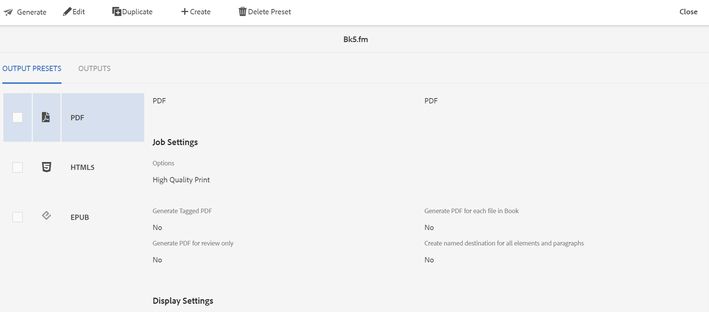

# Generate output of .book or .fm files {#generating_output_fm_docs}

Perform the following steps to generate output for FrameMaker documents:

1.  In the Assets UI, navigate to and click on the `.book` or `.fm` file that you want to publish.

    The DITA map console appears showing the list of Output Presets available to generate output.

    {width="800"}

1.  Select one or multiple Output Presets that you want to use for generating the output.

1.  Click the Generate icon to start the output generation process.

>[!NOTE]
>
> You can view the current status of the output generation request by clicking on Outputs. For more information, see [View the status of the output generation task](fm-output-view-status.md).

**Parent topic:**[Generate output of FrameMaker documents](fm-output-generatation.md)
