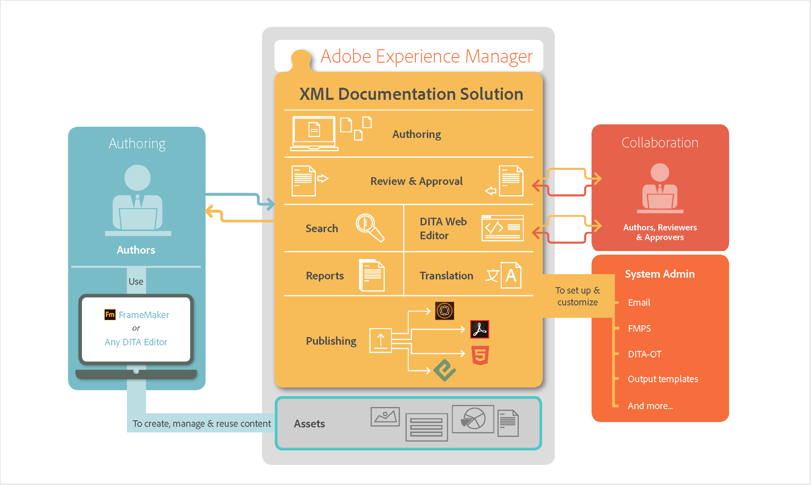

# How AEM Guides works {#id167G9A00DO4}

The following diagram illustrates how AEM Guides works with AEM and any DITA editor to enable content management, reuse, translation, and review in an enterprise scenario.

{width="800" align="center"}

**Parent topic:**[About Adobe Experience Manager Guides as a Cloud Service](../user-guide/intro.md)
