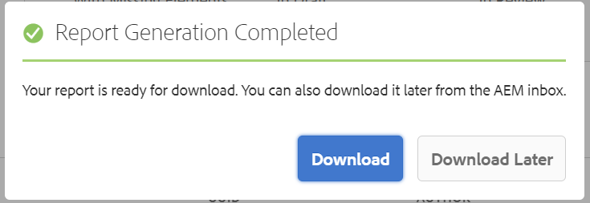

# DITA map report from the map dashboard {#id205BB800EEN}

AEM Guides provides your administrators the reporting capabilities to check the overall integrity of the documentation before it is pushed live or made available to end users. DITA map report from the map dashboard in AEM Guides provides valuable information such as the missing topics, topics with missing elements, UUID of referenced topics and media files,and review status of each topic. A detailed individual topic-level report also provides DITA content-related information such as content references and missing images or cross-references.

>[!NOTE]
>
> AEM Guides refreshes this report on every event that results in a change in your map file or when any reference within your topic file is updated.

Perform the following steps to view the DITA Map Report:

1.  In the Assets UI, navigate to and click on the DITA map file for which you want to view the report.

1.  Click **Reports**.

    {width="800" align="left"}

    The Reports page is divided into two parts:

    -   **Topic Summary:**

        Lists the overall summary of the selected map file. By looking at the Summary, you can quickly know the total number of topics in the map, missing topics, number of topics that have missing elements, topics' state — In Draft, In Review, or Reviewed state.

    -   **Details:**

        When you click on a topic, a detailed report of the selected topic is displayed.

        {width="800" align="left"}

        Items highlighted under **A**, **B**, **C** and **D** are described below:

        - **Topic**: The title of the topic specified in the DITA map. Hovering the mouse pointer over the topic's title displays the complete path of the topic. If there are issues in the topic, like missing references or images, then a red dot is shown before the topic's title.

        - **File Name**: Name of the file.

        - **UUID**: The universally unique identifier \(UUID\) of the file.

        - **Author**: User who worked last on this topic.

        - **Document State**: The current state of the document - Draft, In-Review or Reviewed.

        - **Missing Topics \(B\)**: If there are topics with broken references, then those topics are listed under the Missing Topics list.

        - **Missing Elements**: Lists the number of missing images or broken cross-references, if any.

        - **Open in Editor \(D\)**: Clicking this icon opens the topic in the Web Editor.

    Items highlighted under **E** are described below:

    - **Multimedia**: Path of images used in the topic is shown along with its UUID. If you click on the image path, the corresponding image is opened in a pop-up window. Broken image links are listed in red color.

    - **Content References**: Path of the content referred in the topic is shown along with its UUID. If you click on the title of the referred content, the corresponding topic is opened in Preview mode.

    - **Cross Reference**: Path of the cross-referenced content is shown along with its UUID. If you click on the title of the referred content, the corresponding topic is opened in Preview mode. Broken cross-references are listed in red color.

    - **Review**: Shows the status of the review task of the topic. You can see the status \(open or close\), due date, and assignee for the topic under review. If you click the topic link, it opens the topic in review mode.

    - **Used In**: Shows a list of other topics or maps where the topic is used. The UUID of all such topics and maps is also listed.

Besides the report for each individual topic, administrators also have access to information such as publishing history of a DITA map. For more information about the history of generated outputs, see [View the status of the output generation task](generate-output-for-a-dita-map.md#viewing_output_history).

## Generate the CSV of DITA map report 

You can download and export the CSV of a DITA map report. The CSV contains the detailed DITA map report.

Perform the following steps to generate the CSV of a DITA map report:

1.  Click **Generate Report** on the top-left to generate the DITA map report.
    
    {width="800" align="left"}

1.  You will receive a notification once the report is ready to download. Click **Download** to download the CSV of the generated report.

    {width="550" align="left"}

    You can also download the CSV of the generated report later from the AEM notification Inbox.

    Click the generated report in the Inbox to download the report.

    {width="300" align="left"}

Once the report is downloaded in the Inbox you can also select the report and use the Open icon on the top to open the selected report.

**Parent topic:**[Reports](reports-intro.md)
