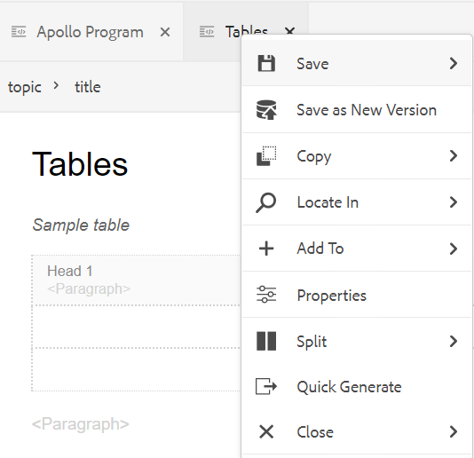
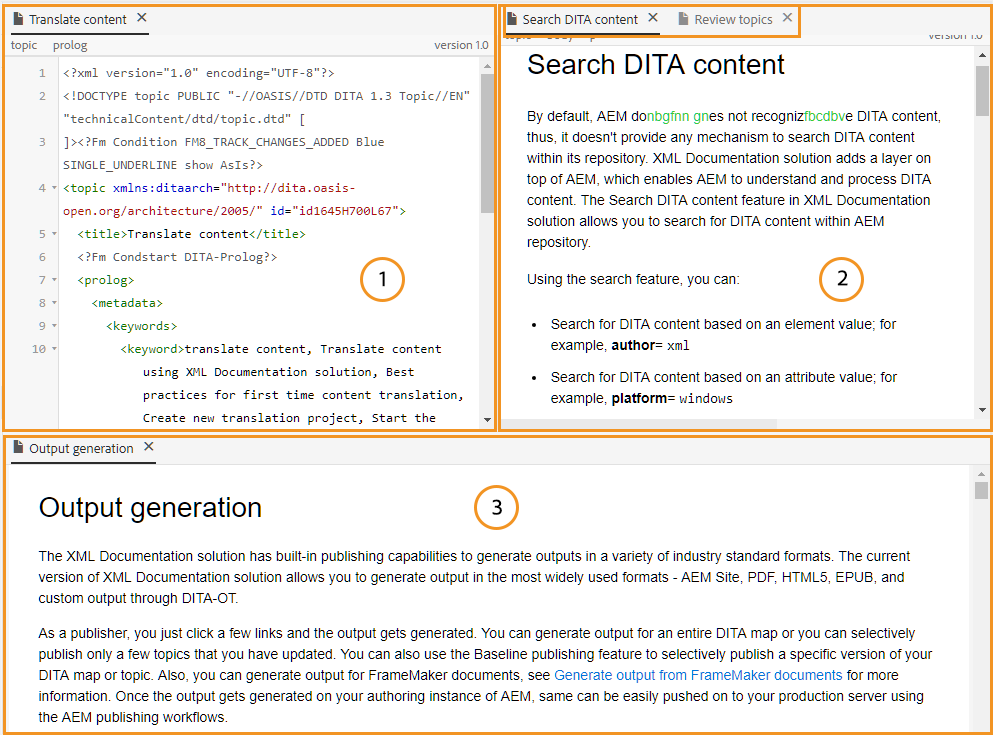
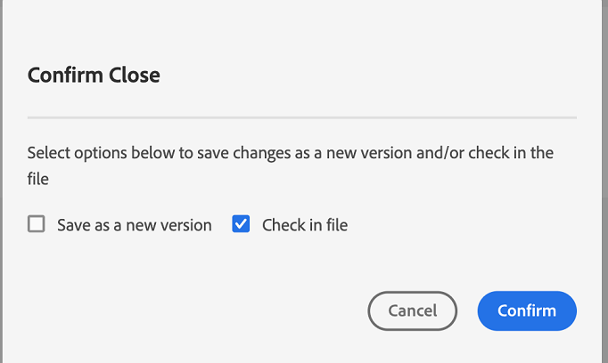

# Other features in the Web Editor {#id2056B0B0YPF}

There are some other useful features in the Web Editor that you can make use of:

**Context menu functions on a file's tab** 

When you open a file in the Web Editor, you can perform various actions from the context menu. You might see different options depending on whether you open a media file, single DITA file, or multiple files.

**Media file**

You get the following functions in the context menu of an opened media file's tab:

{width="300" align="left"}

**Single DITA file**

You get the following functions in the context menu of an opened file's tab:

:   {width="300" align="left"}

**Multiple files**

When you have multiple files opened, then you get more options in the context menu:

{width="550" align="left"}

The various options in the context menu are explained below:

***Save***: You can choose from the following options:

-   **Save**: To save a file without creating a new version, select **Save**. Whenever you create a new topic, a version-less working copy of the topic is created in DAM. Saving your document updates the working copy of your document in DAM. Doing a simple save on this version does not create a new version of a topic. If your topic is under review, saving a topic does not give your reviewers access to your changed topic content.

-   **Save All**: If there are multiple documents opened in the Web Editor, then you also get an option to **Save All** opened documents.

***Save As New Version***

To create a new version of the file, select **Save As New Version**. For more details about **Save** and **Save As New Version**, see [Know the Web Editor features](web-editor-features.md#).

***Copy***: You can choose from the following options:

-   **Copy UUID**: To copy the UUID of the currently active file to the Clipboard, select **Copy \> Copy UUID**.
-   **Copy Path**: To copy the complete path of the currently active file to the Clipboard, select **Copy \> Copy Path**.

***Locate In***: You can choose from the following options:

-   **Map**: If you have opened a large DITA map and want to find the exact location of a file in the map, then select **Locate In \> Map**. When you select the Locate in Map option, the file \(from where the option is invoked\) is located and highlighted in the map hierarchy. To be able to use this feature, you must open the map file in the Web Editor. If the Map View is hidden, then invoking this feature will display the Map View and the file is highlighted in the map hierarchy.

-   **Repository**: Similar to Locate in Map, the **Locate In \> Repository** shows the location of the file in the repository \(or DAM\). The Repository View is opened and the selected file is highlighted in the repository. If the file is within a folder, then that folder is expanded to show the selected file's location in the repository.

***Add To***: You can choose from the following options:

-   **Favorites**: To add the selected file to favorite collection, select **Add To \> Favorites**. For more details, see the **Favorites** feature description in the [Left Panel](web-editor-features.md#id2051EA0M0HS) section.

-   **Reusable Contents**: To copy the selected file to the reusable content list, select **Add To \> Reusable Contents**. For more details, see the **Reusable Contents** feature description in the [Left Panel](web-editor-features.md#id2051EA0M0HS) section.

***Properties***

To see the AEM properties page of the selected file, select **Properties**.

***Split***: You can choose from the following options:

**Up, Down, Left, or Right**

By default, the Web Editor allows you to view one topic at a time. There could be instances wherein you would like to see two or more topics at the same time. Splitting the editor's screen allows you to view multiple topics at the same time. For example, if you have two topics - A and B opened in the editor. Right-clicking on topic B and choosing **Split \> Up** divides the editor window into two parts. Topic B is displayed in the upper half and Topic A is displayed in the bottom half. Similarly, you can also split the screen horizontally by selecting **Split \> Left** or **Split \> Right**. The following screenshot of the Web Editor displays topics split horizontally and vertically. In each split, you can have a different view. For example in the following screenshot, the screen 1 is in Source view mode, screen 2 has two documents opened in Author mode, and screen 3 is in the Preview mode. You can move your documents from one screen to the other by dragging the file tab and dropping it on to the screen where you want to place it. Similarly, you can also reorder file tabs by dragging and moving them as per your preference.

{width="800" align="left"}

***Quick Generate***

Generate the output for the selected file. Output can be generated only for files that are a part of an output preset. For more details, see [Article-based publishing from the Web Editor](web-editor-article-publishing.md#id218CK0U019I).

***Close***: You can choose from the following options:

**Close**, **Close Others**, or **Close All**

If you want to close the file from which you invoked the context menu, then select **Close \> Close**. Use **Close \> Close Others** to close all other opened file except the currently active file. To close all open files, select the **Close \> Close All** option from the context menu or you can also choose to close the Web Editor. If there are any unsaved files in your session, then you are prompted to save those files.

**File close and save scenarios** 

When you try to close a file opened in the Web Editor using the **Close** button on the file's tab or the **Close** option in the Options menu, AEM Guides prompts you to save your edits and unlock a locked file.

The prompts are based on the following configurations selected by your administrator:

-   **Ask for check-in on close:** You are given the option to check in the file \(which you have checked out\) when you close the editor.
-   **Ask for new version on close**: You are given the option to save the file \(which you have edited\) as a new version when you close the editor.

Your file saving experience will depend on the following three scenarios, wherein you have:

-   Not done any changes to the content.
-   Edited the content and saved the changes.
-   Edited the content but not saved the changes.

You may see the following options depending on whether the file is locked/unlocked and has saved or unsaved changes:

-   **Unlock and Close**: The lock on the file is released, and the file gets closed.

    {width="400" align="left"}

-   **Save as a New Version**: This will save the changes you have made in your content and create a new version of your file. You can also add labels and comments for the newly saved version. For more information about saving a new version, see [Save As New Version](web-editor-features.md#save-as-new-version-id209ME400GXA).

-   **Unlock the File**: If you choose to unlock a file, it will release the lock on your file and the changes are saved in the current version of the file.

    >[!NOTE]
    >
    > If you deselect the option to unlock the file, you also get an option to close the file without saving the changes.

    For example, one of the prompts is shown in the following screenshot:

    {width="400" align="left"}

**Visual cues for broken references** 

- If your topic contains broken cross-references or content references, they are shown in red text.

**Smart copy-paste** 

- You can easily copy paste content within and across topics. The source element structure is maintained at the destination. Also, if the copied content contains content references, then even those are copied.

**Remember last browsed location** 

- The Web Editor provides a smart file browse dialog. The editor remembers the last used location while inserting a reference or content. The first time you invoke the file browse dialog \(via Insert Reference or Insert Reuse Content\), then you are taken to the location where the current document is saved. In the same session, if you try to insert another reference, then the file browse dialog automatically navigates to the location from where you inserted the last reference.

>[!NOTE]
>
> In case of an image, audio, or video file, the file browse dialog defaults to the file's location and not the last used location.

**Support for article-based publishing** 

- From the Web Editor, you can generate the output for one or more topics, or the entire DITA map. You need to create output presets for your DITA map and then you can easily generate the output for one or more topics. If you have updated a few topics in your map, you can also generate the output only for those topics from the Web Editor. For more details, see [Article-based publishing from the Web Editor](web-editor-article-publishing.md#id218CK0U019I).

**Support for Markdown documents** 

- The Web Editor allows you to use Markdown documents \(.md\) along with your DITA documents. You can easily author and preview a Markdown document in the Web Editor and also add it in your map file through DITA map editor. For more details, see [Author Markdown documents from the Web Editor](web-editor-markdown-topic.md#).

**Support for DITA glossary term topic** 

- The Web Editor support DITA glossary terms that you can insert by adding `term` or `abbreviated-form` elements.

**Insert MathML equations** 

- Experience Manager Guides gives you an out-of-the-box support for inserting MathML equations by integration with [MathType Web](https://docs.wiris.com/en/mathtype/mathtype_web/intro) application. To insert a MathML equation, select the **Insert Element** icon and type mathml. When you select mathml element from the list, the **Insert MathML** dialog is displayed:

{width="550" align="left"}

Using the MathML equation tools, create your equation and click **Insert** to add it to your document. The equation is inserted with light gray background, as shown below:

{width="400" align="left"}

At any time you can update an equation by right-clicking on an existing equation and selecting **Edit MathML** from the context menu.

- **Validation of equations in the MathML editor**

    Experience Manager Guides validates MathML equations when you save a topic containing them.
    When you insert an equation using the MathML editor, Experience Manager Guides highlights the equation in red if there are any syntax issues. You can correct it before inserting it. If you don't make any changes but select **Insert**, it displays a warning.
    
    {width="400" align="left"}

    If you insert the MathML equation that contains a syntax error, a validation error occurs when you try to save the topic.

**Insert footnotes** 

- Insert footnote in your content by using the `fn` element. In the authoring mode, the footnote value is shown inline with the content. However, when you switch you the Preview mode or publish your document, the footnote appears at the end of the topic.

**Rename or replace an element** 

- The Web Editor displays the element's breadcrumb at the top of the topic. If you want to swap or replace an element with another element, then you can do so from the breadcrumb's context menu. For example, you can swap `p` element with `note` or any other valid element at the context.

{width="400" align="left"}

On the breadcrumb, right-click on an element's name that you want to replace, then select Rename Element from the context menu. The Rename Element dialog displays all valid elements that are allowed at the current location. From the Rename Element dialog, select the element that you want to use. The original element is replaced with the new element.

In addition to the context menu of the breadcrumb, the Rename Element dialog can also be accessed from other locations:

-   Click on the element name on the breadcrumb to select the content of the element and right-click on the selected content to bring up the context menu.

-   Enable Tags view, click on the opening tag of any element and then right-click on the selected content to bring up the context menu.

-   You can access the Rename Element dialog by invoking the Options menu of an element in the Outline panel.

**Wrap an element** 

- Wrapping an element allows you to add an element tag to the selected text. You can wrap the text to any child element following DITA standards. For example, if you have text under a `note` element, then you can wrap the text to a `p` element. 
    
    The **Wrap Element** option is available in the context menu of the topic's breadcrumb. To wrap an element, right-click on the element and open the context menu. Select the element from the **Wrap Element** dialog. The text appears in the new element. 

    You can also select the text or the element in the content and then select the **Wrap Element**  option from the context menu.

**Unwrap an element** 

- Unwrapping an element allows you to remove the element tag from the selected text and merge it with its parent element. For example, if you have a `p` element within a `note` element, you can unwrap the `p` element to merge the text directly within the `note` element. The **Unwrap Element** option is available in the context menu of the topic's breadcrumb. To unwrap an element, right-click on the element to open the context menu, then finally select **Unwrap Element** to remove the element and merge the element's text with its parent element.

**White space handling for DITA elements**

- In XML, white spaces include spaces, tabs, carriage returns, and blank lines. Experience Manager Guides converts multiple consequent white spaces into one space. This helps you preserve the WYSIWYG view of the Web Editor. 

    >[!NOTE]
    >
    >In some elements where white spaces need to be preserved according to the DITA rules, the multiple consequent white spaces are retained. For example, `<pre>` and `<codeblock>` elements. 

**Preserving line breaks and indentation** 

- DITA elements that contain line break and spaces are supported and rendered as per their definition in the Author, Source, or Preview modes, and also in the final published output. The following screenshot shows the content within the `msgblock` element wherein the line breaks and spaces \(indentation\) have been preserved:

{width="500" align="left"}

**Handling non-breaking spaces in Web Editor** 

- You can insert non-breaking spaces in your document using the **Insert Special Characters**   icon or the **Alt** + **Space** shortcut keys.  These non-breaking spaces appear as an indicator while you edit a topic in the Web Editor. You can turn off the display of the non-breaking spaces with the **Show non-breaking space indicator in the author mode** option from the **Appearance** tab of the **User preferences** .. 

- If you copy and paste content with a non-breaking space from any external sources into the **Author** view, the non-breaking space is converted into a space. 
However, if you copy and paste content with a non-breaking space from the **Author** view, it's preserved.

**Auto-generate element ID** 

- You can automatically generate IDs for the elements in your DITA topic. These IDs are unique within a DITA topic. For example, if you generate IDs for a paragraph element, the IDs will be p\_1, p2, p\_3, and so on. You can select multiple elements and generate IDs for each selected element.

Do the following to automatically generate ID for one or multiple elements:

1.  Open the topic in the Web editor.
1.  Select the content on which you want to assign IDs.
1.  Right-click and select **Generate IDs from the context menu.**

    Alternatively you can right-click in the breadcrumb and select **Generate IDs**.

**Parent topic:**[Work with the Web Editor](web-editor.md)
