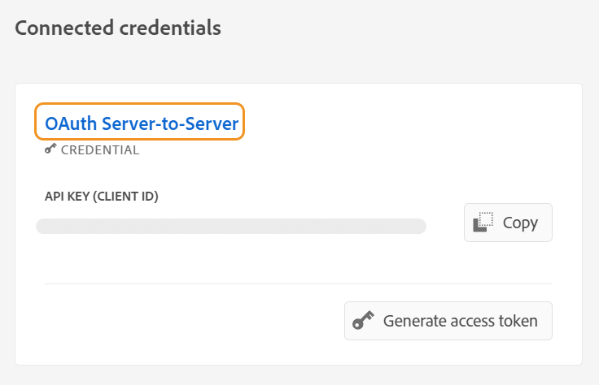

# Configure the AI-powered Smart Help to search content

As an administrator, you can configure the Smart Help feature for the authors. The Smart Help service is secured by Adobe IMS auth-based authentication. Integrate your environment with Adobe’s secure token-based authentication workflows and start using the new Smart Help feature. The following configurations help you to add the **AI configuration** tab to a folder profile. Once added, you can use the Smart Help feature in the Web Editor.

## Create IMS configurations in Adobe Developer Console

Perform the following steps to create IMS configurations in Adobe Developer Console:

  >[!NOTE]
  >
  >If you have already created an OAuth project to configure the Smart Suggestions feature or the microservice-based publishing, you can skip the following steps to create the project. You can begin from Step 8.

1. Launch [Adobe Developer Console](https://developer.adobe.com/console). 
1. After successfully logging in to Developer Console, you'll view the **Home** screen. The **Home** screen is where you can easily find information and quick links, including top-navigation links to Projects and Downloads.
1. To create a new empty project, select **Create new project** from the **Quick start** links.
 {width="550" align="left"}
*Create a new project.*

1. Select **Add API** from the **Projects** screen.  The **Add an API** screen appears. This screen displays all available APIs, Events, and services for Adobe products and technologies with which you can develop applications.

1. Select the **I/O Management API** to add it to your project.

*Add I/O Management API to your project.*

1. Create a new **OAuth credential** and save it.
 {width="3000" align="left"}
*Configure OAuth credential to your API.*

1. In the  **Projects** tab, choose the **OAuth Server to Server** option and then select the newly created credentials.

1. Select the **OAuth Server-to-Server** link to view the credential details of your project.  

     {width="800" align="left"}

    *Connect to the project to view the credential details.*

1. Return to the **Projects** tab and select **Project overview** on the left. 

     
    
    *Get started on the new project.*

1. Click the **Download** button on the top to download the service JSON.

     

    *Download the JSON service details.*

You have configured the OAuth authentication details and downloaded the JSON service details. Keep this file handy as it's required in the next section.

### Add IMS configuration to the environment

Perform the following steps to add IMS configuration to the environment:

1. Open Experience Manager and then select your program,  which contains the environment  you want to configure.
1. Switch to the **Environments** tab.
1. Select the environment name, which you want to configure. This should navigate you to the **Environment Information** page.
1. Switch to the **Configuration** tab.
1. Update the SERVICE_ACCOUNT_DETAILS JSON field. Ensure you are using the same name and configuration as given in the following screenshot.

  {width="800" align="left"}
 

*Add the environment configuration details.*


Once you have added the IMS configuration to the environment, perform the following steps to link these properties with AEM Guides using OSGi: 

1. In your cloud manager Git project code, add the below given two files (for file contents, view [Appendix](#appendix)).

    * `com.adobe.aem.guides.eventing.ImsConfiguratorService.cfg.json`
   
1. Ensure that the newly added files are getting covered by your `filter.xml`.
1. Commit and push your Git changes.
1. Run the pipeline to apply the changes to the environment.

Once this is done, you should be able to use the **Smart Help** feature.


## Appendix {#appendix}

**File**: 
`com.adobe.aem.guides.eventing.ImsConfiguratorService.cfg.json`

**Content**:

```
{
 "service.account.details": "$[secret:SERVICE_ACCOUNT_DETAILS]",
}

```


Once you have configured, the **Smart Help**  icon is displayed in the right panel of the Web Editor. Select the icon to view the **Smart Help** panel. 
For more details, view the [AI-powered Smart Help to search content](../user-guide/ai-based-smart-help.md) section in the Experience Manager User Guide.
