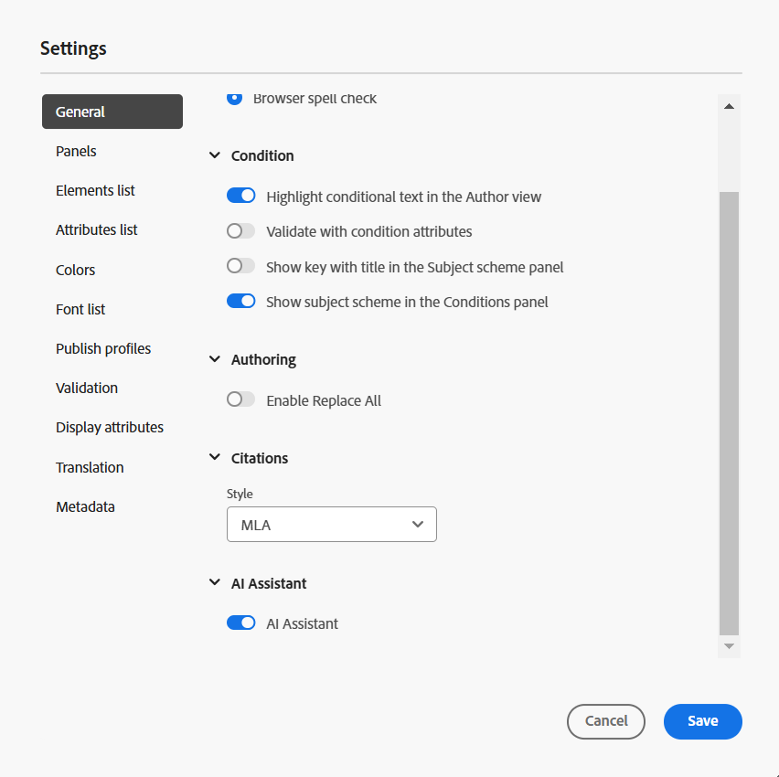

# Configure the AI Assistant

As an administrator, you can configure the AI Assistant feature in Experience Manager Guides. AI Assistant is secured by Adobe IMS auth-based authentication. Integrate your environment with Adobe's secure token-based authentication workflows and start using the AI Assistant feature. The following configuration help you to add the **AI configuration** tab to folder profile. Once added, you can use the AI Assistant feature in Experience Manager Guides.

Perform the following steps to configure AI Assistant:

1. [Create IMS configuration in Adobe Developer Console](#create-ims-configurations-in-adobe-developer-console).
2. [Add IMS configurations to environment](#add-ims-configuration-to-the-environment)
3. [Enable AI flag in the environment](#enable-ai-flag-in-the-environment)
4. [Apply changes to the environment](#apply-changes-to-the-environment)
5. [Enable AI Assistant in Folder Profile](#enable-ai-assistant-in-folder-profile)
6. [Configure Smart Suggestions in Folder Profile](./conf-folder-level.md#configure-ai-assistant-for-smart-help-and-authoring)

## Create IMS configurations in Adobe Developer Console

Perform the following steps to create IMS configurations in Adobe Developer Console:

  >[!NOTE]
  >
  >If you have already created an OAuth project to configure the microservice-based publishing, you can skip the following steps to create the project.

1. Launch [Adobe Developer Console](https://developer.adobe.com/console). 
1. After successfully logging in to Developer Console, you'll view the **Home** screen. The **Home** screen is where you can easily find information and quick links, including top-navigation links to Projects and Downloads.
1. To create a new empty project, select  **Create new project** from the  **Quick start** links.
 {width="550" align="left"}
*Create a new project.*

1. Select  **Add API**  from the  **Projects** screen.  The **Add an API** screen appears. This screen displays all available APIs, Events, and services for Adobe products and technologies with which you can develop applications.

1. Select the **I/O Management API** to add it to your project.

*Add I/O Management API to your project.*

1. Create a new **OAuth credential** and save it.

   

   *Configure OAuth credential to your API.*

1. In the  **Projects** tab, choose **OAuth Server to Server** option and then select the newly created credentials.

1. Select the **OAuth Server-to-Server** link to view the credential details of your project.  

     {width="800" align="left"}

    *Connect to the project to view the credential details.*

1. Return to the **Projects** tab and select **Project overview** on the left. 

     
    
    *Get started on the new project.*

1. Select the **Download** button on the top to download the service JSON.

     

    *Download the JSON service details.*

You have configured the OAuth authentication details and downloaded the JSON service details. Keep this file handy as it's required in the next section.

## Add IMS configuration to the environment

Perform the following steps to add IMS configuration to the environment:

1. Open Experience Manager and then select your program  which contains the environment  you want to configure.
1. Switch to the **Environments** tab.
1. Select the environment name which you want to configure. This should navigate you to the **Environment Information** page.
1. Switch to the **Configuration** tab.
1. Update the SERVICE_ACCOUNT_DETAILS JSON field. Ensure you are using the same name and configuration as given in the following screenshot.

    {width="800" align="left"}

## Enable AI flag in the environment 

To enable the AI Assistant feature on the Experience Manager Guides UI, add the `ENABLES_GUIDES_AI` flag in the environment. 

Ensure that you are using the same name and configuration as given in the following screenshot.

{width="800" align="left"}
 
Setting the flag to **true** enables the functionality, while setting it to **false** disables it.

## Add the GUIDES_AI_SITE_ID variable in the environment 

Add the `GUIDES_AI_SITE_ID` variable in your environment (Cloud Manager) and set the value to `id_f651abc807c84f52b425737bb93f87ba` to enable it. 

Ensure that you are using the same name and configuration as given in the following screenshot.

{width="800" align="left"}
 
## Apply changes to the environment

Once you have added the IMS configuration and enabled the AI Assistant flag to the environment, perform the following steps to link these properties with AEM Guides using OSGi: 

1. In your cloud manager Git project code, add the below given two files (for file contents, view [Appendix](#appendix)).

    * `com.adobe.aem.guides.eventing.ImsConfiguratorService.cfg.json`
    * `com.adobe.guides.ai.config.service.AiConfigImpl.cfg.json`
1. Ensure that the newly added files are getting covered by your `filter.xml`.
1. Commit and push your Git changes.
1. Run the pipeline to apply the changes on the environment.

## Enable AI Assistant in Folder Profile

Once the configuration changes are applied, enable the AI Assistant feature for the desired Folder profile. 

For more details, view [Know the Editor features](../user-guide/web-editor-features.md).

{width="300" align="left"}

## Configure Smart Suggestions in Folder Profile

After enabling the AI Assistant feature, configure the Smart Suggestions functionality in Folder Profile. 

For details, refer to [Configure Smart Suggestions in Folder Profile](./conf-folder-level.md#configure-ai-assistant-for-smart-help-and-authoring). 


## Appendix {#appendix}

**File**: 
`com.adobe.aem.guides.eventing.ImsConfiguratorService.cfg.json`

**Content**:

```
{
 "service.account.details": "$[secret:SERVICE_ACCOUNT_DETAILS]"
}

```

**File**: `com.adobe.guides.ai.config.service.AiConfigImpl.cfg.json`

**Content**:

```
{
  "conref.inline.threshold":0.6,
  "conref.block.threshold":0.7,
  "related.link.threshold":0.5,
  "emerald.url":"https://adobeioruntime.net/apis/543112-smartsuggest/emerald/v1",
  "instance.type":"prod",
  "chat.url":"https://aem-guides-ai-v2.adobe.io",
  “site.id”: “id_f651abc807c84f52b425737bb93f87ba”
}
```

## AI Assistant configuration details

|Key|Description|Allowed Values|Default Value|
|---|---|---|---|
|conref.inline.threshold|Threshold that controls the precision/recall of suggestions fetched for the tag that the user is typing in currently.|Any value from -1.0 to 1.0.|0.6|
|conref.block.threshold|Threshold that controls precision/recall of suggestions fetched for tags across the entire file.|Any value from -1.0 to 1.0.|0.7|
|emerald.url|Endpoint for the Smart Suggestion vector database|[https://adobeioruntime.net/apis/543112-smartsuggest/emerald/v1](https://adobeioruntime.net/apis/543112-smartsuggest/emerald/v1)|[https://adobeioruntime.net/apis/543112-smartsuggest/emerald/v1](https://adobeioruntime.net/apis/543112-smartsuggest/emerald/v1)|
|chat.url|Endpoint for the AI assistant service|[https://aem-guides-ai-v2.adobe.io](https://aem-guides-ai-v2.adobe.io)|[https://aem-guides-ai-v2.adobe.io](https://aem-guides-ai-v2.adobe.io)|
|site.id|Identifier for the context containing indexed AEM Guides documentation pages.|id_f651abc807c84f52b425737bb93f87ba|id_f651abc807c84f52b425737bb93f87ba|
|instance.type|Type of the AEM instance. Make sure this is unique for each AEM instance that the smart suggestions is configured on. A use case would be to test the feature on stage environment with "instance.type" = "stage" while at the same time, the feature is also configured on "prod".|Any unique key identifying the environment. Only *alpha numeric* values are allowed. "dev"/"stage"/"prod"/"test1"/"stage2"|"prod"|

Once you have configured, the AI Assistant icon is displayed in the Home page and Editor of the Experience Manager Guides. For more details, view [AI Assistant](../user-guide/ai-assistant.md) section in the Experience Manager User Guide.
