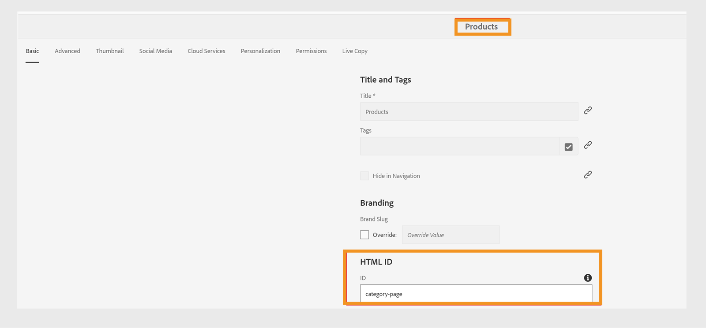

# Download and install AEM Sites templates

This guide provides step-by-step instructions to set up and configure the latest AEM Guides template for generating AEM Sites pages in a cloud environment. Follow these steps to install the required packages, create and configure presets, and generate AEM Sites.

## Prerequisites

Before proceeding with the setup, ensure the following pre-requisites are met:

- Adobe Experience Manager (AEM) Cloud: A running instance of AEM as a Cloud Service with AEM Guides 2502 or later versions.

- Required Permissions: Download the following packages:

    - Access to Cloud Manager to deploy packages.
    - Access to Git Repository associated with your environment.
    - Permissions to create and modify presets in AEM Guides.

- Required Permissions: Download the following packages:

    - Components package: guides-components.all-1.3.0.zip
    - Sites template: aemg-docs-1.2.0.zip    

## Package Installation via Cloud Deployment (Install Components Package (guides-components.all-1.x.x.zip))

1. Navigate to **Repositories** in the left panel of Cloud Manager.
2. Select **Access Repo Info** and copy the git clone command.
3. Clone the repository to your local system using the provided username and password (generate password if required).
4. In your locally cloned repository, create a new Maven bundle or add to an existing one.
5. Ensure the structure /jcr_root/apps/fmdita/install exists in the Maven project.
6. Place the downloaded guides-components.all-1.x.x.zip file in the install folder. 
7. Open the filters.xml file located in the META-INF folder of the parent content directory.
8. Add the following filter: <filter root="/apps/fmdita" mode="merge"/>
9. Update the pom.xml file as per your environment requirements. 
10. Push the changes to the main Git repository.
11. Navigate to **Pipelines** in Cloud Manager and run the pipeline for the desired environment.
12. Once the deployment is complete, the components package will be installed on the AEM Cloud environment.

## Create Site using installed templates

1. Go to the AEM Sites page (<servername>/sites.html/content).
2. Select **Create** > **Site** from Template.
3. Import the sites template aemg-docs-1.x.x.zip using the **Import** option.
4. Select **AEMG Docs 1.x.x** and then select **Next**.
5. Enter the **Site Title** and **Site Name**.
6. Select **Create**.

## Create AEM Site Preset

1. Open a DITA map in AEM Guides and navigate to the **Output** panel.
2. Select **Create Preset**.
3. Select the type as **AEM Sites**.
4. Enter a name for the preset.
5. Uncheck the **Use legacy component mapping** setting.
6. Select **Add** to create the preset.
7. Configure AEM Site Preset: There are two options to configure the out-of-the-box (OOTB) site:

    **Option 1**

    1. Select Site as the one created above (e.g., AEMG Docs Site).
    2. Verify that the Publish path and Topic page template are automatically set to: Publish path: /content/AEMG-Docs-Site/en/docs/product and Topic page template: Topic Page.

    **Option 2**

    1. Set the Site path manually as /content/AEMG-Docs-Site/en/docs/product.
    2. Verify that the Topic page template is automatically set to Topic Page.

8. Save the changes made to the preset.

## Generate AEM Sites

1. With the preset configured, generate the AEM Site for the corresponding DITA map.
2. The generated site will be available at the path: /content/AEMG-Docs-Site/en/docs/product.
3. As an optional step, if you want to change the default path for site generation:
    - Navigate to **AEM Sites**.
    - Create a new product page under the OOTB site structure.
    - Navigate to **AEMG Docs** > **English** > **Docs**. 
    - Select the **Home** page and then select **Next**.
    - Enter the **Title** and **Name** for the page.
    - Select **Create**.

>[!NOTE]
>
> * Ensure all configurations are tested in a non-production environment before deploying to production.
> * Refer to the official Deploying to AEM as a Cloud Service documentation for additional details.

## Customize existing AEM Sites templates {#customize-existing-aem-sites-templates}

Besides the predefined templates, you can also use your existing templates with the AEM Sites presets. Perform the following steps to customize existing AEM Sites templates:

### Template Setup

You need the following two types of templates:

- Category or Landing Template: This template is used for the Product documentation landing page and corresponds to a DITA map.  AEM Site Page for a DITA map is generated using this template. You can use this template at any level.
        - Add a text component to your existing template. The text component should have a mandatory property, `text="$category.html$"`.
        - For example, you can pick we-retail templates and use the section-page template as the landing page template for the DITA map. To do so, make the changes as shown in the following screenshot:

    -  Detail Page or Topic Page Template: Use this template for the content of topics of a map. All the Sites pages of DITA/XML content are created using Topic Page templates. To create these templates, there are two pre-requisites:
        - Add a text component to the template, contained in a container component, with a mandatory property. `text="$topic.content$"`. 

       - Reflect the same container and text component in the structure of the same template, as shown in the following screenshot:

### Tag Category Page as documentation container

Assuming a site hierarchy is created for the documentation pages using the previous template, choose one of the category pages created in that site hierarchy. Tag the category page as a Documentation container by giving it an ID. 
To do so, assign its property `id` a value `category-page`. Refer to the following screenshot:
 

