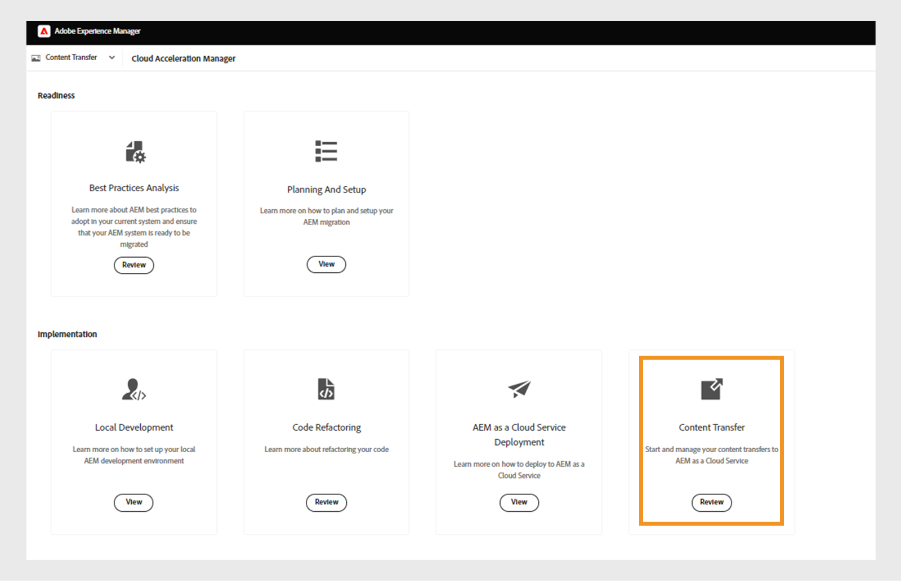

# Migration of JCR to reprocess assets

Migrating from a Java Content Repository (JCR) to a traditional database (DB) can significantly enhance system performance, particularly for data-intensive tasks such as publishing and report generation. This migration strategy focuses on improving the speed and efficiency of data processing by transitioning away from the hierarchical, node-based structure of JCR to a more streamlined relational database model. Notably, migration is performed at the folder level rather than the entire repository, allowing organizations to selectively migrate only the assets necessary for specific operations. This targeted approach reduces overhead, avoids unnecessary data transfers, and leads to faster execution of high-volume tasks like publishing. By optimizing both scope and performance, folder-level JCR to DB migration offers a practical and scalable solution for modern content-driven systems.

## Migration process

1. Select the **Tools** icon on the left panel of the Experience Manager home page.
1. Select **Guides** from the list and then select the **Assets Processor** Tile.
1. The Guides Asset Processor window opens with the following details:
    

Then install the package via **Package Manager** on your source Adobe Experience Manager instance. Make sure to download the latest version. 
For more details on the latest version, view  [Release Notes](https://experienceleague.adobe.com/docs/experience-manager-cloud-service/content/release-notes/release-notes/release-notes-current.html?lang=en). 

>[!NOTE]
> 
> Only version 2.0.0 and higher is supported, and it's recommended to use the latest version.

Perform the following steps to migrate Experience Manager Guides content to Experience Manager as a cloud service.

1. Log in to [experience.adobe.com](https://experience.adobe.com/) and select **Experience Manager**.

     

1. Click **Launch** on the **Cloud Acceleration Manager** tile.
 

1. Create your first project.
  

1. Add the name and description and click **Create**. Your project is created.  
1. Select the created project and open the project screen.
1. Click **Review** on the **Content Transfer** tile.
 
    

1. Click **Create migration set**.

1. Provide the name and description for the migration set.
 
  
     

1. After the creation, select the three dots and select **Copy extraction key**.
 

1. Click **Copy to clipboard**. Create your first project.
  

1. Select **Adobe Experience Manager**  on the top and then select the **Software Distribution** tile. 
 

1. On the **Software Distribution** portal, select **Adobe Experience Manager as the Cloud Service** tab, search "content transfer tool",  and download the content transfer tool package.

    >[!NOTE]
    >
    >  Ensure you download the latest version.

1. Upload and install the package `content-transfer.all-3.0.10.zip` in the **Package Manager** of your On-premise instance.

1. On the On-premise instance select **Tools** > **Operations** > **Content Migration** > **Content Transfer**.
 

1. Select **Content Transfer**, create a migration set, and paste the extraction key copied from the cloud acceleration manager. This establishes a connection between the source and the target. Then it verifies the key and shows the validity after entering the value.

1. Enable the **Include versions** option to include the file versions. 
 

1. Provide the path you want to migrate and click **Save**. 
For example,  `/content/sites`
or
`/content/dam/tech-docs`

 

    >[!NOTE]
    >
    > You need to migrate the following paths mandatorily for **Experience Manager Guides** content.

    * `/content/dam`
    * `/var/dxml`

    The following paths are restricted while creating a migration set:
    * `/apps`
    * `/libs`
    * `/home`
    * `/etc` You are allowed to select some `/etc` paths in CTT.

1. Click **Save** 
1. Select the **migration set** and then select **Extract** on the top.
 

1. Verify details in the **Migration Set Extraction** pop up for the paths and configurations you selected and click **Extract**. Extraction will take minutes, and you'll view the status as updated.
    
 
1. Once the extraction is complete and indicated by the status `finished`, go to Cloud Acceleration Manager and select the project you created in step 18. 
For more information select the three dots, and then select **View details**. 

1. In the Migration set details pop-up, verify the migration set configuration and close the pop up. You can view the paths and other setings as shown in the following screenshot:
 

1. Click **Ingestion Jobs** > **New Ingestion**. 
1. Acknowledge the required checkmark values and then click **Create**.
 

1. Pick the migration set, select your environment's required server, and then click **Ingest**.

    

## Run Content Transfer Tool on a Publish Instance

Install Content Transfer Tool on the source Publish instance to move content to the target Publish instance. 
The Content Transfer Tool does not differentiate between published and unpublished content when ingesting content into a Publish environment. The content specified in the migration set is ingested into the chosen target instance. The user can ingest a migration set into an Author instance, Publish instance, or both. 

### Recommended Approach 

Consider the following recommendations: 

* Use the same version of the **Content Transfer Tool** that was used on the Author instance. 
* During ingestion to Publish, the Publish tier will not be scaled down (unlike the author). 
* Migrate only a single Publish node. Prior to beginning the extraction, remove it from the load balancer. 

>[!NOTE]
>
> As a precaution, make sure that no write operations happen on the Publish instances including user initiated actions like:
> * Content distribution from AEM as a Cloud Service Author to Publish in that environment 
> * User Sync between Publish instances

    
## Troubleshooting

If extraction fails due to the following error then you can resolve this by importing the relevant CA certificate: 

`javax.net.ssl.SSLHandshakeException: sun.security.validator.ValidatorException: PKIX path building failed: sun.security.provider.certpath.SunCertPathBuilderException: unable to find valid certification path to requested target` 

**Reason**: The Adobe Experience Manager server has firewall restrictions, so add the following endpoint to the allowed list.

`casstorageprod.blob.core.windows.net`

*Enable SSL Logging.*
