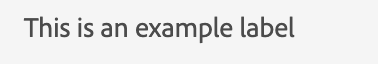

# Label

To display any text or string, we use the component, label.
The label component in JUI represents an html `<label/>`.

Below is an example for adding a static label

```js title="staticLabel.js"

const staticLabelJSON =  {
    "component": "label", //tells the component name
    "label": "This is an example label", // the string to be displayed
}

```

Below JSON displays a dynamic string:

```js title="dynamicLabel.js"
const labelJSON =  {
    "component": "label", //tells the component name
    "label": "@name", // the variable storing the text to be displayed
},

```

The rendered label will look like this:


