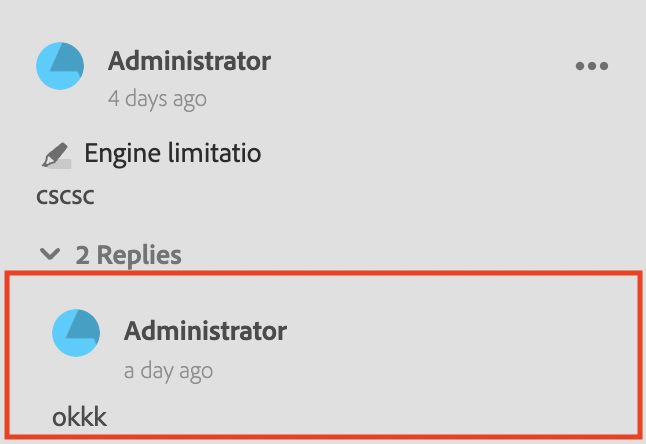
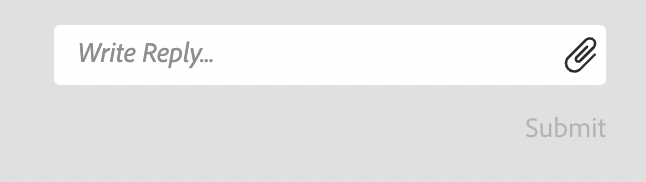

# Components of the Review App

Following are the major components of the review app:

- Inline Review Panel: `id: inline_review_panel`
  - The right panel where the review comments are rendered on the XML Editor side.

- Topic Reviews: `id: topic_reviews`
  - The right panel where the comments are rendered on the Review App.

- Review Comment: `id: review_comment`
  - The widget for each review comment.

Review Comment on the review app:

Review Comment on the xml editor side:

- Review Comment Reply: `id: comment_reply`
  - The widget for each review comment reply.

- New Review Comment Reply: `id: comment_new_reply`
  - The widget for new review comment reply.

- Annotation Toolbox: `id: annotation_toolbox`
  - The top right toolbar on the review app.

