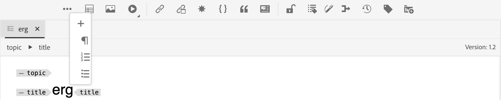

# Customizing topbar and toolbar

To customize the `topbar` and `toolbar`, you can use the ids: `topbar` or `toolbar`, and follow the same view, controller structure.

>[!NOTE]
>
>Starting with the 2502 and 5.0 release of Experience Manager Guides, the id **toolbar** has been renamed to **editor toolbar**. If you are using the previous versions, you can customize the toolbar using the **toolbar** id. We now do not have any id as **topbar** and in place have a **editor_tab_bar**.

Below is a trivial example of toolbar customization. Here, we have removed the `Insert Numbered List` button, and replaced the `Insert Paragraph` button with our own component using a customized on-click handler.

>[!TIP]
>
>Since **editor_toolbar** is designed to render buttons, adding widgets to it may disrupt its CSS and responsiveness. It is recommended to include only buttons or basic components, such as a label.

For accessing functionality exposed under the `proxy` object, you need to acces it using `this.getValue`, lets say for fetching a value.

For AEM Guides 5.0 and 2502 release and further, you can refer to below example for toolbar customization.

```js title = toolbar_customization.js
const toolbarExtend = {
    id: "editor_toolbar",
    view: {
        items: [
            {
                component: "div",
                target: {
                    key:"title",value: "Insert Numbered List",                    
                    viewState: VIEW_STATE.REPLACE
                }
            },
            {
                "component": "button",
                "icon": "textParagraph",
                "variant": "action",
                "quiet": true,
                "title": "Insert Paragraph",
                "on-click": "INSERT_P",
                target: {
                    key:"title",value: "Insert Paragraph",                    
                    viewState: VIEW_STATE.REPLACE
                }
            },
            {
                "component": "button",
                "icon": "fileHTML",
                "variant": "action",
                "quiet": true,
                "title": "URL Link Customization",
                "on-click": "openExternalLinkDialog",
                target: {
                key: "title", value: "Insert Bulleted List",
                viewState: VIEW_STATE.REPLACE
                }
            }
        ]
    },
    controller: {
        init: function() {
            console.log(this.getValue("canUndo"))
            this.subscribeAppEvent({
              key: "editor.preview_rendered",
              next: async function (e) {
                console.log(this.getValue("canUndo"))
              }.bind(this)
            })
        },
        INSERT_P(){
            this.appEventHandlerNext("AUTHOR_INSERT_ELEMENT",  "p" )
        },
        openExternalLinkDialog() {
            this.appEventHandlerNext("AUTHOR_INSERT_ELEMENT",
                {
                args: "<xref href='' scope='external' format = 'dita' ></xref>", activeTabId: "conkey_reference"
                }
            )
        }
    }
}
```


Once customized, the final output can be seen as follows: 


Refer to the below example if customizing the toolbar on AEM Guides 4.6.x release, and previous version. 

```js title = toolbar_customization.js
const topbarExtend = {
    id: "toolbar",
    view: {
        items: [
            {
                component: "div",
                target: {
                    key:"title",value: "Insert Element",                    
                    viewState: VIEW_STATE.REPLACE
                }
            },
            {
                component: "div",
                target: {
                    key:"title",value: "Insert Paragraph",                    
                    viewState: VIEW_STATE.REPLACE
                }
            },
            {
                component: "div",
                target: {
                    key:"title",value: "Insert Numbered List",                    
                    viewState: VIEW_STATE.REPLACE
                }
            },
            {
                component: "div",
                target: {
                    key:"title",value: "Insert Bulleted List",                    
                    viewState: VIEW_STATE.REPLACE
                }
            },
            {
                "component": "button",
                "extraclass": "insert-multimedia",
                "icon": "more",
                "variant": "action",
                "quiet": true,
                "holdAffordance": true,
                "title": "More Insert Options",
                "elementID": "toolbar_insert",
                "on-click": {
                    "name": "APP_SHOW_OPTIONS_POPOVER",
                    "args":{
                        "target": "toolbar_insert",
                        "extraclass": "new_options_buttons",
                        "items": [
                            {
                                "component": "button",
                                "icon": "add",
                                "variant": "action",
                                "quiet": true,
                                "title": "Insert Element",
                                "on-click": "AUTHOR_SHOW_INSERT_ELEMENT_UI"
                            },
                            {
                                "component": "button",
                                "icon": "textParagraph",
                                "variant": "action",
                                "quiet": true,
                                "title": "Insert Paragraph",
                                "on-click": "INSERT_P"
                            },
                            {
                                "component": "button",
                                "icon": "textNumbered",
                                "variant": "action",
                                "quiet": true,
                                "title": "Insert Numbered List",
                                "on-click": "AUTHOR_INSERT_REMOVE_NUMBERED_LIST"
                            },
                            {
                                "component": "button",
                                "icon": "textBulleted",
                                "variant": "action",
                                "quiet": true,
                                "title": "Insert Bulleted List",
                                "on-click": "AUTHOR_INSERT_REMOVE_BULLETED_LIST"
                            },
                            {
                                "component": "button",
                                "icon": "table",
                                "variant": "action",
                                "quiet": true,
                                "title": "Insert Table",
                                "on-click": "AUTHOR_INSERT_ELEMENT",
                            }
                        ]
                    },
                },
                target: {
                    key:"title",value: "Insert Table",                    
                    viewState: VIEW_STATE.REPLACE
                }
            },
        ]
    },
    controller: {
        init() {
            console.log(this.proxy.getValue('canUndo'))
            this.proxy.subscribeAppEvent({
                key: "editor.preview_rendered",
                next: async function (e) {
                    console.log(this.proxy.getValue('canUndo'))
                }.bind(this)
            })
        },
        INSERT_P(){
            this.next("AUTHOR_INSERT_ELEMENT",  "p" )
        }
    }
}
```

Once customized, the final output can be seen as follows: 




In another example, we would create a custom toolbar button that can jump directly to desired sub-options of **Cross reference** such as Email, File reference, Weblink, etc. 


```js title = toolbar_customisation.js
const toolbarExtend = {
    id: "editor_toolbar",
    view: {
        items: [
            
                {
                    "component": "button",
                    "icon": "fileHTML",
                    "variant": "action",
                    "quiet": true,
                    "title": "External URL Link",
                    "on-click": "openExternalLinkDialogP",
            
                target: {
                    key:"title",value: "Insert Bulleted List",                    
                    viewState: VIEW_STATE.REPLACE
                }
            }
        ]
    },
    controller: {
        openExternalLinkDialog() {
            tcx.eventHandler.next ("AUTHOR_INSERT_ELEMENT")
            t{
          args:"<xref href='' scope='external' format = 'dita' ></xref>",activeTabId:"conkey_reference"
        }
    }
  }
}
```

Here, `activeTabId` is the enum for selecting the correct tab. By default, selecting the Cross reference tab opens `file_link`. You can change the `activeTabId` values to  `content_reference`, `conkey_reference`, `key_reference`, `file_link`, `web_link`, and ` email_link` based on the requirement. 
