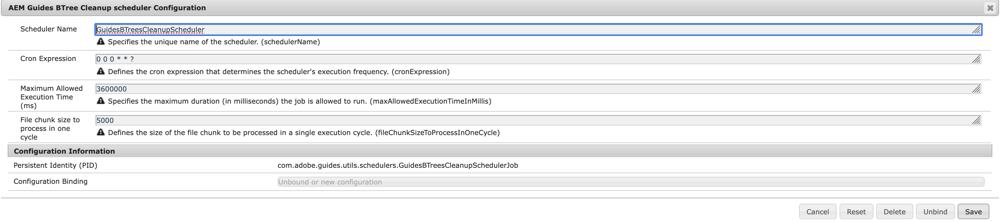

# Configure B-tree cleanup 

Set up the B-tree cleanup job and manage the `Guides BTree deletion` setting to keep your system optimized and storage clean.

## Configure B-tree cleanup job

The following tabs provide instructions to configure B-tree clean up job based on your Experience Manager Guides setup: Cloud Service or On-Premise.

>[!BEGINTABS]

>[!TAB Cloud Service]

1. Use the instructions given in [Configuration overrides](download-install-additional-config-override.md) to create the configuration file.

1. In the configuration file, provide the following (property) details:

    |PID|Property Key|Property Value|
    |---|---|---|
    |`com.adobe.guides.utils.schedulers.GuidesBTreesCleanupSchedulerJob`|`cronExpression`| **Default value:** "0 0 0 * * ?"|

>[!TAB On-Premise]

1. Open the Adobe Experience Manager Web Console Configuration page.

    The default URL to access the configuration page is:

    ```http
    http://<server name>:<port>/system/console/configMgr
    ```

1. Search for and select the *com.adobe.guides.utils.schedulers.GuidesBTreesCleanupSchedulerJob* bundle.

1. Update the cron expression to set up the B-tree cleanup scheduler job run frequency.

1. Configure the B-tree clean up scheduler as shown below.

    {align="left"}

1. Select **Save**.

>[!ENDTABS]

## Configure Guides B-tree deletion enable setting

The following tabs provide instructions to enable the setting based on your Experience Manager Guides setup: Cloud Service or On-Premise.

>[!BEGINTABS]

>[!TAB Cloud Service]

1. Use the instructions given in [Configuration overrides](download-install-additional-config-override.md) to create the configuration file.

1. In the configuration file, provide the following (property) details:

    |PID|Property Key|Property Value|
    |---|---|---|
    |`com.adobe.fmdita.config.ConfigManager`|`btree.deletion.enabled`| **Default value:** "True"|

>[!TAB On-Premise]

1. Open the Adobe Experience Manager Web Console Configuration page.

    The default URL to access the configuration page is:

    ```http
    http://<server name>:<port>/system/console/configMgr
    ```

1. Search for and select the *com.adobe.fmdita.config.ConfigManager* bundle.
1. Enable the setting `Guides btree deletion enabled`.

    {align="left"}

1. Select **Save**.

>[!ENDTABS]