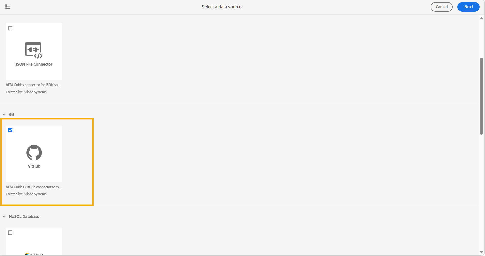
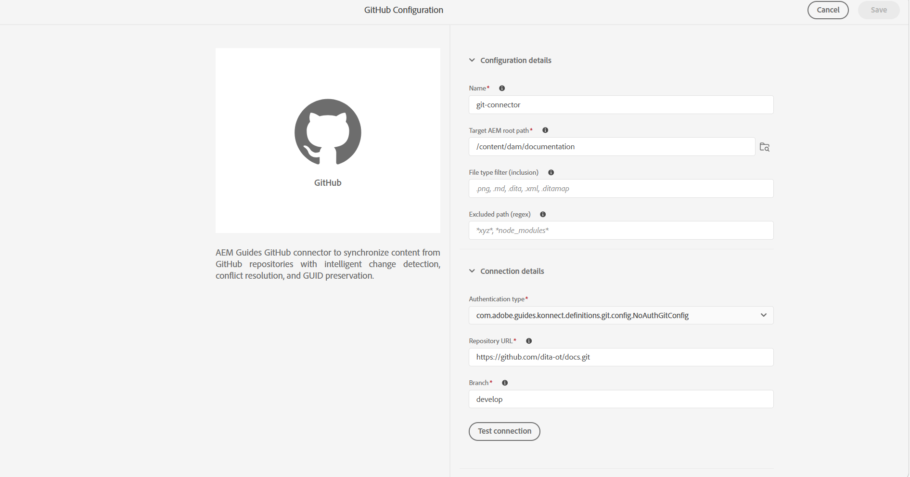
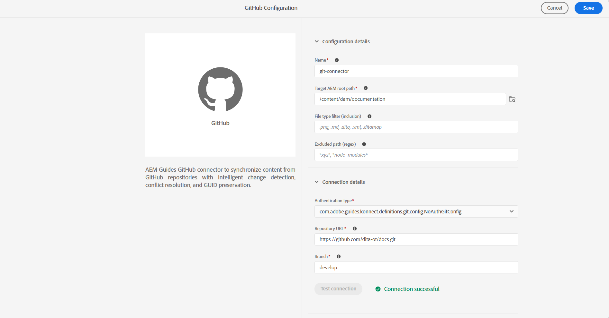
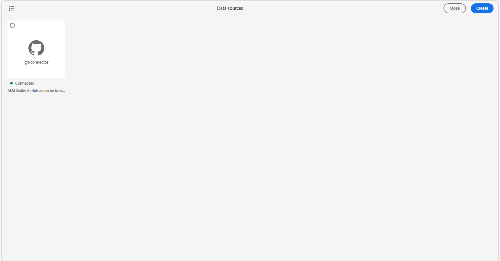

# Create and configure Git Connector from the user interface

Use the Data Sources tool in Experience Manager Guides to create and configure a Git connector from the user interface. After you configure the connector successfully, you can use it to import content from a Git repository into Experience Manager Guides.

1. Select the **Adobe Experience Manager** link at the top and choose **Tools**. 
1. Select **Guides** from the list of tools.
1. Select the **Data Sources** tile. The **Data Sources** page is displayed. 
1. Select **Create**.
1. From the list of datasource connectors, select **GitHub**.

    {width="600"}

1. Select **Next**. 
1. Enter the configuration and connection details. 

    {width="600"}

    >[!TIP]
    >
    >* Hover over  near the field to view more details about it.
    > * Fields with * are mandatory. For example, you can enter the following details for the ElasticSearch connector.

    * **Name**: Enter the name of the data source.
    * **Target AEM root path**: Enter the path in the AEM repository where content imported from Git should be stored.
    * **File type filter (inclusion)**: Specify the file types to include during import.
    * **Excluded path (regex)**: Specify path patterns to exclude from import.
    * **Authentication type**: Select the authentication type from the drop-down list. For example: Basic *username-password authentication* for personal or private Git repositories, and *No-auth* for public repository URLs.
    * **Repository URL**: Enter the Git repository URL from which content should be imported.
    * **Branch**: Enter the branch to use for content import.

1. Test the connection. The **Test connection** button is enabled only after you enter the required details. If the connection details are correct, a success message appears. Otherwise, an error message appears.

    {width="600"}

1. Select **Save** on the top to save the connector. 

    The Save button is enabled only after all required details are entered and the connection is successful. If the connector is saved successfully, you can view the configured Github connector on the **Data sources** page. 

    {width="600"}

