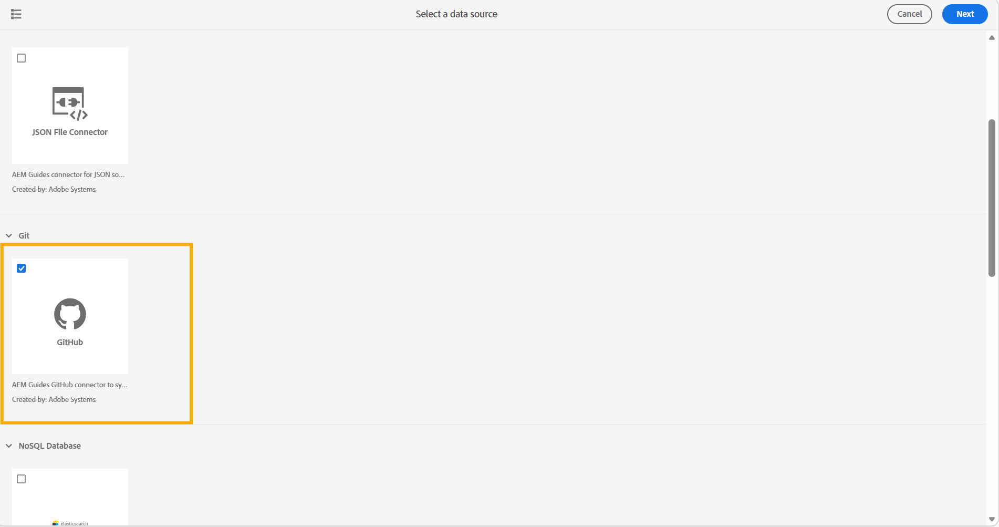
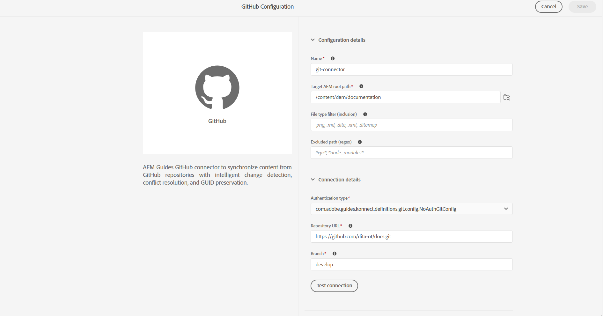
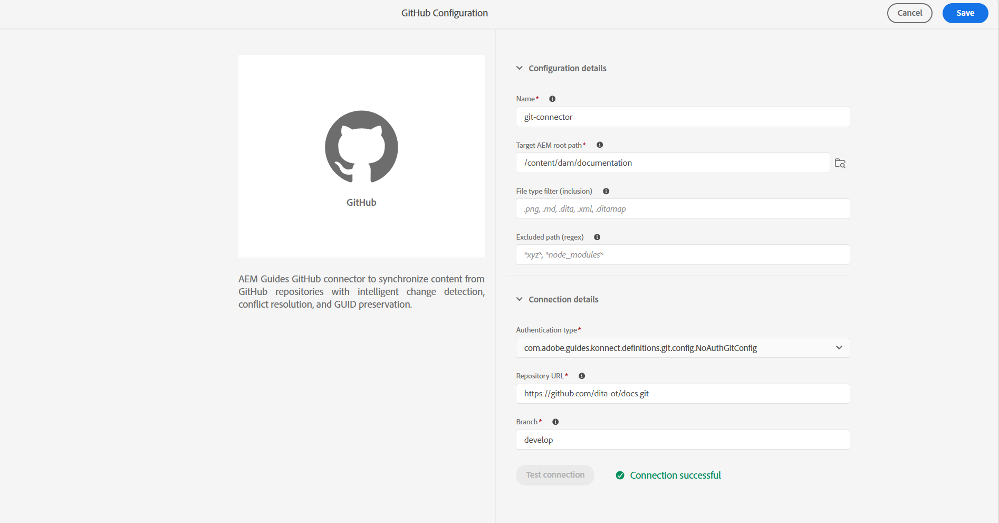
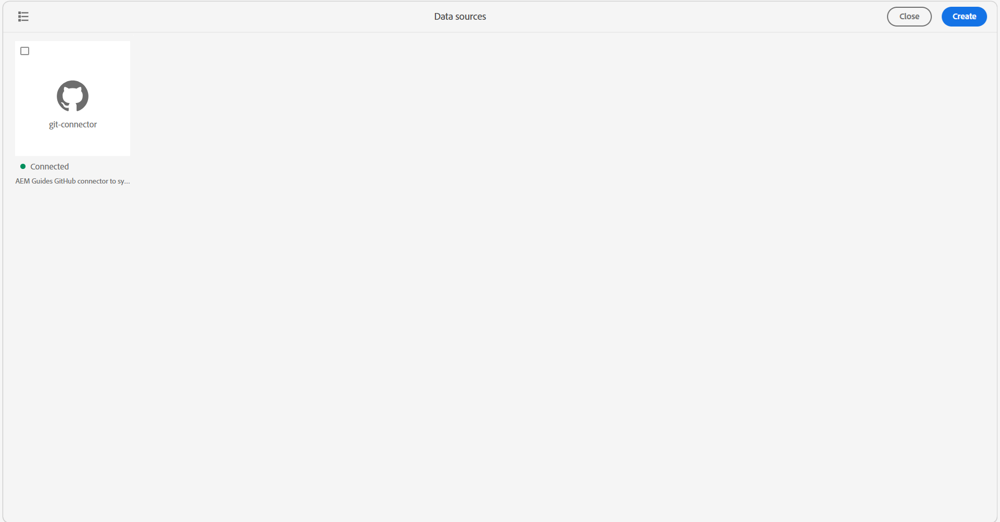

# Create and configure Git Connector from the user interface

Use the Data Sources tool in Experience Manager Guides to create and configure a Git connector from the user interface. After you configure the connector successfully, you can use it to import content from a Git repository into Experience Manager Guides.

>[!NOTE]
>
> Before you begin, ensure that Git Connector is deployed to your Cloud Manager project. For details, view [Add Git Connector to your Cloud Manager project.](#add-git-connector-to-your-cloud-manager-project)


1. Select the **Adobe Experience Manager** link at the top and choose **Tools**. 
1. Select **Guides** from the list of tools.
1. Select the **Data Sources** tile. The **Data Sources** page is displayed. 
1. Select **Create**.
1. From the list of datasource connectors, select **GitHub**.

    {width="600"}

1. Select **Next**. 
1. Enter the configuration and connection details. 

    {width="600"}

    >[!TIP]
    >
    >* Hover over  near the field to view more details about it.
    >* Fields with * are mandatory. For example, you can enter the following details for the ElasticSearch connector.

    * **Name**: Enter the name of the data source.
    * **Target AEM root path**: Enter the path in the AEM repository where content imported from Git should be stored.
    * **File type filter (inclusion)**: Specify the file types to include during import.
    * **Excluded path (regex)**: Specify path patterns to exclude from import.
    * **Authentication type**: Select the authentication type from the drop-down list. Currently, **Personal Access Token (PAT)** is the only supported authentication method. Enter the PAT during connector setup to authenticate and access the Git repository. 
    
        Learn how to [Generate a GitHub personal access token](#generate-a-github-personal-access-token).
    * **Repository URL**: Enter the Git repository URL from which content should be imported.
    * **Branch**: Enter the branch to use for content import.

1. Test the connection. The **Test connection** button is enabled only after you enter the required details. If the connection details are correct, a success message appears. Otherwise, an error message appears.

    {width="600"}

1. Select **Save** on the top to save the connector. 

    The Save button is enabled only after all required details are entered and the connection is successful. If the connector is saved successfully, you can view the configured Github connector on the **Data sources** page. 

    {width="600"}

## Add Git Connector to your Cloud Manager project

Before Git Connector is available to configure from the **Data Sources** page, it must be embedded as a dependency in your AEM project. Perform the following steps to add the dependency:

1. In your AEM project's `all/pom.xml`, add Git Connector as a dependency under `<dependencies>`:

    ```xml
    <dependency>
        <groupId>com.adobe.guides.konnect.definitions</groupId>
        <artifactId>git-connector-all</artifactId>
        <version>1.0.0</version>
        <type>zip</type>
        <scope>provided</scope>
    </dependency>
    ```

1. In the same `pom.xml`, add the dependency to the `<embeddeds>` section of the `filevault-package-maven-plugin` configuration:

    ```xml
    <embedded>
        <groupId>com.adobe.guides.konnect.definitions</groupId>
        <artifactId>git-connector-all</artifactId>
        <type>zip</type>
        <target>/apps/YOUR-PROJECT-packages/application/install</target>
    </embedded>
    ```

    Replace `YOUR-PROJECT` with your project's package name.

1. Commit and push the changes to your Cloud Manager Git repository, then run the pipeline to deploy them.

Once the pipeline completes, Git Connector is installed in your environment and available to configure from the **Data Sources** page.

## Generate a GitHub personal access token

Git Connector uses a GitHub personal access token (PAT) to authenticate with your repository. Generate a token with the following scopes before you configure the connector.

1. Sign in to GitHub and go to **Settings > Developer settings > Personal access tokens > Tokens (classic)**, or go directly to [https://github.com/settings/tokens](https://github.com/settings/tokens).

1. Select **Generate new token > Generate new token (classic)**.

1. In the **Note** field, enter a descriptive name, such as `AEM Guides Konnect Connector`.

1. Under **Expiration**, choose a period based on your organization's security policy.

1. Under **Select scopes**, enable the following scopes:

    - **repo**: Select the top-level checkbox. All sub-scopes are selected automatically, granting read/write access to repository content, commit status, and deployments.
    - **admin:org**: Select only **read:org**. This is required to resolve organization and team membership.
    - **admin:repo_hook**: Select only **read:repo_hook**. This is required to read existing webhooks.

1. Select **Generate token**.

Copy the token immediately and store it securely, it will be displayed only once. If you lose it, you'll need to generate a new token and update the connector's **Authentication type** field with the new value.