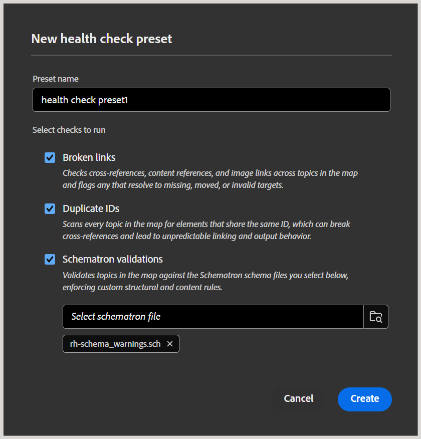

# Create and manage health check presets

As an Administrator, you can configure the health check feature at a folder-profile level in Experience Manager that allows Authors and Publishers to run content health checks on a DITA map. This includes early detection of issues such as broken links, duplicate IDs, and Schematron validation failures across a map before publishing, instead of checking each file individually. Which checks are run is defined by a health check preset, a set of rules that Authors and Publishers can select and run.

This article provides information on creating and managing health check presets.

## Create a health check preset

Perform the following steps to create a health check preset at a folder-profile level:

1. Go to [Workspace settings](./workspace-settings.md) and select **Health check** from the list. 
1. In the **Health check presets** panel, select **New**. 

    
1. The **New health check preset** dialog is displayed. Add a preset name and select the rules or checks you want to include - available options are Broken links, Duplicate IDs, and Schematron validations. 

    
1. Select **Create**.
1. Select **Save** to save the setting. 

This preset is now available to Authors and Publishers. For Authors, the **Run health check** option is displayed in the Options menu of a map in the Map view, in the Health check report panel, allowing them to run a health check on the selected map using one of the health check presets configured for their profile. For details, view [Additional features in Map editor](../user-guide/map-editor-other-features.md#run-health-check-on-a-map).

For Publishers, the **Run health check before output generation** toggle is displayed in the preset panel, which they can enable or disable as per the requirement. When enabled, the health check report is appended to the logs at the start of the publishing process, but does not block output generation. 

## Manage health check presets

Once created, the preset is added to the Health check presets panel from where you can perform the edit, duplicate, or remove operations on the preset.

- **Edit**: Allows you to edit the preset fields such as the name of the preset, the checks (select or unselect checks), and add or remove Schematron files attached to the preset. 
- **Duplicate**: Creates a duplicate of the preset in the same list.
- **Remove**: Removes the preset from the panel.

Select **Save** to save your changes.
