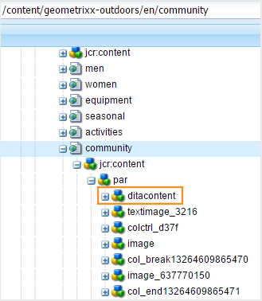

# Configure output generation settings {#id181AI0B0E30}

AEM Guides comes with a lot of configuration options for you to customize the output generation process. This topic covers all configurations and customizations that would help you set up your output generation process.

## Configure the Baseline tab on the DITA map dashboard {#id223MD0D0YRM}

The following tabs provide instructions to hide the Baseline tab on the DITA map dashboard based on your Experience Manager Guides setup: Cloud Service or On-Premise.

>[!BEGINTABS]

>[!TAB Cloud Service]

1.  Use the instructions given in [Configuration overrides](download-install-config-override.md#) to create the configuration file.
1.  In the configuration file, provide the following \(property\) details to configure the baseline tab on the map dashboard.

|PID|Property Key|Property Value|
|---|------------|--------------|
|`com.adobe.fmdita.config.ConfigManager`|`hide.tabs.baseline`|Boolean\(`true/false`\).**Default value**: `true`|

>[!NOTE]
>
> This configuration is enabled by default and the Baseline tab is not available on the map dashboard.

>[!TAB On-Premise]

1.  Open the Adobe Experience Manager Web Console Configuration page.

    The default URL to access the configuration page is:

    ```http
    http://<server name>:<port>/system/console/configMgr
    ```

1.  Search for and click on the **com.adobe.fmdita.config.ConfigManager** bundle.

1.  Select the **Hide Baseline Tab** option.

1.  Click **Save**.

>[!NOTE]
>
> This configuration is disabled by default and the Baseline tab is available on the map dashboard.

>[!ENDTABS]


## Configure blended publishing within an existing AEM Site {#id1691I0V0MGR}

If you have an AEM Site that contains DITA content, you can configure your AEM Site output to publish DITA content to a predefined location within your site. For example, in the following screenshot of an AEM Site page, the `ditacontent` node is reserved to store DITA content:



The remaining nodes in the page are authored directly from the AEM Site editor. Configuring the publish setting to publish DITA content to a predefined location ensures that none of your existing non-DITA content gets modified by the AEM Guides publishing process.

You need to perform the following configurations on your existing site to allow publishing of DITA content to a predefined node:

-   Configure your site's template properties

-   Add nodes in your site to publish DITA content


The following tabs provide instructions to configure your existing site's template properties based on your Experience Manager Guides setup: Cloud Service or On-Premise.

>[!BEGINTABS]

>[!TAB Cloud Service]

1.  Use the Package Manager to download /libs/fmdita/config/templates/default file.

    >[!NOTE]
    >
    > Do not make any customizations in the default configuration files available in the `libs` node. You must create an overlay of the `libs` node in the `apps` node and update the required files in the `apps` node only.

1.  Add the following properties:

    |Property name|Type|Value|
    |-------------|----|-----|
    |`topicContentNode`|String|Specify the node name where you would like to publish the DITA content. For example, the default node where AEM Guides publishes DITA content is: <br> `jcr:content/contentnode`|
    |`topicHeadNode`|String|Specify the node name where you would like to store the metadata information of your DITA content. For example, the default node where AEM Guides stores metadata information is: <br> `jcr:content/headnode`|


Next time when you publish any DITA content using your site's template configurations, the content gets published into the nodes specified in the `topicContentNode` and `topicHeadNode` properties.

>[!TAB On-Premise]

1.  Log into AEM and open the CRXDE Lite mode.

1.  Navigate to your site's template configuration node. For example, AEM Guides stores the default template configurations in the following node:

    `/libs/fmdita/config/templates/default`

    >[!NOTE]
    >
    > Do not make any customizations in the default configuration files available in the `libs` node. You must create an overlay of the `libs` node in the `apps` node and update the required files in the `apps` node only.

1.  Add the following properties:

    |Property name|Type|Value|
    |-------------|----|-----|
    |`topicContentNode`|String|Specify the node name where you would like to publish the DITA content. For example, the default node where AEM Guides publishes DITA content is: <br>`jcr:content/contentnode`|
    |`topicHeadNode`|String|Specify the node name where you would like to store the metadata information of your DITA content. For example, the default node where AEM Guides stores metadata information is: <br>`jcr:content/headnode`|


The following screenshot shows the properties added in the default template node of AEM Guides:

{width="800"}

Next time when you publish any DITA content using your site's template configurations, the content gets published into the nodes specified in the `topicContentNode` and `topicHeadNode` properties.

However, for existing sites, you must manually add the `topicContentNode` and `topicHeadNode` nodes.

Perform the following steps to add the required nodes to your existing site:

1.  Log into AEM and open the CRXDE Lite mode.

1.  Locate `jcr:content` within your site node.

1.  Add `topicContentNode` and `topicHeadNode` nodes with the same name that you specified in the site's template configurations.

>[!ENDTABS]

## Configure Base Output Location for publishing

The following tabs provide instructions to configure the base output location based on your Experience Manager Guides setup: Cloud Service or On-Premise.

>[!BEGINTABS]

>[!TAB Cloud Service]

1. Use the instructions given in [Configuration overrides](download-install-config-override.md) to create the configuration file.

1. In the configuration file, provide the following (property) details to configure the base output location:

    |PID|Property Key|Property Value|
    |---|---|---|
    |`com.adobe.fmdita.config.ConfigManager`|`base.output.path`| **Default value:** "/content/dam/fmdita-outputs"|

>[!TAB On-Premise]    

1.  Open the Adobe Experience Manager Web Console Configuration page.

    The default URL to access the configuration page is:

    ```http
    http://<server name>:<port>/system/console/configMgr
    ```

1.  Search for and select the *com.adobe.fmdita.config.ConfigManager* bundle.

1.  Update the property **Base Output Location** to specify the default path in the AEM repository where the PDF will be saved after publishing. Additionally, if an invalid path is entered, it will automatically revert to the default path: `/content/dam/fmdita-outputs`.

1.  Click **Save**.

>[!ENDTABS]

## Use metadata in publishing output through DITA-OT {#id191LF0U0TY4}

AEM Guides provides a way to pass custom metadata while publishing output using DITA-OT. As an administrator and a Publisher you would need to perform the following tasks to configure and use custom metadata in the published output:

-   As an administrator, add the required metadata in the system so that it is made available on the Properties page of the DITA map.

-   As an administrator, add the custom metadata in the metadata list so that it shows up in the DITA map console.

-   As a Publisher, configure and add the custom metadata with the DITA map and generate the required output.


To add the required metadata in the system, perform the following steps:

1.  Log into Adobe Experience Manager as an administrator.

1.  Click on the Adobe Experience Manager link at the top and choose **Tools**.

1.  Select **Assets** from the list of tools.

1.  Click on the **Metadata Schemas** tile.

    The Metadata Schema Forms page is displayed.

1.  Select the **default** form from the list.

    >[!NOTE]
    >
    > The properties displayed on the Properties page for a DITA map are taken from this form.

1.  Click **Edit**.

1.  Add the custom metadata that you want to use in your published outputs. For example, we will add audience metadata using the following steps:

    1.  From the **Build Form** components list, drag-and-drop **Single Line Text** component onto the form.

    2.  Select the new field to open the **Settings** of the field.

    3.  In the **Field Label**, enter the metadata name— Audience.

    4.  In the **Map to Property** setting, specify ./jcr:content/metadata/<name of the metadata\>. For our example, we will set it to ./jcr:content/metadata/audience.

    Using these steps, add all required metadata parameters.

1.  Click **Save**.


The new parameter now shows up on the Properties page for all DITA maps.


Next, you need to make the custom metadata available in the DITA map console. The following tabs provide instructions to make the custom metadata available on the DITA map dash board based on your Experience Manager Guides setup: Cloud Service or On-Premise. 

>[!BEGINTABS]

>[!TAB Cloud Service] 

1.  Use the package manager to access the metadataList file available at the following location in your Cloud Manager's Git repository:

    /libs/fmdita/config/metadataList

    >[!NOTE]
    >
    > The metadataList file contains a list of properties that are shown in the **Properties** drop-down list of a DITA map in the map dashboard. By default, there are four properties listed in this file— docstate, dc:language, dc:description, and dc:title.

1.  Add the custom metadata that you have added in the Metadata Schema Forms page. For our example, add audience parameter to the end of the default list.

>[!TAB On-Premise]

1.  Log into AEM and open the CRXDE Lite mode.

1.  Access the metadataList file available at the following location:

    /libs/fmdita/config/metadataList

    >[!NOTE]
    >
    > The metadataList file contains a list of properties that are shown in the **Properties** drop-down list of a DITA map in the map dashboard. By default, there are four properties listed in this file— docstate, dc:language, dc:description, and dc:title.

1.  Add the custom metadata that you have added in the Metadata Schema Forms page. For our example, add audience parameter to the end of the default list.

1.  Click **Save All**.

>[!ENDTABS]

Now the custom metadata will show up in the DITA map console's **Properties** drop-down list.

Lastly, as a Publisher, you need to include the custom metadata in the published output. To process the custom metadata while generating the output, perform the following steps:

1.  In the Assets UI, navigate to the DITA map that you want to publish.

1.  Select the DITA map file and open its properties page.

1.  On the Properties page, specify the value for the custom metadata. For our example, we have specified a value of External for the audience parameter.

    

1.  Click **Save & Close**.

1.  Click on the DITA map file to open the DITA map console.

1.  In the **Output Presets** tab, select the output preset that you want to use to generate the output.

1.  Click **Edit**.

1.  From the **Properties** drop-down list, select the properties that you want to pass on to the publishing process.

    


The selected properties/metadata are passed on to the publishing process and are made available in the final output.

### Validate metadata passing to the DITA-OT for processing (only for Cloud Service)

In order to validate the metadata values passed to the DITA-OT, local environment using a cloud ready jar can be used. Since we can't access local file system on cloud, only way to validate metadata file is via cloud ready jar.

-   File name: metadata.xml
-   File location: crx-quickstart/profiles/ditamaps/<ditamap-1234\>

    To access metadata.xml:

    -   Login to the server location where AEM instance is running.
    -   Migrate to crx-quickstart/profiles/ditamaps/<newly-created-directory-name\>/metadata.xml.
-   Sample file format:

    **metadata.xml**

    ```XML
    <?xml version="1.0" encoding="UTF-8" standalone="no"?>
    <root>
       <Path id="/absolutePath/sampleMap.ditamap">
          <metadata>
             <meta isArray="false" key="dc:description">This is a file</meta>
             <meta isArray="false" key="dc:title">Myfile</meta>
             <meta isArray="true" key="multivalueText">One;Two;Three</meta>
          </metadata>
       </Path>
       <Path id="/absolutePath/sampleTopic.dita">
          <metadata>
             <meta isArray="false" key="dc:description">description for the accountability</meta>
             <meta isArray="false" key="dc:title">accountability title</meta>
             <meta isArray="true" key="multivalueText">value1</meta>
          </metadata>
       </Path>
    </root>
    ```


-   isArray: A Boolean attribute that defines whether the metadata is a multi-value \(Array\) or not. The values are delimited by a semicolon.
-   Path id: Absolute path to the file stored under the temp directory.

>[!NOTE]
>
> If particular metadata is not present for the file, <meta\> tag with the key will not appear as the property for that file in the metadata.xml file.

## Configure the DITA-OT command line argument field to accept root map metadata (only for Cloud Service)

To use the DITA-OT command line argument field to pass root map metadata, perform the following steps:

1.  Use the instructions given in [Configuration overrides](download-install-config-override.md#) to create the configuration file.
1.  In the configuration file, provide the following \(property\) details to configure the DITA-OT command line argument field in the Preset:

|PID|Property Key|Property Value|
|---|------------|--------------|
|`com.adobe.fmdita.config.ConfigManager`|`pass.metadata.args.cmd.line`|Boolean\(`true/false`\).**Default value**: `true`|

- Setting the property value to **true** enables the DITA-OT command line functionality, allowing you to pass the metadata through DITA-OT command line.
- Setting the property value to **false** disables the DITA-OT command line functionality. You can then, use the Property field in the Preset to pass the metadata. 

## Customize DITA map console {#id188HC08M0CZ}

AEM Guides gives you the flexibility of extending the capabilities of the DITA map console. For example, if you have a set of reports that are different from what is available in the AEM Guides, you can add such reports to the map console. To customize the map console, you need to create an AEM Client Library \(or ClientLib\) that will contain the code to perform the functionality that you need.

>[!NOTE]
>
> Direct modification to page components is not recommended, as it will get overwritten by new releases of the product.

AEM Guides provides the `apps.fmdita.dashboard-extn` category for customizing map console. Whenever the map console is loaded, the functionality created under the `apps.fmdita.dashboard-extn` category gets executed and loaded.

>[!NOTE]
>
> For more information about creating AEM Client Library, see [Using Client-Side Libraries](https://experienceleague.adobe.com/docs/experience-manager-cloud-service/implementing/developing/full-stack/clientlibs.html?lang=en).

## Handle image rendition during output generation {#id177BF0G0VY4}

AEM comes with a set of default workflows and media handles to process assets. In AEM, there are pre-defined workflows to handle asset processing for the most common MIME types. Typically, for every image that you upload, AEM creates multiple renditions of the same in binary format. These renditions may be of different size, with a different resolution, with an added watermark, or some other changed characteristic. For more information about how AEM handles assets, see [Processing Assets Using Media Handlers and Workflows](https://experienceleague.adobe.com/docs/experience-manager-cloud-service/assets/asset-microservices-overview.html?lang=en) in AEM documentation.

AEM Guides allows you to configure which image rendition to use at the time of generating output for your documents. For example, you can choose from one of the default image renditions or create one and use the same to publish your documents. Image rendition mapping for publishing your documents is stored in the `/libs/fmdita/config/ **renditionmap.xml**` file. A snippet of `renditionmap.xml` file is as follows:

>[!NOTE]
>
> It is recommended that you create a copy of the `renditionmap.xml` file in the `apps` folder for all customizations.

```XML
<renditionmap>
   <mapelement>
      <mimetype>image/png</mimetype>
      <rendition output="AEMSITE">cq5dam.web.1280.1280.jpeg</rendition>
      <rendition output="PDF">original</rendition>
      <rendition output="HTML5">cq5dam.web.1280.1280.jpeg</rendition>
      <rendition output="HTML5" outputName="ditahtml5">cq5dam.thumbnail.319.319.png</rendition>
      <rendition output="EPUB">cq5dam.web.1280.1280.jpeg</rendition>
      <rendition output="CUSTOM">cq5dam.web.1280.1280.jpeg</rendition>
   </mapelement>
...
</renditionmap>
```

The `mimetype` element specifies the MIME type of the file format. The `rendition output` element specifies the type of output format and the name of rendition \(for example, `cq5dam.web.1280.1280.jpeg`\) that should be used for publishing the specified output. You can specify the image renditions to use for all supported output formats - AEMSITE, PDF, HTML5, EPUB, and CUSTOM. 

If you want to specify different image renditions for an output preset, you can use the `outputName` attribute, with its value set to the title of the preset, to define custom renditions for specific output presets under the same output type. This is useful when you need different image sizes or formats for different publishing scenarios.

For example:


```XML
<renditionmap>
   <mapelement>
      <mimetype>image/png</mimetype>
      
      <rendition output="HTML5">cq5dam.web.1280.1280.jpeg</rendition>
      <rendition output="HTML5" outputName="ditahtml5">cq5dam.thumbnail.319.319.png</rendition>
      
   </mapelement>
...
</renditionmap>
```

In the above renditions, when the `outputName` attribute is set to `ditahtml5`(preset title), the `ditahtml5` preset uses the thumbnail image `cq5dam.thumbnail.319.319.png`. If the `outputName` attribute is not specified, all HTML5 outputs use the larger image `cq5dam.web.1280.1280.jpeg`.

If the specified rendition is not present, then AEM Guides publishing process first looks for the web rendition of the given image. If even the web rendition is not found, then the original rendition of the image is used.

>[!NOTE]
>
> These image renditions control only the output generation. An image's web rendition is used when you open a document for preview or review.

## Configure auto-purging period for output history {#id19AAI070V8Q}

When you generate an output, the output gets created along with the output logs. For large DITA maps, these logs can take a large amount of space in your repository. By default, the logs are stored at the following location in the repository:

`/var/dxml/metadata/outputHistory`

Over a period of time, the collective size of all log files could run into GBs. AEM Guides allows you to configure a time period to keep these log files in the repository. After the specified time period, the logs along with output generation history are deleted from the repository.

>[!NOTE]
>
> The output generation history is the log entry in the Generated Outputs list in the Outputs tab.

Configuring the history purging feature impacts the output generation for all DITA maps in the repository. In the Outputs tab of a DITA map, the history is purged after the specified number of days and at the time specified in the setting.

>[!NOTE]
>
> Removing the log files and output generation history does not have any impact on the generated output.

The following tabs provide instructions to set a day and time to purge output history and logs based on your Experience Manager Guides setup: Cloud Service or On-Premise.

>[!BEGINTABS]

>[!TAB Cloud Service]

Use the instructions given in [Configuration overrides](download-install-config-override.md#) to create the configuration file. In the configuration file, provide the following \(property\) details to set a day and time to purge output history and logs:

|PID|Property Key|Property Value|
|---|------------|--------------|
|`com.adobe.fmdita.config.ConfigManager\|output.history.purgeperiod`|Specify the number of days after which the output history along with output logs are purged. If you want to disable this feature, then set this property to 0.Everyday at the specified time the purging process is executed on outputs generated before the number of days specified in this property. | **Default value**: 5|
|`output.history.purgetime`|Specify the time when the purging process is initiated. | **Default value**: 0:00 \(or 12:00 midnight\)|

>[!TAB On-Premise]

1.  Open the Adobe Experience Manager Web Console Configuration page.

    The default URL to access the configuration page is:

    ```http
    http://<server name>:<port>/system/console/configMgr
    ```

1.  Search for and click on the **com.adobe.fmdita.config.ConfigManager** bundle.

1.  In the **Output History Purging Period** property, specify the number of days after which the output history along with output logs are purged. By default, it is set to 5 days. If you want to disable this feature, then set this property to 0.

1.  In the **Output History Purging Time** property, specify the time when the purging process is initiated. By default, it is set to 0:00 \(or 12:00 midnight\). Everyday at this time, the purging process is executed on outputs generated before the number of days specified in the **Output History Purging Period** property.

    >[!NOTE]
    >
    > By default, the purging feature is executed every midnight on outputs older than 5 days.

1.  Click **Save**.

>[!ENDTABS]

## Change the recently generated outputs list limit {#id1679JH0H0O2}

You can change the maximum number of generated outputs that are displayed in the Outputs tab for a DITA map.

>[!BEGINTABS]

>[!TAB Cloud Service] 

Use the instructions given in [Configuration overrides](download-install-config-override.md#) to create the configuration file. In the configuration file, provide the following \(property\) details to change the number of outputs to display in the list:

|PID|Property Key|Property Value|
|---|------------|--------------|
|`com.adobe.fmdita.config.ConfigManager`|`output.historylimit`|Integer value.<br> **Default value**: 25|

>[!TAB On-Premise]

By default, a list of last 25 generated outputs is shown. To change the number of outputs to display in the list, update the **Outputs List Limit** setting in the `com.adobe.fmdita.config.ConfigManager` bundle.

>[!ENDTABS]

>[!TIP]
>
> See the *Output history* section in the [Best practices guide](https://helpx.adobe.com/content/dam/help/en/xml-documentation-solution/cs-mar-22/Adobe-Experience-Manager-Guides_Best-Practices_EN.pdf) for best practices around working with output history.

## Output generation performance optimization (only for On-Premise) {#id176LB050VUI}

AEM Guides allows you to configure the output generation processes pool size that controls the number of output generation processes that run concurrently. By default, the process pool size is set to number of processing cores available in your system plus one. You might want to change this value to 1 in case you want sequential publishing. In this case, the first publishing task gets executed and the next publishing task is stored in the publishing queue.

To change the output generation processing pool size, update the **Generation Pool Size** setting in the `com.adobe.fmdita.publish.manager.PublishThreadManagerImpl` bundle.

## Configure FrameMaker Publishing Server (only for On-Premise) {#id1678G0Z0TN6}

You can use FrameMaker Publishing Server \(FMPS\) to generate output for your DITA content. Configuring FMPS will allow you to generate output in multiple formats supported by FMPS.

>[!NOTE]
>
> To generate output using FMPS, you need to have the FMPS server setup. For installation and configuration details, see the FrameMaker Publishing Server User Guide.

To configure AEM Guides to use FMPS, update the following properties of the `com.adobe.fmdita.config.ConfigManager` bundle in the Web Console.

>[!NOTE]
>
> Access http://<server name\>:<port\>/system/console/configMgr URL to open the Web Console.

|Property|Description|
|--------|-----------|
|FrameMaker Publishing Server Login Domain|Specify the domain name or the workgroup name on which the FrameMaker Publishing Server is hosted. Based on the FMPS version, provide the domain name as:-   **FMPS 2020**: IP address as 192.168.1.101 <br>- **FMPS 2019 and earlier**: IP address or the domain name|
|FrameMaker Publishing Server URL|Specify the URL of the FrameMaker Publishing Server. Based on the FMPS version, provide the FMPS URL as:<br>- **FMPS 2020**: `http://<fmps_ip>:<port>` \(http://192.168.1.101:7000\) <br> - **FMPS 2019 and earlier**: `http://<fmps_ip>:<port>/fmserver/v1/`|
|FMPS Version|Specify the version number of the FrameMaker Publishing Server. Based on the FMPS version, provide the version information as: <br>- **FMPS 2020**: 2020 <br> - **FMPS 2019 and earlier**: 2019 or 2017|
|FrameMaker Publishing Server Username and Password|Specify the user name and password to access the FrameMaker Publishing Server.|
|FMPS Timeout|\(*Optional*\) Specify the time \(in seconds\) for which AEM Guides waits for a response from the FrameMaker Publishing Server. If no response if received in the specified time, AEM Guides terminates the publishing task and the task is flagged as failed. <br> Default value: 300 seconds \(5 minutes\)|
|External AEM URL|*\(Optional\)* The AEM URL where the FrameMaker Publishing Server will place the generated output files. For example, `http://<server-name>:<port>/`.|
|AEM Admin Username and Password|*\(Optional\)* The user name and password for an administrator of your AEM setup. This will be used by FrameMaker Publishing Server to communicate with AEM.|
|FMPS Task Execution Wait Timeout|This setting is applicable only for FMPS 2020. Specify the time \(in seconds\) after which FMPS will stop waiting for this process to execute.|
