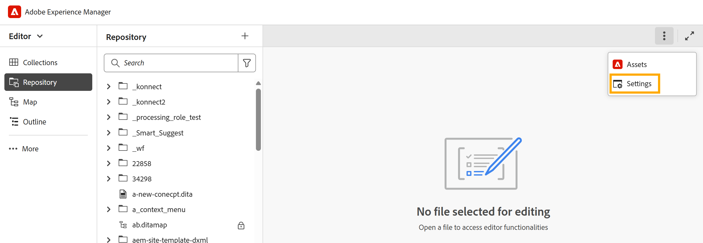

# Configure Editor settings

In the On-premise setup, the **Settings** option appears in the Editor's tab bar. In the Cloud Service setup, this option has been renamed to **Workspace settings**.

All existing configuration options available under **Editor settings** remain unchanged.

{width="650" align="left"}

To learn about the available configuration options, view [Configure Workspace settings](../cs-install-guide/workspace-settings.md).
