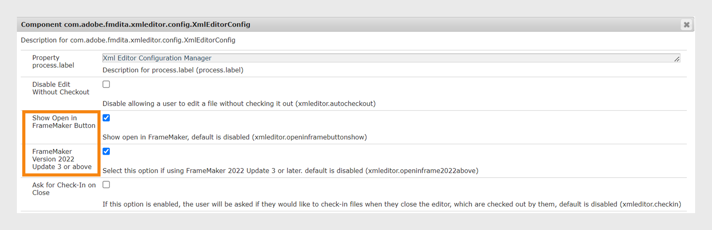

# Integrate desktop-based XML editors {#id181GB01G0HS}

There are a lot of XML editors available on the market, and you could be using one already. Adobe FrameMaker is one of the most powerful XML editors, which comes with AEM connector. Using the AEM connector in FrameMaker, you can easily connect with the AEM repository, check-out and check-in files, and edit files directly in FrameMaker. You can also configure Experience Manager Guides to launch FrameMaker from the Web Editor. Once you have the file opened in FrameMaker, you can edit and check the file back into the AEM repository.

## Enable file editing in FrameMaker from the Web Editor 

You can use FrameMaker or any other DITA editor to create and update DITA content. However, if your organization uses FrameMaker as DITA editor, then you can give your users an option to open DITA documents directly in FrameMaker from AEM.

By default, your users do not see the **Open in FrameMaker** button on the AEM toolbar. Perform the following steps to add this button on the AEM toolbar:

1.  Open the Adobe Experience Manager Web Console Configuration page.

    The default URL to access the configuration page is:

    ```http
    http://<server name>:<port>/system/console/configMgr
    ```

1.  Search for and click on the **com.adobe.fmdita.xmleditor.config.XmlEditorConfig** bundle.


1.  Select the **Show Open in FrameMaker Button** option.

1. If you are using version 4.6 and FrameMaker 2022 September release - Update 3, you must enable the **FrameMaker Version 2022 Update 3 or above** config for your users to pass on the Experience Manager Guides server details to FrameMaker. By default, it is disabled.


1.  Click **Save**.


When you enable the **Show Open in FrameMaker Button** option, then the **Open in FrameMaker** button is shown on selecting any DITA file in the AEM repository. When this option is *not enabled*, the **Open in FrameMaker** button is shown only when you select a .fm or a .book file in the repository.


