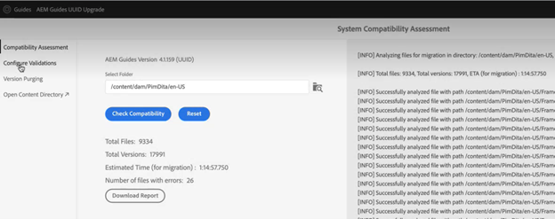
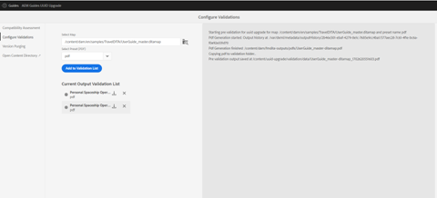
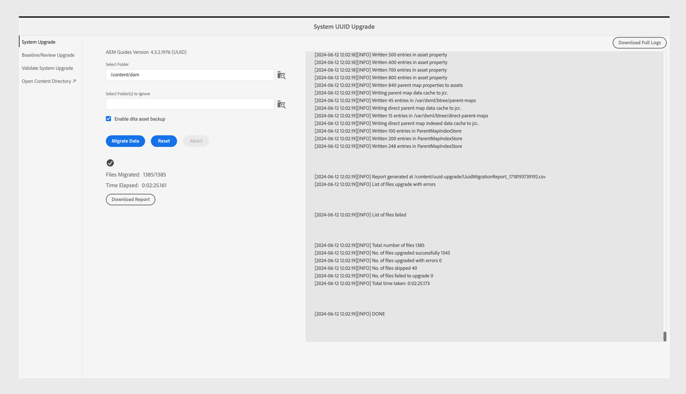
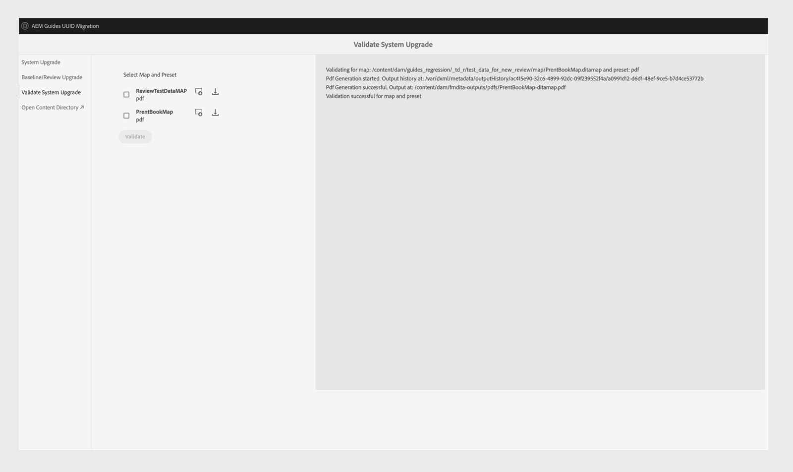

# 4.6.0 Service Pack 4 non-UUID to 4.6.1 UUID content migration

Perform these steps to migrate your content from non-UUID version 4.6.0 Service Pack 4 to UUID version 4.6.1. 

>[!IMPORTANT]
>
> * Before you start the migration process, ensure that you have:
>
>   1.  Closed all active reviews.
>   1.  Closed all translation tasks.
> * Before migrating content to the UUID server, ensure that you have a non-UUID server with a compatible AEM Guides version installed on it.
> * If you are using a version released before 4.6.0 Service Pack 4, then you need to first upgrade to version 4.6.0 Service Pack 4. Follow the [upgrade instructions](./upgrade-xml-documentation.md) specific to the licensed version of your product. 
> * If you are using a specific Service Pack released after 4.6.0 Service Pack 4, then you must uninstall that Service Pack and revert to 4.6.0 Service Pack 4. 

## Package installation

Download the required packages from Adobe Software Distribution Portal, based on your version:

1. **Pre-migration**: [com.adobe.guides.pre-uuid-migration-2.0.zip](https://experience.adobe.com/#/downloads/content/software-distribution/en/aem.html?package=%2Fcontent%2Fsoftware-distribution%2Fen%2Fdetails.html%2Fcontent%2Fdam%2Faem%2Fpublic%2Faemdox%2Fother-packages%2Fuuid-migration%2F4-0%2Fcom.adobe.guides.pre-uuid-migration-2.0.zip)
1. **Download UUID version 4.6.1**: [com.adobe.fmdita.feature-uuid-4.6.1.5886.zip](https://experience.adobe.com/#/downloads/content/software-distribution/en/aem.html?package=%2Fcontent%2Fsoftware-distribution%2Fen%2Fdetails.html%2Fcontent%2Fdam%2Faem%2Fpublic%2Faemdox%2Fother-packages%2Fuuid-migration%2F4-0%2Fcom.adobe.fmdita.feature-uuid-4.6.1.5886.zip)
1. **Migration**: [com.adobe.guides.uuid-upgrade-2.0.zip](https://experience.adobe.com/#/downloads/content/software-distribution/en/aem.html?package=%2Fcontent%2Fsoftware-distribution%2Fen%2Fdetails.html%2Fcontent%2Fdam%2Faem%2Fpublic%2Faemdox%2Fother-packages%2Fuuid-migration%2F4-0%2Fcom.adobe.guides.uuid-upgrade-2.0.zip)

## Premigration checks

Perform the following checks on non-UUID version 4.6.0 Service Pack 4:

1. Install the pre-migration package [com.adobe.guides.pre-uuid-migration-2.0.zip](https://experience.adobe.com/#/downloads/content/software-distribution/en/aem.html?package=%2Fcontent%2Fsoftware-distribution%2Fen%2Fdetails.html%2Fcontent%2Fdam%2Faem%2Fpublic%2Faemdox%2Fother-packages%2Fuuid-migration%2F4-0%2Fcom.adobe.guides.pre-uuid-migration-2.0.zip) over version 4.6.0 Service Pack 4.

   >[!NOTE]
   >
   >* You need administrator permission to execute the migration. 
   >* Fixing the files with errors before proceeding with the migration is recommended. 

1. If there are more than 100,000 DITA files in the system, update the query limit configs for the script to work:

    * Navigate to `/system/console/configMgr and increase both the configs to more than number of assets - queryLimitInMemory` and `queryLimitReads under org.apache.jackrabbit.oak.query.QueryEngineSettingsService`

1. Launch `http://<server-name>/libs/fmdita/clientlibs/xmleditor_uuid_upgrade/page.html`. 
1. Select **Compatibility Assessment** from the left panel and browse the  `/content/dam` folder path for all assets.
1. Check the compatibility to list the following information:
    * Total files
    * Estimated time for migration
    * Number of files with errors 
    * Files with GUID filename

    

1. If the error appears, then analyze the logs and fix those errors. You can re-run the compatibility matrix after fixing the errors.

1. Select **Configure Validations** from the left panel. Then, **Select map** and **Select preset** of the map to configure them. The current output validation list displays the output files present before migration and can be validated against the output files generated post-migration later. 

    By selecting multiple and large DITA maps, you can validate that all the content has been successfully migrated without issues. Selecting presets with baselines in them, also ensures that baselines and versions are migrated successfully.

    

1. (Optional) Perform version purging on the content to remove unnecessary versions and speed up the migration process. To perform version purging, select the option **Version Purge** from the migration screen and go to the user interface using the URL `http://<server- name>/libs/fmdita/clientlibs/xmleditor_uuid_upgrade/page.html`. 
   >[!NOTE]
   >
   >This utility does not remove any versions used in baselines or reviews or has any labels.   

For more details, view [purge older versions](../install-guide/version-management.md#purge-older-versions-of-dita-files).

## Migration prerequisites

1. Execute UUID migration only on an Author instance.
1. Ensure the following infrastructure readiness:
    * Author instance is upsized in terms of CPU and memory to support faster processing and additional memory needed for bulk activity. for example, if the current allocated CPU and memory are 8 vCPU and 24 GB heap, then use double the size for this activity. 
    * The overall disk space and temporary disk space `(crx-quickstart directory)` should have a buffer of 10 times what is already consumed. Once you complete the migration, you can reclaim most of the disk space by running compaction.
    * Do run **Offline Tar compaction** before starting this activity.
    * Make sure that no indexing or system maintenance is planned during the window of this migration.

1. Install the UUID version of the supported release over the non-UUID version. For example, if you're using 4.6.0 Service Pack 4 non-UUID build, you need to install UUID version 4.6.1  [com.adobe.fmdita.feature-uuid-4.6.1.5886.zip](https://experience.adobe.com/#/downloads/content/software-distribution/en/aem.html?package=%2Fcontent%2Fsoftware-distribution%2Fen%2Fdetails.html%2Fcontent%2Fdam%2Faem%2Fpublic%2Faemdox%2Fother-packages%2Fuuid-migration%2F4-0%2Fcom.adobe.fmdita.feature-uuid-4.6.1.5886.zip) and run the migration.

1. Install the uuid migration upgrade package [com.adobe.guides.uuid-upgrade-2.0.zip](https://experience.adobe.com/#/downloads/content/software-distribution/en/aem.html?package=%2Fcontent%2Fsoftware-distribution%2Fen%2Fdetails.html%2Fcontent%2Fdam%2Faem%2Fpublic%2Faemdox%2Fother-packages%2Fuuid-migration%2F4-0%2Fcom.adobe.guides.uuid-upgrade-2.0.zip).
1. Disable launchers for the following workflows using the URL: `http://<server-name>/libs/cq/workflow/content/console.html`.

    * DAM Update Asset workflow
    * DAM Metadata Writeback workflow

     >[!NOTE]
     >
     >Ideally any workflow launchers, which run on any path inside `content/dam` should be disabled.

1. Update the following configurations as per the suggested changes:

   |Configuration|Property|Value|
   |---|---|---|
   |`com.adobe.fmdita.config.ConfigManager`|Enable Post Processing Workflow Launchers|Disable|
   |`com.adobe.fmdita.config.ConfigManager`|uuid. regex|`^GUID-(?<id>.*)`|
   |`com.adobe.fmdita.postprocess.version.PostProcessVersionObservation`|Enable Version Postprocessing|Disable|
   |Day CQ Tagging Service|Enable validation (validation.enabled)|Disable|

1. Add a separate logger for: 
    * `com.adobe.fmdita.uuid` 
    * `com.adobe.guides.uuid`. 

1. (If not done earlier) If there are more than 100,000 DITA files in the system, update the `queryLimitReads` under `org.apache.jackrabbit.oak.query.QueryEngineSettingsService` to a larger value (any value greater than the number of assets present, for example 200,000).

   |PID|Property Key|Property Value|
   |---|---|---|
   |org.apache.jackrabbit.oak.query.QueryEngineSettingsService|queryLimitReads|Value: 200000   Default Value: 100000|

## Migration

1. Launch `http://<server-name>/libs/fmdita/clientlibs/xmleditor_uuid_upgrade/page.html`.

    
    >[!NOTE]
    >
    > If you choose "Enable DITA asset backup", the temporary backup files are stored under `/content/uuid-upgrade` and the DITA file backups are deleted when the migration of a file is complete.

1. Select **System upgrade** from the left panel to run the migration. It's recommended to migrate all the data at once, as the system optimally handles batching internally. Only files that are not DITA assets and are not used in any DITA assets can be skipped for migration.

1. (Optional) Select the folders for which you want to skip the migration. Use this option to migrate these folders later or skip migrating them. Ensure that these folders don't have any DITA assets and aren't referred by (and in the future won't be referred by) any DITA assets. For example, `content/dam/projects`.

1. Select *Enable dita asset backup* to create a backup of asset before migration. This backup is used to rollback in case there is an error in migrating a file. The backup is deleted, if the migration is successful. However, this slows down the migration process.

1. Start the migration. 
    >[!NOTE]
    >
    > Download the full logs and observe if there were any errors. If any error or exception is found *Do not proceed* but first fix the error. Common errors are listed at the end of this article.

1. Once the migration is complete, the report is available to download and entire logs can also be downloaded.

1. Select **Download Report** while the migration is running to check whether all files in the folder are upgraded correctly and whether all features work only for that folder.

    >[!NOTE]
    >
    > Content migration can be run on a folder level, the complete `/content/dam`, or the same folder (rerun migration).

    Also, it's important to make sure that the content migration is done for all the media assets, such as images and graphics you have used in the DITA content.

1. Once all the files are migrated, select **Baseline/Review Upgrade** from the left panel to migrate the baselines and review at the folder level.  

>[!NOTE]
>
>If you restart the system or the migration is aborted, the script will resumes when you re-run it with the same parameters as before. Contact your customer success team if you get issues due to the shutdown.

## Analyzing the reports from each step

 **Step: System Upgrade**

|Summary after process completion|How to interpret?|Action|
|---|---|---|
|Total number of files: 488| Total number of files processed under the given set of folders. | NA|
|Number of files migrated successfully: 488| Number of files migrated successfully to UUID. |NA|
|Number of files skipped: 0| Some files in the DAM repository may have subassets, and those subassets are skipped as they are not eligible for UUID migration.|NA|
|Number of files failed to upgrade: 0| If the count isn't 0, then the logs have to be analyzed for any issues.| Check the exception, you may have to fix the error and re-run the migration.|
|Total time taken: 00:01:18|||

Additionally, a list of **Files upgraded with errors** and **Files failed** during the migration process can be accessed under the summary table of the report.  
 

**Step: Upgrade Baselines**

|Summary after process completion|How to interpret?|Action|
|---|---|---|
| Total number of files: 288 |Number of DITA maps with at least 1 baseline. ||
|Number of files migrated successfully: 13|Number of DITA maps, successfully upgraded with all baselines.||
|Number of files skipped: 275| Number of DITA maps without any baseline.||
| Number of files failed to upgrade: 0| The number of baseline objects that were not valid (they were empty) is listed in the report (Excel).| Check if there are errors other than: `baselineObj not found on`|

Additionally, a list of **Files upgraded with errors** and **Files failed** during the migration process can be accessed under the summary table of the report.  

## Postmigration 

1. Once the migration is completed, select **Validate system upgrade** from the left panel and validate the output files before and after the migration to ensure that the migration is successful. 

    

1. After migrating the server successfully enable the following workflows and configurations (including all the other workflows that were disabled initially during the migration) to continue working on the server:

    * DAM Update Asset workflow
    * DAM Metadata workflow

    >[!NOTE]
    >
    >Ideally any workflow launchers, which were running on any path inside `content/dam` before the migration should be enabled.

1. Enable the following configurations:

    |Configuration|Property|Value|
    |---|---|---|
    |`com.adobe.fmdita.config.ConfigManager`|*Enable Post Processing Workflow Launchers*|Enable|
    |`com.adobe.fmdita.postprocess.version.PostProcessVersionObservation`|*Enable Version Postprocessing*|Enable|
    |Day CQ Tagging Service|*Enable validation (validation.enabled)*|Enable|

1. Assets properties to review post migration:

    |Configuration|Property|Pre migration value on Non-UUID|Post migration value on UUID|
    |---|---|---|---|
    |`com.adobe.fmdita.config.ConfigManager`|**Use title for AEM Site page names**|False (default value)|True|

    >[!NOTE]
    >
    > If before migration, the property, **Use title for AEM Site page names** inside `com.adobe.fmdita.config.ConfigManager`, set to *False*, then after migration this property needs to be updated.

1. After the validation is done, most of the disk space can be reclaimed by running compaction (refer to `https://experienceleague.adobe.com/docs/experience-manager-65/deploying/deploying/revision-cleanup.html?lang=en`).
