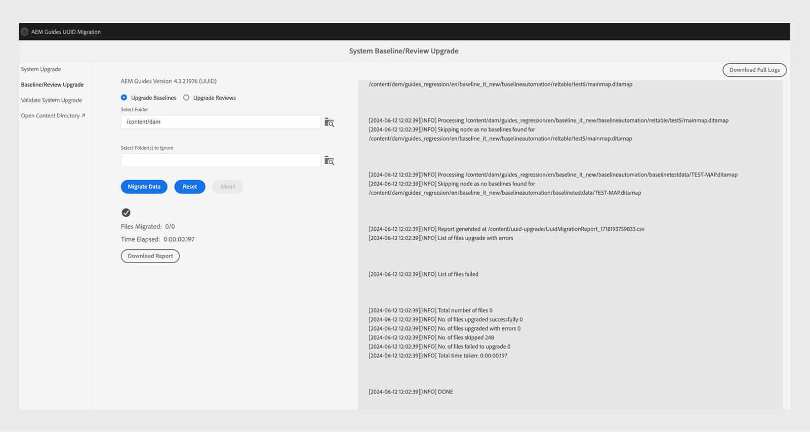

# Migrate non-UUID versioned content

Perform these steps to migrate your non-UUID versioned content to UUID content. 

## Compatibility matrix

|Current AEM Guides version (non-UUID)|Required Version to migrate to UUID| Supported Upgrade path| 
|---|---|---|
| 3.8.5|  4.0 non-UUID|Install 4.1 (UUID) and run the migration|
|4.0, 4.0.x, 4.1, or 4.1.x  | Same as current non-UUID| Install 4.1 (UUID) and run the migration|
|4.2 or Higher|   NA |Not supported yet|
|4.3.x or Higher|   4.3.0 non-UUID |Install 4.3.1 (UUID) |

## Required packages for 4.1 

1. **Pre-migration**: `com.adobe.guides.pre-uuid-migration-1.0.9 .zip`
1. **Migration**: `com.adobe.guides.uuid-upgrade-1.1.19.zip`

## Required packages for 4.3

1. **Pre-migration**: `com.adobe.guides.pre-uuid-migration-1.1.3.zip`
1. **Migration**: ` com.adobe.guides.uuid-upgrade-1.1.15.zip`

## Pre-migration

1. (Optional) Perform version purging on the content to remove unnecessary versions and speed up the migration process. To perform version purging on version 4.1 (NOT supported on 4.0), install the package `com.adobe.guides.version-purge-1.0.11.zip`, and go to the user interface using this URL `http://<server-name> /libs/fmdita/clientlibs/xmleditor_version_purge/page.html`. 

    >[!NOTE]
    >
    >This utility does not remove any versions used in baselines or reviews or has any labels.
1. Install the pre-migration package (`ccom.adobe.guides.pre-uuid-migration-1.1.2 .zip`).

   >[!NOTE]
   >
   >* You need administrator permission to execute the migration. 
   >* Fixing the files with errors before proceeding with the migration is recommended. 
1. Open `http://<server-name>/libs/fmdita/clientlibs/xmleditor_uuid_upgrade/page.html`. 
1. Select **Compatibility Assessment**  from the left panel and browse a folder path.
1. Check the compatibility to list the following information:
    * Total files
    * Total versions
    * Estimated time for migration
    * Number of files with errors 

{width="800" align="left"}

1. Select **Configure Validations** from the left panel. Then **Select map** and **Select preset** of the map to configure them. The current output validation list will display the output files present before migration and can be validated against the output files generated post-migration later. 

{width="800" align="left"}

## Migration 

### Step 1: Update configuration

1. Ensure that the free space available is at least 10 times the space taken by AEM (crx-quickstart directory) during migration. Once you complete the migration , you can reclaim most of the disk space by running compaction (refer to [Revision Cleanup](https://experienceleague.adobe.com/docs/experience-manager-65/deploying/deploying/revision-cleanup.html?lang=en)).

1. Enable *Enable Post Processing Workflow Launchers* in `com.adobe.fmdita.config.ConfigManager` and *Enable Version Postprocessing* in `com.adobe.fmdita.postprocess.version.PostProcessVersionObservation.`

1. Install the UUID version of the supported release over the non-UUID version. For example, if you're using a 4.0 non-UUID build or a 4.1 non-UUID build, you need to install UUID version 4.1.

1. Install the new package for uuid migration (`com.adobe.guides.uuid-upgrade-1.1.13`).

1. Disable the following workflows and any other workflow that runs on `/content/dam` using launchers in `http://localhost:4502/libs/cq/workflow/content/console.html`.

    * DAM Update Asset workflow
    * DAM Metadata Writeback workflow

1. Disable *Enable Post Processing Workflow Launchers* in `com.adobe.fmdita.config.ConfigManager` and disable *Enable Version Postprocessing* in `com.adobe.fmdita.postprocess.version.PostProcessVersionObservation`. 

1. Disable the property Enable validation (`validation.enabled`) in Day CQ Tagging Service.

1. Ensure that `uuid.regex` property folder is set properly in `com.adobe.fmdita.config.ConfigManager`. If it's blank, set it to the default value - `^GUID-(?<id>.*)`.
1. Add a separate logger for `com.adobe.fmdita.uuid.upgrade.UuidUpgrade` The browser response is also available at `/content/uuid-upgrade/logs`.

### Step 2: Run the migration and validate

#### Install the migration package

1. Open `http://<server-name>/libs/fmdita/clientlibs/xmleditor_uuid_upgrade/page.html`.

{width="800" align="left"}

1. Select **System upgrade** from the left panel to run the migration. Start on a folder with smaller data before running it on `/content/dam`.

1. Select **Download Report** while the migration is running to check whether all files in the folder are upgraded correctly and whether all features work only for that folder.

>[!NOTE]
>
> Content migration can be run on a folder level or the complete `/content/dam` or on the same folder (rerun migration).

Additionally, it's important to make sure that the content migration is also done for all the media assets, such as images and graphics that you have used in the DITA content.

#### Baseline and Review migration

Select **Baseline/Review Upgrade** from the left panel to migrate the baselines and review at folder level.  

{width="800" align="left"}

### Step 3: Restore the configuration

Once the server is migrated successfully, enable post-processing, tagging, and the following workflows (including all the other workflows which are disabled initially during the migration) to continue working on the server.

* DAM Update Asset workflow
* DAM Metadata workflow

>[!NOTE]
>
>If some files are not processed or be corrupted before migration, and they would be corrupted before migration and remain corrupted even after migration.

## Migration validation

Once the migration is completed, select **Validate system upgrade** from the left panel and validate the output files before and after the migration to ensure the migration is successful. 

{width="800" align="left"}

1. Once the migration is completed, most of the disk space can be reclaimed by running compaction (refer to `https://experienceleague.adobe.com/docs/experience-manager-65/deploying/deploying/revision-cleanup.html?lang=en`).

