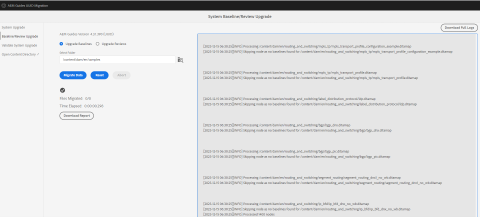

# Non-UUID to UUID content migration {#id226TI0U20XA}

Perform these steps to migrate your content from non-UUID version 4.3.1 to UUID version 4.3.2. 

>[!IMPORTANT]
>
> * Before migrating content to the UUID server, ensure that you have a non-UUID server with a compatible AEM Guides version installed on it.
> *	If you are using a version before 4.3.1, upgrade to version 4.3.1. Follow the [upgrade instructions](./upgrade-xml-documentation.md) specific to the licensed version of your product. 
> * Currently, versions later than 4.3.1 are not supported for migration.

>

## Package installation

Download the required packages from Adobe Software Distribution Portal, based on your version:

1. **Pre-migration**: [com.adobe.guides.pre-uuid-migration-1.2.26.zip](https://experience.adobe.com/#/downloads/content/software-distribution/en/aem.html?package=%2Fcontent%2Fsoftware-distribution%2Fen%2Fdetails.html%2Fcontent%2Fdam%2Faem%2Fpublic%2Faemdox%2Fother-packages%2Fuuid-migration%2F2-0%2Fcom.adobe.guides.pre-uuid-migration-1.2.26.zip)
1. **Download UUID version 4.3.2**: [com.adobe.fmdita-6.5-uuid-4.3.2.1976.zip](https://experience.adobe.com/#/downloads/content/software-distribution/en/aem.html?package=%2Fcontent%2Fsoftware-distribution%2Fen%2Fdetails.html%2Fcontent%2Fdam%2Faem%2Fpublic%2Faemdox%2Fother-packages%2Fuuid-migration%2F2-0%2Fcom.adobe.fmdita-6.5-uuid-4.3.2.1976.zip)
1. **Migration**: [com.adobe.guides.uuid-upgrade-1.2.99.zip](https://experience.adobe.com/#/downloads/content/software-distribution/en/aem.html?package=%2Fcontent%2Fsoftware-distribution%2Fen%2Fdetails.html%2Fcontent%2Fdam%2Faem%2Fpublic%2Faemdox%2Fother-packages%2Fuuid-migration%2F2-0%2Fcom.adobe.guides.uuid-upgrade-1.2.99.zip)

## Pre-migration

Perform the following checks on non-UUID version 4.3.1:

1. Install the pre-migration package over version 4.3.1.

   >[!NOTE]
   >
   >* You need administrator permission to execute the migration. 
   >* Fixing the files with errors before proceeding with the migration is recommended. 

1. (Optional) If there are more than 100,000 DITA files in the system, update the `queryLimitReads` under `org.apache.jackrabbit.oak.query.QueryEngineSettingsService` to a larger value (any value greater than the number of assets present, for example 200,000) and then redeploy.

   |PID|Property Key|Property Value|
   |---|---|---|
   |org.apache.jackrabbit.oak.query.QueryEngineSettingsService|queryLimitReads|Value: 200000   Default Value: 100000|

    

1. Launch `http://<server-name>/libs/fmdita/clientlibs/xmleditor_uuid_upgrade/page.html`. 
1. Select **Compatibility Assessment from the left panel and browse the  `/content/dam` folder path for all assets.
1. Check the compatibility to list the following information:
    * Total files
    * Estimated time for migration
    * Number of files with errors 
    * Files with GUID filename

    

1. Select **Configure Validations** from the left panel. Then, **Select map** and **Select preset** of the map to configure them. The current output validation list displays the output files present before migration and can be validated against the output files generated post-migration later. 

    By selecting multiple and large DITA maps, you can validate that all the content has been successfully migrated without issues. Selecting presets with baselines in them, also ensures that baselines and versions are migrated successfully.

    

1. (Optional) Perform version purging on the content to remove unnecessary versions and speed up the migration process. To perform version purging, select the option **Version Purge** from the migration screen and go to the user interface using the URL `http://<server- name>/libs/fmdita/clientlibs/xmleditor_uuid_upgrade/page.html`. 
   >[!NOTE]
   >
   >This utility does not remove any versions used in baselines or reviews or has any labels.   

## Migration 

### Step 1: Update configuration

1. Ensure that the free space available is at least ten times the space taken by AEM (crx-quickstart directory) during migration. Once you complete the migration, you can reclaim most of the disk space by running compaction (refer to [Revision Cleanup](https://experienceleague.adobe.com/docs/experience-manager-65/deploying/deploying/revision-cleanup.html?lang=en)).

1. Install the new package for uuid migration.

1. Select *Enable Post Processing Workflow Launchers* in `com.adobe.fmdita.config.ConfigManager` and *Enable Version Postprocessing* in `com.adobe.fmdita.postprocess.version.PostProcessVersionObservation.`

1. Install the UUID version of the supported release over the non-UUID version. For example, if you're using 4.3.1 non-UUID build, you need to install UUID version 4.3.2 and run the migration.

1. Disable the following workflows and any other workflow that runs on `/content/dam` using launchers in `http://<server-name>/libs/cq/workflow/content/console.html`.

    * DAM Update Asset workflow
    * DAM Metadata Writeback workflow

1. Disable *Enable Post Processing Workflow Launchers* in `com.adobe.fmdita.config.ConfigManager` and disable *Enable Version Postprocessing* in `com.adobe.fmdita.postprocess.version.PostProcessVersionObservation`. 

1. Disable the property Enable validation (`validation.enabled`) in Day CQ Tagging Service.

1. Ensure that `uuid.regex` property folder is set properly in `com.adobe.fmdita.config.ConfigManager`. If it's blank, set it to the default value - `^GUID-(?<id>.*)`.
1. Add a separate logger for `com.adobe.fmdita.uuid` The browser response is also available at `/content/uuid-upgrade/logs`.

1. (Optional, if not done earlier) If there are more than 100,000 DITA files in the system, update the `queryLimitReads` under `org.apache.jackrabbit.oak.query.QueryEngineSettingsService` to a larger value (any value greater than the number of assets present, for example 200,000) and then redeploy.

   |PID|Property Key|Property Value|
   |---|---|---|
   |org.apache.jackrabbit.oak.query.QueryEngineSettingsService|queryLimitReads|Value: 200000   Default Value: 100000|

### Step 2: Run the migration and validate

#### Install the migration package

1. Launch `http://<server-name>/libs/fmdita/clientlibs/xmleditor_uuid_upgrade/page.html`.

    

1. Select **System upgrade** from the left panel to run the migration. Start on a folder with smaller data before running it on `/content/dam`. It is possible to migrate files in batches. However, it is important to migrate all files are migrated for the system to be working. Only files, which are not DITA assets and are not used in any DITA assets can be skipped for migration.

1. (Optional) Select the folders for which you want to skip the migration. Use this option to migrate these folders later or skip migrating them. Ensure that these folders don't have any DITA assets and aren't referred by (and in the future won't be referred by) any DITA assets.

1. Select *Enable dita asset backup* to create a backup of asset before migration. This backup will be used to rollback in case there is an error in migrating a file. The backup is deleted, if the migration is successful. However, this slows down the migration process.

1. Start the migration. 

1. Once the migration is complete, the report is available to download and entire logs can also be downloaded.

1. Select **Download Report** while the migration is running to check whether all files in the folder are upgraded correctly and whether all features work only for that folder.

>[!NOTE]
>
> Content migration can be run on a folder level, the complete `/content/dam`, or the same folder (rerun migration).

Also, it's important to make sure that the content migration is done for all the media assets, such as images and graphics you have used in the DITA content.

#### Baseline and Review migration

Select **Baseline/Review Upgrade** from the left panel to migrate the baselines and review at the folder level.  

### Step 3: Restore the configuration

After migrating the server successfully, enable post-processing, tagging, and the following workflows (including all the other workflows that were disabled initially during the migration) to continue working on the server.

* DAM Update Asset workflow
* DAM Metadata workflow

>[!NOTE]
>
>If some files are not processed or corrupted before migration, they will be corrupted before migration and remain corrupted even after migration.

## Migration validation

1. Once the migration is completed, select **Validate system upgrade** from the left panel and validate the output files before and after the migration to ensure that the migration is successful. 

    

1. After the validation is done, most of the disk space can be reclaimed by running compaction (refer to `https://experienceleague.adobe.com/docs/experience-manager-65/deploying/deploying/revision-cleanup.html?lang=en`).

