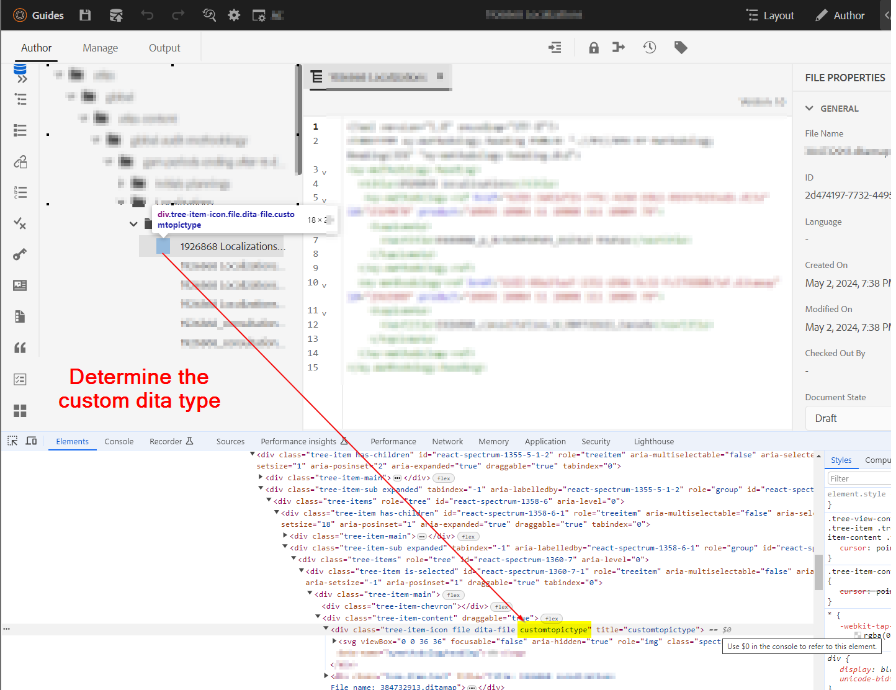

# Configuring icon for custom/specialized dita (topic or map) types


## Problem Statement

With custom schema used in AEM Guides, you can create custom topic or map types and with that you may notice the custom topic/map types do not show icon in the web-editor or Assets UI. See  below screenshot for reference 


So in order to assign a icon to the custom topic/map types, you have to do following:
- Find the custom topic/map type
- Write styles to add the desired icon for the custom type


We can implement the above steps to show icon on web-editor (repository view) as well as in Assets UI. Below are the steps for both


## Showing icon for custom topic/map in web-editor view

_Step 1:_ Determine the dita type for the custom dita topic/ap
- Open the repository view in web-editor > open developer console on browser
- Inspect the icon space next to the listed topic/map 
- Check the class assigned to the custom topic 
- See the screenshot below for more details 
- We will use this class to assign icon and write css for this
    
_Step 2:_ Create css and assign icon to this dita type
- Create a client library under /apps, lets say you create a cq:ClientLibraryFolder under desired path
    - add categories "apps.fmdita.xml_editor.page" to it
- create a folder "assets" under this directory and add all the icons you want to use for custom dita types
- add a css file under client library folder, say "tree-icons.css"
    - add following code to it
        
```
            .tree-item-icon {
                &.custommaptype {
                    background-image: url('assets/custommap.svg')
                }
                &.customtopictype {
                    background-image: url('assets/customtopic.svg')
                }
            }
```

- add css.txt under the client library folder and add reference to "tree-icon.css" just created
- save/deploy these changes

Refer below screenshot for more details.
 

And the final output is shown in below screenshot


## Showing icon for custom topic/map in Assets UI

_Step 1:_ determining the dita type of the custom dita topic/map
- this is explained in the previous methods' Step 1
    
_Step 2:_ Create Javacscript to define which icons to load for the custom dita type for custom topic/map types
- Create a client library under /apps, lets say you create a cq:ClientLibraryFolder under desired path
    - add following properties to it:
        - "categories"(multivalue string) value as "dam.gui.admin.coral" 
        - "dependencies"(multivalue string) value as "libs.fmdita.versioncontrol"
- Create a copy of the file "/libs/fmdita/clientlibs/clientlibs/xmleditor/clientlib-dam/topic_type.js" to this /apps directory
    - edit the copied "topic_type.js" and change/add customtopictype under the variable "typeImageNameMap"
    - You can also change the path of images folder by changing the value of variable "parentImagePath" to where custom icons are stored
- Create a file named js.txt under client library folder and add reference to "topic_type.js"
- save/deploy these changes
Refer below screenshot for more details.


And the final output will appear as shown in screenshot 
