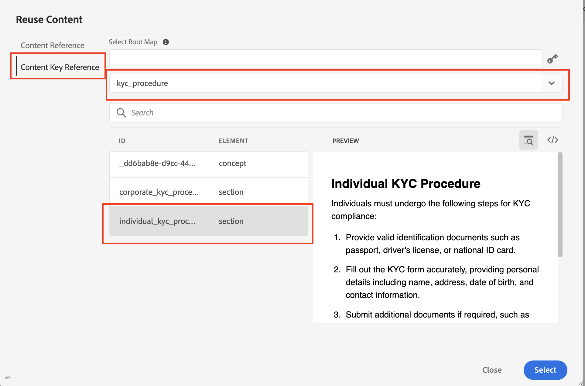

# Content reusability in AEM Guides 

Adobe AEM Guides leverage DITA's strengths to provide a user-friendly interface for content reuse.

This article will discuss:

1. [Reusability using topic reference (`topicrefs`)](#reusability-using-topic-referencestopicref)
2. [Reusability using content reference (`conref` and `conkeyref`)](#reusability-using-content-reference-conref--conkeyref)
3. [Bonus tip to reuse content with drag and drop in AEM Guides](#reuse-content-with-a-single-click-in-aem-guides)

## Reusability using topic references(topicref)


Let's suppose you are a Manufacturing company and have generic topics for safety precautions or troubleshooting techniques.

These can be referenced and adapted in specific user manuals for each machine model, reducing redundancy and ensuring core safety information remains consistent.

```
<map id="user_manual_model 100" title="ABC Model 100 User Manual ">


<topicref href="Safety_Information.dita" format="dita">
</topicref>
.
.
.
.
.
</map>

```


Similarly for Model 200

```
<map id="user_manual_model 200" title="ABC Model 200 User Manual ">

<topicref href="Safety_Information.dita" format="dita">
</topicref>
.
.
.
.
.
  
</map>

```

## Reusability using content reference (conref & conkeyref)

The content reference (conref) attribute allows you to link to other parts of your content. This promotes reusability and reduces redundancy.

For example:

Let's suppose you are a financial enterprise and have a generic topic for KYC which contains KYC procedures for individuals, corporate, and so forth.

You want to reuse individual KYC fragment for your "Saving account" and "Demat account" topics.

```
<section id="kyc_requirements_saving_account">
  <title>Know Your Customer (KYC) Requirements</title>
  <p>To comply with regulations and ensure customer identification, all individual applicants for savings  accounts must fulfill the KYC requirements as outlined below</p>
  <p conref=kyc_procedures.dita#individual_kyc></p>
</section>

```

Here `conref=kyc_procedures.dita#indvidual_kyc` kyc_procedures.dita is the file identifier and #individual_kyc is the fragment identifier.

Kyc_procedure.dita continues to be the only single source of information. If regulatory changes require updates to the KYC process, update the topic path with the new one. The changes will automatically reflect in all topics that reference it.

Using AEM Guides, Its two clicks

Step 1: Click Insert Reusable content 


<br>

Step 2: Select your file and fragment which needs to be reused.


Similar to 'conref,' you can use 'conkeyref' as well where instead of giving a content path, you refer to content via key

Code example :

```
<section conkeyref="kyc_procedure/individual_kyc_procedure" id="individual_kyc_procedure"></section>

```

The key definition looks like this :

```
<map id="ABC_manual">
  <title>ABC_Manual</title>
  <topicref href="kyc_procedure_2020.dita" keys="kyc_procedure" processing-role="resource-only" type="concept">
  </topicref>
  <topicref href="savings_account.dita" type="concept">
  </topicref>
</map>
```

Key - 'Kyc_procedure' continues to be the single source of information. If there are any changes to the KYC process as required by regulations, you simply need to update one topic path with a new topic path, and those changes are automatically reflected in all topics that are referring to it. 

```
<map id="ABC_manual">
  <title>ABC_Manual</title>
  <topicref href="kyc_procedure_2024.dita" keys="kyc_procedure" processing-role="resource-only" type="concept">
  </topicref>
  <topicref href="savings_account.dita" type="concept">
  </topicref>
</map>

```

Here the topic path is changed from "kyc_procedure_2020.dita" to "kyc_procedure_2024.dita" due to recent regulation changes.

Using AEM Guides, Its two clicks

Step 1: Click Insert Reusable content 


Step 2: Select your root map (optional), key, and fragment that needs to be reused.


Here the root map was auto-selected since it was already open in the map view.


## Reuse content with a single click in AEM Guides 

AEM Guides offers a "Reusable contents" capability to add content references at a single click.

Step 1: Add a generic topic to Reusable contents 


Step 2: Once added, Drag, and drop the fragment that you want to reuse in any of your destination topics.


    

## FAQ

### All content is not showing up after selection of file/key in the Reuse content dialog

Assign IDs to fragments (Dita elements) that you would like to reuse in other topics 

## Keys are not showing up in the Reuse content dialog

Make sure you have opened the root map/parent map in map-view, which has a key definition or add the root map path manually in the same dialog.


<br>
<br>
<br>


Post on the AEM Guides Community [forum](https://experienceleaguecommunities.adobe.com/t5/experience-manager-guides/ct-p/aem-xml-documentation) for any queries.
