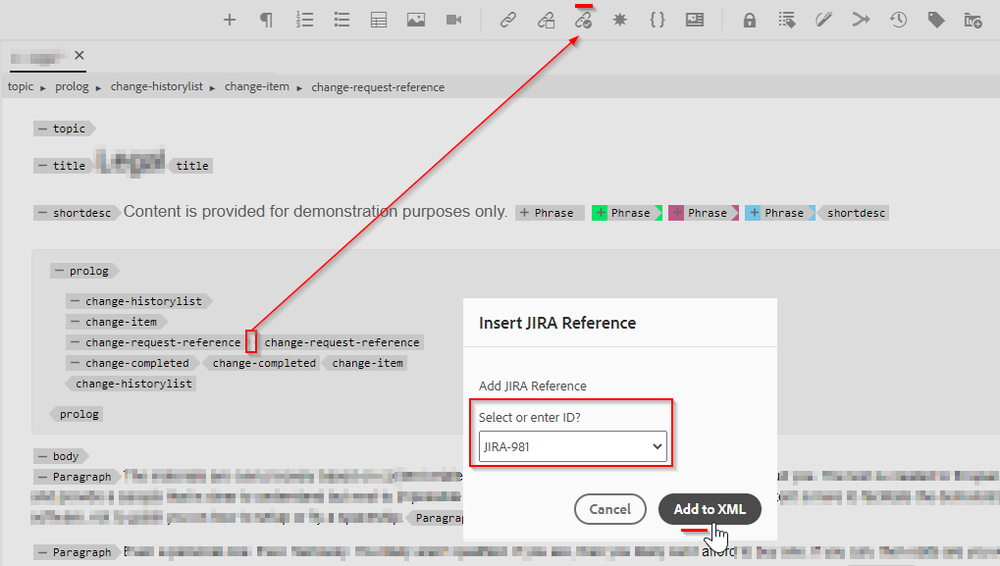

# Add new custom actionable button in webeditor toolbar

In this article we will learn how add a new custom button in webeditor toolbar and call javascript to perform desired custom operation.

Adding a actionable button to webeditor involves following steps:
- Adding the button in the *ui_config.json* at the position where it is needed
- Registering the button on-click event in the webeditor for user to perform an action when they click it


## Implementing by taking an example

Let us understand this with an example where a author wants to add a jira reference to a topic prolog section. The prolog section with embedded jira reference-id may look like below:


The "change-request-id" element that contains the JIRA ID should be retrieved from the API (lets say based on a specific JIRA query which is depicted by application). When the user is authoring the prolog section, user should be able to click a button and insert a jira reference id from web-editor toolbar, something like:


And when the user clicks the button, it should show a dialog which should pull the possible options and allow the user to select the desired JIRA ID, something like:



which should then add the "change-request-id" to the prolog:


## Implementing this


### Add the button in webeditor by configuring it in *ui_config.json*

Use the folder profiles to check the *ui_config.json* under the "XML Editor Configuration" tab and add the button configuration JSON into the desired section of the "toolbar" group

```
{
    "on-click":"insertJIRARef",
    "icon":"linkCheck",
    "variant":"quiet",
    "type":"button",
    "title":"Insert JIRA Reference"
}
```

[use this link to learn more about Folder profile and configuring ui_config.json](https://experienceleague.adobe.com/docs/experience-manager-guides-learn/videos/advanced-user-guide/editor-configuration.html?lang=en)


### Handle the on-click event for the new button

NOTE: Steps mentioned below are available as package attached in this post


- After saving the folder profile create a "cq:ClientLibraryFolder" under a project directory (could be under */apps*) and add properties as shown in the screenshot below:


```
This example uses "coralui3" library to show a dialog as it is used in the Javascript sample we presented.
You may use different library of your choice.
```

- Under this client library folder create two files as mentioned below:
    - *overrides.js*: which will have the javascript code to handle the on-click event for "insertJIRARef" (use attached package to get the content of this javascript)
    - *js.txt*: which will include the "overrides.js" to enable this javascript

- Save the changes and you should be ready to test.


### Testing

- Open web-editor
- From user preferences choose the folder profile in which you added the custom *ui_config.json*. If you added it to the Global profile then you are probably already using that.
- Open a topic, you will notice the toolbar having a new button "Insert Jira Reference"
- You can then add prolog section as given below to the topic and try clicking in "Insert Jira Reference" button inside the prolog element "change-request-reference"

```
<prolog>
    <change-historylist>
        <change-item>
            <change-request-reference>
            </change-request-reference>
            <change-completed></change-completed>
            <change-summary></change-summary>
        </change-item>
    </change-historylist>
</prolog>
```

Refer screenshot below to know how it will look like:


### Attachments

- Sample clientlibs package which will install the webeditor client library having javascript code for toolbar button action: [download using this link](../../../assets/authoring/webeditor-addbuttonontoolbar-insertjira-clientlib.zip)
- Sample *ui_config.json* that you can upload to a folder profile: [download sample ui_config.json](../../../assets/authoring/sample_ui_config_Guides4.2-InsertJiraReference.json) 

```
Please note this is compatible to AEM 6.5 and AEM Guides version 4.2.
If you are using a different version please add the toolbar button to the ui_config.json manually.
```
