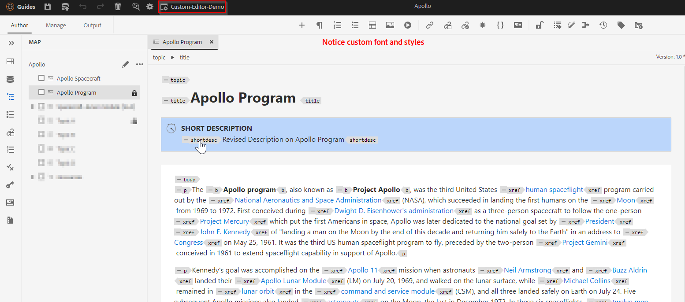

# Add custom styles to Guides webeditor 

In this article we will learn how add custom styles to change the webeditor default look and feel. 

This will involve following steps:
- Adding the custom styles via Folder profile XML Editor Configuration
- Choosing the respective folder profile in webeditor and testing the changes


## Implementing by taking an example

Let us understand this with an example where we want to show the short description and title as separate block with some style aspects in editor.




## Implementing this


### Adding the custom CSS to the folder profile

Use the folder profiles to check the *css_layout.css* under the "XML Editor Configuration" tab and add the CSS having custom styles

[use this link to learn more about Folder profile and configuring CSS template layout](https://experienceleague.adobe.com/docs/experience-manager-guides-learn/videos/advanced-user-guide/editor-configuration.html?lang=en#customize-the-css-template-layout)

Use the following to setup above style in your webeditor:
- Use [css_layout.css](../../../assets/authoring/webeditor-customstyles-css_layout.css) and upload it to the folder profile of your choice
- Install the attached package [webeditor-styles-resources.zip](../../../assets/authoring/webeditor-styles-resources.zip) using AEM package manager to install the resources used in the above CSS file 

```
This will install the resources at path "/content/dam/resources" which will include sub-folders "fonts" and "images"
```


### Testing

- Open web-editor
- From user preferences choose the folder profile in which you added the custom styles. If you added it to the Global Profile then you are probably already using that.
- Open a topic, you will notice the editing area should have custom UI

```
Please note this is compatible to AEM Guides version 4.2 and AEM Guides cloud version 2303 (March)
```


## References

You may also be interested in the expert session around webeditor configurations and customization covered in [Expert session on webeditor](https://experienceleague.adobe.com/docs/experience-manager-guides-learn/tutorials/knowledge-base/expert-session/webbased-authoring-jan2023.html?lang=en)
