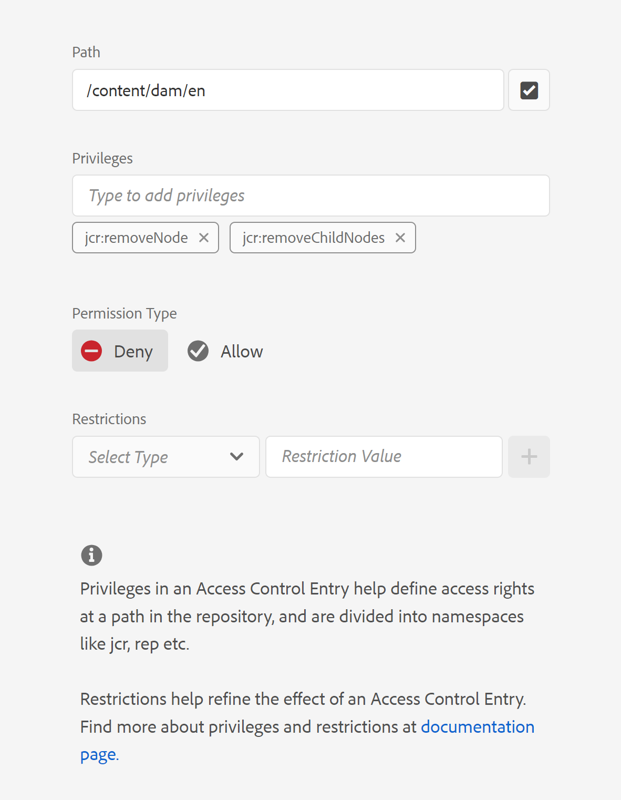

# Remove 'Delete' option from file context menu in webeditor

In this article we will learn how hide the 'Delete' option from file context menu in AEM Guides Editor for specific users or groups. For other customizations on file context menu options, please check Guides Extension framwork. More details can be found [here](https://github.com/adobe/guides-extension/tree/main).

As you can see from below snippet, the file context menu has 'Delete'option available for this specific user.


Now, let us see how we can hide the 'Delete' option for this user.

## Implementation Steps:

- Navigate to Tools > Security > Permissions from AEM home page.
- Choose the group or user from the search box.
- Click on 'Add ACE' from top right corner.
- Choose the folder path.
- Include privileges "jcr:removeChildNodes" and "jcr:removeNode".
- Choose 'Permission Type' as 'deny' and click on 'Add' as shown below.




### Testing

- Login to AEM as the user for which the ACE's has been added.
- Open web-editor.
- Go to repository view and choose the folder for which the ACE's have been added.
- Open the file context menu.
- 'Delete' option will not appear in the context menu.

The file context menu will now look like this:


```
Please note that these steps would also remove 'move' and 'rename' options from the Editor as they are also tied to delete process at the backend.
```
