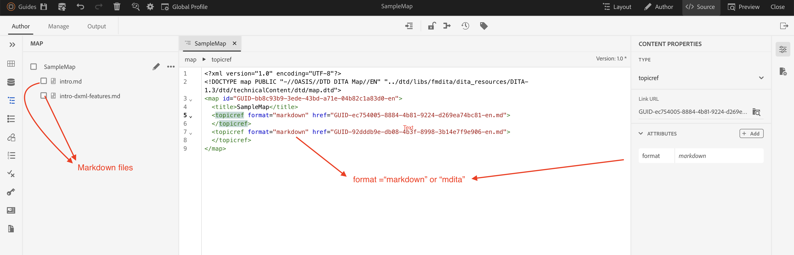

# Use Markdown in AEM Guides

## Available Options

There are 2 options for using markdown files in AEM Guides :

- Option 1 : Import existing markdown in AEM Guides and use them directly inside ditamap to publish

- Option 2 : Convert existing markdown files into DITA 

Lets talk about each options :

### Option 1: Import existing markdown in AEM Guides and use them directly inside ditamap to publish 

It has Simpler setup and faster implementation. But, Limited functionality utilization of AEM Guides feature like content re-usability.

User need to add attribute `format="markdown" ` or `format="mdita"` so that publishing engines understands the type of file and publish accordingly. 

Sample file : [Markdown Ditamap](https://acrobat.adobe.com/id/urn:aaid:sc:AP:da31137e-be84-44fb-8974-d038eeff0283)

#### Publish to PDF and Web output 

AEM Guides gives both Web (Html5/AEM Site) and PDF (Native-PDF/DITA-OT) option to publish ditamap with Markdown content 

### Option 2 : Convert Markdown to DITA format

Full utilization of AEM Guides functionality which content re-usability, conditional processing translation, baseline etc. But, It would need upfront efforts to convert `.md` to `.dita` format.

Markdown to DITA can be converted using external tools like Adobe FrameMaker and DITA-OT.

For Adobe FrameMaker, refer : [Import markdown](https://www.adobe.com/in/products/framemaker/features.html#import-markdown)

For DITA-OT, refer : [Markdown as Input](https://www.dita-ot.org/dev/topics/markdown-input.html)

Sample file converted using Adobe FrameMaker : [Markdown to DITA sample](https://acrobat.adobe.com/id/urn:aaid:sc:AP:874881f3-ba43-410c-abc6-2df899536d79)

#### Publish to PDF and Web output 

Once markdown files are converted into DITA, User can seamlessly publish output to any formats available in AEM Guides.

Available formats in AEM Guides : [Output formats](../../../../user-guide/generate-output-understand-presets.md)
