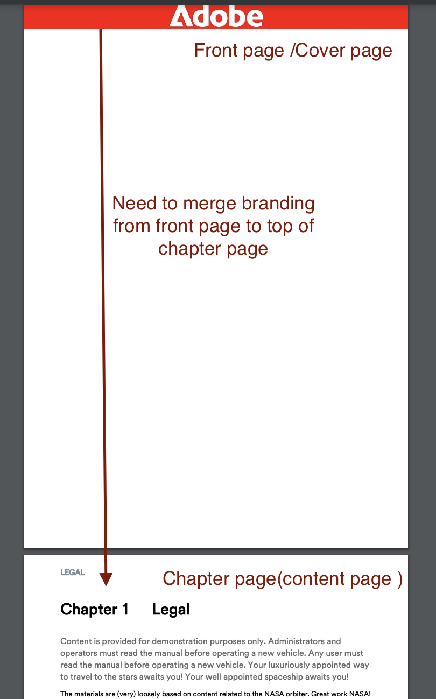

# Add Enterprise Branding to the First Page of a DITA PDF

## This article will cover: 

Achieving Enterprise branding by seamlessly merging the FrontCover page with the chapter page, ensuring the enterprise's identity is prominently displayed at the top of the content.

-   [Set up your Content](#set-up-your-content)
-   [Make the Necessary Changes in the PDF Template](#create-necessary-changes-in-pdf-template)

**Before:**


<br>
<br>

**After:**


## Set up your Content

To publish content in PDF format, you must create a Ditamap or Bookmap.

Sample Bookmap structure :

```

<bookmap>
  <title>My Bookmap Title </title>
  <frontmatter>
    <booklists>
      <toc/>
      <figurelist/>
      <tablelist/>
    </booklists>
  </frontmatter>

  <chapter href="chapter1.ditamap">
  <chapter href="chapter2.ditamap">
  </chapter>

  <backmatter>
    <booklists>
      <indexlist/>
    </booklists>
  </backmatter>
</bookmap>

```

Sample Ditamap structure:

```
<map title="My map Title">

  <topicref href="topic1.dita" >
  </topicref>
  <topicref href="topic2.dita">
  </topicref>
  
</map>

```

The FrontCover of PDF is automatically generated if Bookmap contains `<frontmatter>`.


## Make the Necessary Changes in the PDF Template

In this section, we will set up our template. (You can use or duplicate the Hi-tech template to get started.)

### Set up your Template :

- Go to your Native PDF template.
- Go to your FrontCover page layout and edit it.
- Here, add your branding image in `data-region="content"`.
- Add other necessary changes in your chapter template if needed.
- Now follow the steps below based on your content.


#### If you are using Ditamap for PDF generation :

When publishing a DITAMAP, Native PDF provides the functionality to automatically generate a FrontCover page. The option to enable or disable FrontCover Page generation can be configured in the Native PDF template.

To merge:
- Go to your Native PDF template settings --> Page Layout Order
- Now merge FrontCover with Next page i.e Chapter & Topics.

- Save template, Select this template for your preset and publish!


#### If you are using Bookmap for PDF generation 

In the case of a Bookmap, the sequence of Page Layout Order is controlled by the Bookmap's structure rather than the template's order.

To achieve this for Bookmap , We will utilize NativePDF's JavaScript feature.

-  Add below JavaScript in your template's resource folder 

```

window.addEventListener('DOMContentLoaded', function () {
    window.pdfLayout.onAfterPagination(function () {
        var frontMatterWrappers = document.querySelectorAll('.rh-front-matter-wrapper');

        frontMatterWrappers.forEach(function(wrapper) {
            var contentDiv = wrapper.querySelector('div[data-region="content"]');
            var chapterBody = document.querySelector('.chapter-body');

            if (contentDiv && chapterBody) {
                chapterBody.insertBefore(contentDiv, chapterBody.firstChild);
            }

            wrapper.remove();
        });
    });
});


```

- Include this JavaScript in your chapter template.


- Enable JavaScript from your preset option


- Publish!

## Attachments :

- [Download the sample PDF template package to see the applied changes.](../assets/publishing/NativePDF_DemoTemplate.zip)
- [Download the sample PDF Preset package to see the applied changes.](../assets/publishing/Preset_Package.zip)


## Other Resources:

- [How to include DITA Bookmap's toc in PDF](./how-to-include-bookmap-toc-in-pdf-publishing.md)
- [Expert session Video on Native PDF](../../expert-sessions/native-pdf-publishing-eamples-part1-june2023.md)
