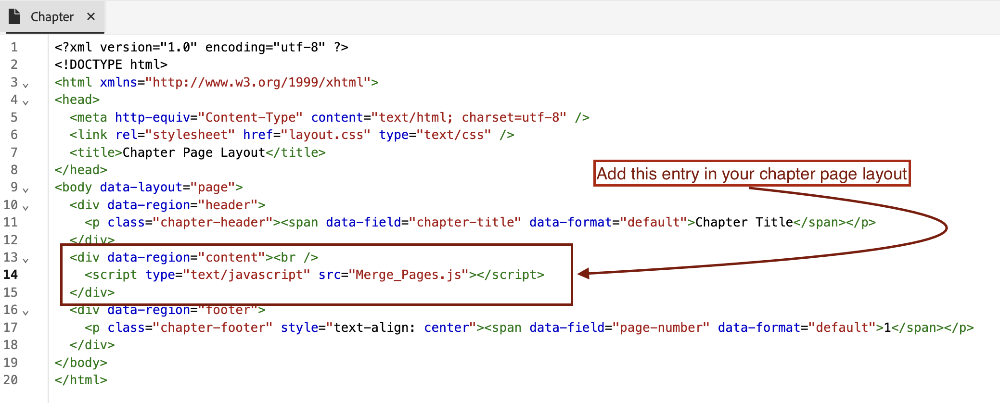

# Add Enterprise Branding to First Page of DITA PDF

## Article will cover : 

Achieving Enterprise branding by seamlessly merging the cover page with the chapter page, ensuring the enterprise's identity is prominently displayed at the top of the content.

-   [Set-up your Content](#set-up-your-content)
-   [Create necessary changes in PDF  Template](#create-necessary-changes-in-pdf-template)

**Before:**


<br>
<br>

**After:**


## Set-up your Content

A Ditamap or Bookmap must be created to publish content in PDF format.

Sample Bookmap structure :

```

<bookmap>
  <title>My Bookmap Title </title>
  <frontmatter>
    <booklists>
      <toc/>
      <figurelist/>
      <tablelist/>
    </booklists>
  </frontmatter>

  <chapter href="chapter1.ditamap">
  <chapter href="chapter2.ditamap">
  </chapter>

  <backmatter>
    <booklists>
      <indexlist/>
    </booklists>
  </backmatter>
</bookmap>

```

Sample Ditamap structure:

```
<map title="My map Title">

  <topicref href="topic1.dita" >
  </topicref>
  <topicref href="topic2.dita" ">
  </topicref>
  
</map>

```

The Coverpage of PDF is  automatically generated if Bookmap contains `<frontmatter>`.


## Create necessary changes in PDF Template

In this section , We will setup our template (You can use /duplicate Hi-tech to get started)

### Setup your template :

- Go to your Native PDF template.
- Go to your Froncover/cover page layout and edit it.
- Here, Add your branding image  in `data-region="content"`
- Add other necessary changes in your chapter template if needed.
- Now follow below steps based on your content.


#### If you re using Ditamap for PDF generation :

When publishing a DITAMAP, Native PDF provides the functionality to automatically generate a front page. The option to enable or disable front page generation can be configured in the Native PDF template.

To merge:
- Go to your Native PDF template settings --> Page Layout Order
- Now merge FrontCover with Next page i.e Chapter & Topics.

- Save template, Select this template for your preset and publish!


#### If you are using Bookmap for PDF generation 

In case of Bookmap, Sequence of Page Layout Oder is controlled from Bookmap's  structure rather than template's order.

To achieve this for Bookmap , We will utilize NativePDF's Javascript feature.

-  Add below Javascript in your template's resource folder 

```

window.addEventListener('DOMContentLoaded', function () {

    window.pdfLayout.onAfterPagination(function () {
        var frontMatterWrappers = document.querySelectorAll('.rh-front-matter-wrapper');

        frontMatterWrappers.forEach(function(wrapper) {
         
            var contentDiv = wrapper.querySelector('div[data-region="content"]');

      
            var chapterBody = document.querySelector('.chapter-body');

        
            if (contentDiv && chapterBody) {
                chapterBody.insertBefore(contentDiv, chapterBody.firstChild);
            }

           
            wrapper.remove();
        });
    });
});

```

- Include this Javascript in your chapter template.


- Enable Javascript from your preset option


- Publish!

## Attachments :

- [Sample PDF template package](../assets/publishing/NativePDF_DemoTemplate.zip)
- [Sample Preset package](../assets/publishing/Preset_Package.zip)


## Other Resources:

- [How to include DITA Bookmap's toc in PDF](./how-to-include-bookmap-toc-in-pdf-publishing.md)
- [Expert session Video on Native PDF](../../expert-sessions/native-pdf-publishing-eamples-part1-june2023.md)

