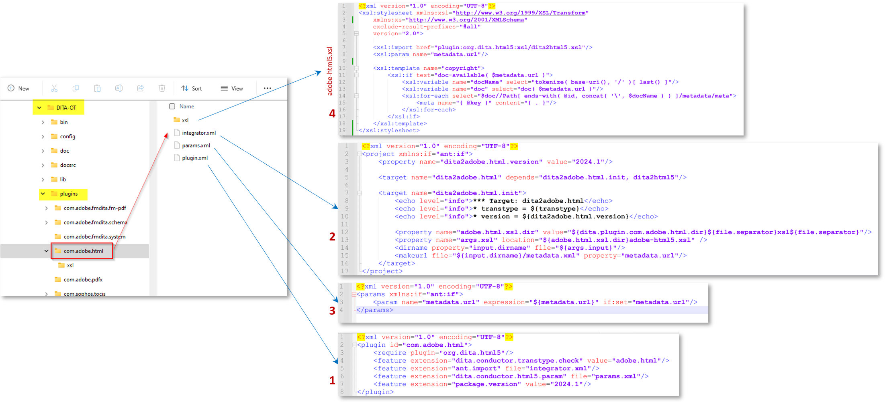

# About this Article

In this article we will explain how to implement changes to DITA-OT plugin to read the metadata.xml _(available in temporary files)_ and utilize the properties, passed by AEM Guides publishing workflow, in DITA-OT plugins and set it in the generated output. 

On a high level, below are the steps that you will learn in this article:
- Set metadata on the output preset of a ditamap in AEM Guides
- On output generation, access this metadata.xml in the DITA-OT temp directory
- Implementation in the DITA-OT plugin to read this _metadata.xml_ and using the available properties in the generated output
- Checking the generated output to see the propagated metadata

## Background

With AEM Guides, you can use DITA-OT plugins to publish to output formats of your choice suing the configured plugins, and
you can also pass metadata of the assets managed in AEM DAM to the DITA-OT process to use it in the generated output - see the documentation on [how to setup ditamap/topics to pass metadata through output presets](https://experienceleague.adobe.com/en/docs/experience-manager-guides/using/user-guide/output-gen/pass-metadata-dita-ot)


## Assumptions

You have a AEM setup with AEM Guides version 4.4.0/2024.6 or above
You have prior knowledge of how DITA-OT works and its directory structure


## Steps explained

### Setting metadata on the asset

With AEM Assets Metadata Schema you can create custom property fields for the Assets in AEM, and users can assign metadata to the assets. Taking an example of a _topic_ asset where a metadata named _customprop_ can be set for an example - refer screenshot below:


### Configuring the metadata on ditamap output preset to pass to DITA-OT

Configure output preset of your choice on the map to export metadata and pass to DITA-OT
Let us say we are generating HTML5 output using a DITA-OT plugin say _adobe.html_.
See screenshot below to understand how to configure the output preset for a map to pass metadata to the DITA-OT plugin.
1. Open a map and browse to the _Output_ tab for this map and open HTML5 preset, and click _Advanced_ tab, on this set the Transformation name as _adobe.html_ (this is the plugin we will configure and use for our example, you can define your custom plugin as well)
2. Set _Retain temporary files_ to be able to download the temp files and check how metadata.xml is formed, you can use this for development
3. Select the metadata properties you want to pass to DITA-OT via metadata.xml. In this example lets say we want to pass _dc:title_ and _customprop_
4. Save the preset, and Generate the output
5. Download the temporary file using the button shown on preset

Refer screenshot below to understand the steps given above:


### Implementing the DITA-OT plugin

#### Accessing the metadata.xml in temporary directory 

In the downloaded temporary files package you will notice a metadata.xml file where you can see the structure of the properties and values (see screenshot below)


##### Understand metadata.xml

- This file contains a list of all the assets which are published, each having:
    - path of the file in DITA directory [id attribute of Path element]
    - and list of metadata property value pairs [under _metadata_ element]

```
        <Path id="topics\about-this-document.dita">
            <sourceProps>
                ...
            </sourceProps>
            <metadata>
                <meta isArray="false" key="dc:title">About This Document</meta>
                <meta isArray="false" key="customprop">customval</meta>
            </metadata>
        </Path>
```

#### Accessing the metadata for each asset in DITA-OT plugin

For the DITA-OT plugin to read the _metadata.xml_ and properties available in it we need to do following:
- Define the custom plugin settings in the _plugins.xml_, where define the params and integrator for plugin iniriation, our sample plugin file will look as below:

```
<?xml version="1.0" encoding="UTF-8"?>
<plugin id="com.adobe.html">
    <require plugin="org.dita.html5"/>
    <feature extension="dita.conductor.transtype.check" value="adobe.html"/>
    <feature extension="ant.import" file="integrator.xml"/>
    <feature extension="dita.conductor.html5.param" file="params.xml"/>
    <feature extension="package.version" value="2024.1"/>
</plugin>
```

- On plugin initiation:
    - set a variable to point to the metadata.xml file i.e. in the _integrator.xml_ under the plugin set a property to define the path of the metadata file, and
    - define the file that runs custom xsl transformation rules, i.e. _args.xsl_, which in our case will point to the file _xsl/adobe-html5.xsl_. 
Refer code below:

```
    <property name="adobe.html.xsl.dir" value="${dita.plugin.com.adobe.html.dir}${file.separator}xsl${file.separator}"/>
    <property name="args.xsl" location="${adobe.html.xsl.dir}adobe-html5.xsl" />
    <dirname property="input.dirname" file="${args.input}"/>
    <makeurl file="${input.dirname}/metadata.xml" property="metadata.url"/>
```

- Pass the value of the variable _metadata.url_ to the custom XSL to utilize it as you need, i.e. in the existing/created _param.xml_ pass the parameter to the plugin, see below a sample params.xml file:

```
    <?xml version="1.0" encoding="UTF-8"?>
    <params xmlns:if="ant:if">
        <param name="metadata.url" expression="${metadata.url}" if:set="metadata.url"/>
    </params>
```

- In the custom XSL transformation file _xsl/adobe-html5.xsl_ you can read the metadata values from the metadata file and set it in the output the way you want. In this example we will add the metadata values to the html head > meta tags. Refer code below:

```
<xsl:import href="plugin:org.dita.html5:xsl/dita2html5.xsl"/>
    <xsl:param name="metadata.url"/>
    <xsl:template name="copyright">
        <xsl:if test="doc-available( $metadata.url )">
            <xsl:variable name="docName" select="tokenize( base-uri(), '/' )[ last() ]"/>
            <xsl:variable name="doc" select="doc( $metadata.url )"/>
            <xsl:for-each select="$doc//Path[ ends-with( @id, concat( '\', $docName ) ) ]/metadata/meta">
                <meta name="{ @key }" content="{ . }"/>
            </xsl:for-each>
        </xsl:if>
    </xsl:template>
```

Refer screenshot below highlighting the steps above



### Testing the plugin Implementation

You can test the plugin by running following command to test it with the temporary files downloaded from AEM (which has map content and its metadata.xml)

```
./dita --input=docsrc/samples/HTML5/aem_forms_documentation.ditamap --format=adobe.html
```

Assuming you have copied the downloaded temporary files under the directory "DITA-OT/docsrc/samples/HTML5".
You can also download the sample given in resources section below.

When the above command is executed you can check the output in the directory "DITA-OT/bin/out", where you can check the html files generated for the topic "about-this-document.dita" which will have the custom metadata in the _head_ element

```
<head>
    <meta http-equiv="Content-Type" content="text/html; charset=UTF-8">
    <meta charset="UTF-8">
    <meta name="copyright" content="(C) Copyright 2024">
    <meta name="DC.format" content="HTML5">
    <meta name="DC.identifier" content="GUID-f193ea85-989d-4d80-99e2-2f5dea3d5310">
    <meta name="DC.language" content="en-US">
    <meta name="dc:title" content="About This Document">
    <meta name="customprop" content="customval">
    <title>About This Document</title>
</head>
```

### Deployment

Once you have developed the DITA-OT plugin, you can integrate this in the DITA-OT using _dita --install_ command under the DITA-OT directory, and deploy it to the AEM server [refer this article for more details](https://experienceleaguecommunities.adobe.com/t5/experience-manager-guides/steps-to-setup-a-custom-dita-ot/td-p/407659)


## Resources

1. Sample temporary files downloaded from sample ditamap - [download using this link](../../assets/publishing/sample-temp-html5-adobe.html-content.zip)
2. DITA-OT plugin with above explained implementation [download using this link](../../assets/publishing/sample-custom-plugin-com.adobe.html.zip)