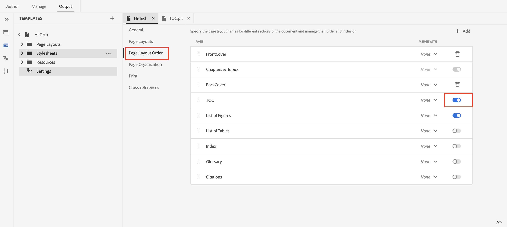

# Generate Bookmap's TOC in PDF publishing 

## Setup your Bookmap

Include the `<toc>`  element:
Within your bookmap's `<frontmatter>`element, locate the `<booklists>` element.  Nest a `<toc>` element inside `<booklists>` like this:

```
<frontmatter>
  <booklists>
    <toc/>  <figurelist/>
    <tablelist/>
  </booklists>
</frontmatter>

```

DITA specification allows placing the TOC and booklists  within the `<backmatter>` section as well.


```
<backmatter>
    <booklists>
      <toc/>
      <figurelist/>
      <indexlist/>
    </booklists>
  </backmatter>

```

The TOC and booklists are automatically generated based on the structure defined in your bookmap.

Once your bookmap is set up, use  Native PDF to generate the PDF output. It will process the bookmap structure and references, including the TOC and booklists.

## TOC design and its order in PDF

Native PDF functionality provides a convenient method for tailoring the layout and design of your table of contents.

You can control design via seprate page-layout for TOC and styles via layout.css. 

TOC and other Booklists order in PDF will be based on bookmap's structure only.


## FAQ

- ### How to Include a Ditamap's TOC in a PDF

Ditamaps themselves don't directly have  a table of contents (TOC) like a bookmap does. However, ditamaps play a crucial role in defining the structure for your content and indirectly contribute to the TOC generation process.

If you are publishing Ditamap then Native PDF gives functionality to generate TOC and booklist automatically , You can enable/disable generation of TOC at ditamap from Native PDF settings.



## Additional Resources :

- [Native PDF design page layout documentation](https://experienceleague.adobe.com/en/docs/experience-manager-guides/using/install-guide/on-prem-ig/output-gen-config/config-native-pdf-publish/design-page-layout)
- [Native PDF essentials pre-recorded Expert session](https://experienceleague.adobe.com/en/docs/experience-manager-guides/using/knowledge-base/expert-session/native-pdf-publishing-essentials-feb23)

<br>
<br>

 Post your question on the AEM Guides Community [forum](https://experienceleaguecommunities.adobe.com/t5/experience-manager-guides/ct-p/aem-xml-documentation) for any queries.

 
