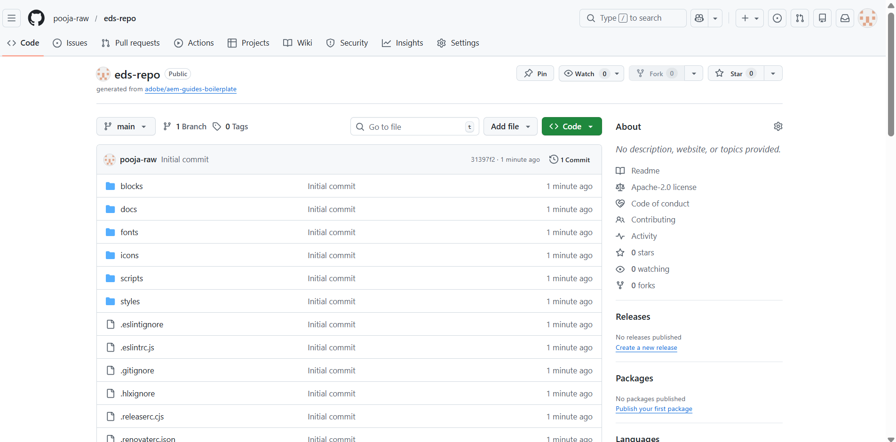
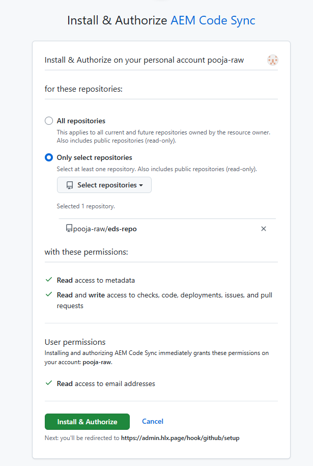
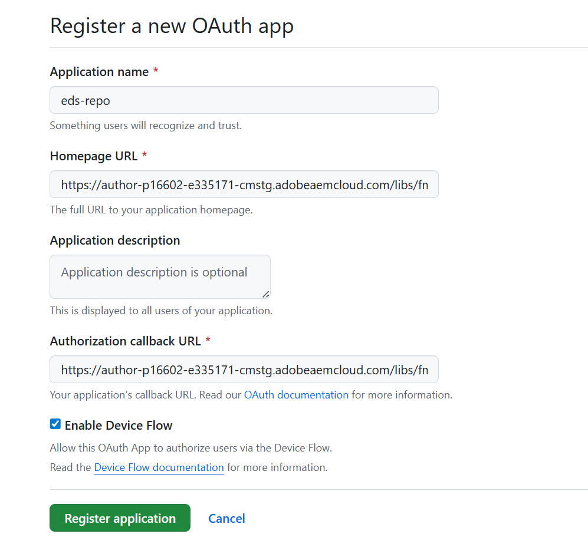
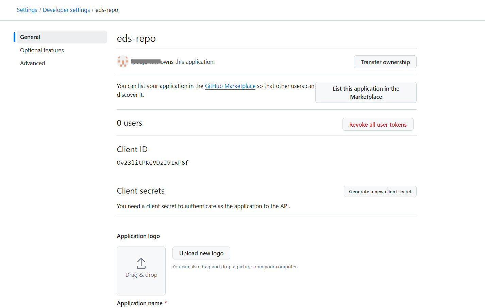
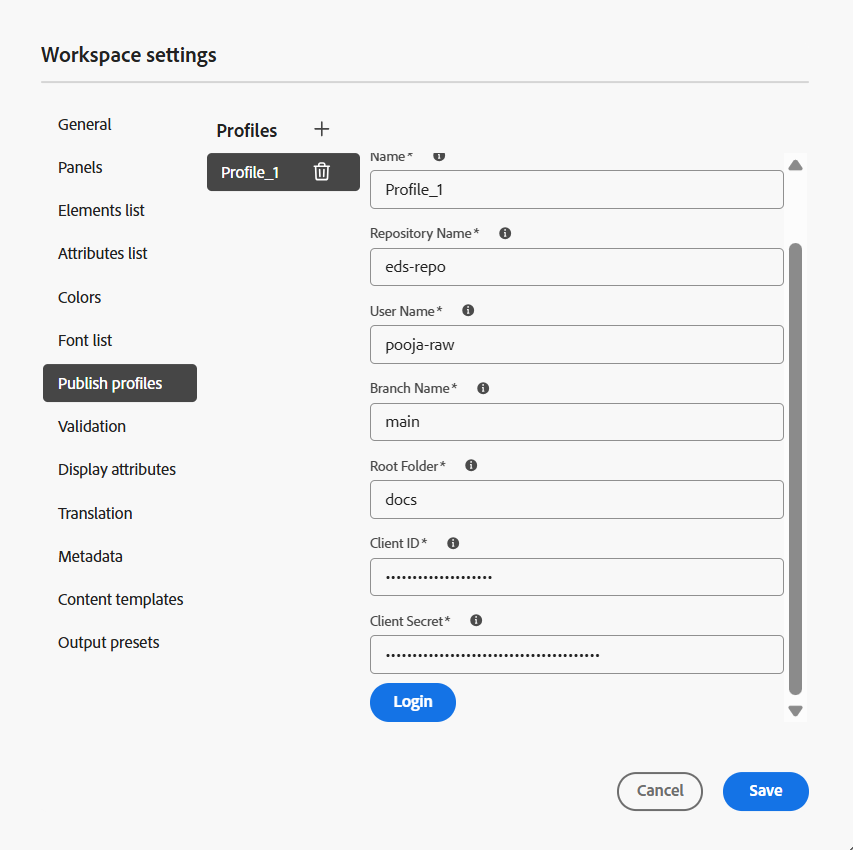

# Experience Manager Guides and Edge Delivery Services (Beta)

Adobe Experience Manager Guides allows you to publish your DITA content directly to Edge Delivery Service (EDS), currently available in *Beta*, through a dedicated GitHub-based Publish profile. This capability enables organizations to deliver high-performance, responsive documentation experiences while maintaining DITA-based authoring workflows in Experience Manager Guides.

For more details on using Edge Delivery Services in Adobe Experience Manager, view [Edge Delivery Services Overview](https://experienceleague.adobe.com/en/docs/experience-manager-cloud-service/content/edge-delivery/overview).

To enable publishing from Experience Manager Guides to Edge Delivery Service (Beta), you must complete a series of configuration steps across GitHub and Experience Manager Guides. The sections below outline each step in sequence and explain how they work together in the overall publishing workflow.

1. [Set up and configure GitHub for Edge Delivery Services (Beta)](#set-up-and-configure-github-for-edge-delivery-services-beta)
2. [Create and configure a Publish profile for Edge Delivery Services (Beta) in Experience Manager Guides](#create-and-configure-a-publish-profile-for-edge-delivery-services-beta-in-experience-manager-guides)
3. [Customize output using Edge Delivery Services blocks](#customize-output-using-edge-delivery-services-blocks)

## Set up and configure GitHub for Edge Delivery Services (Beta)

The sections below outline each step in sequence and explain how to set up and configure GitHub for Edge Delivery Services (Beta):

### Create a GitHub Repository for Edge Delivery  (Beta)

Edge Delivery Services (Beta) requires a GitHub repository with a predefined structure. Adobe provides an official boilerplate repository specifically designed for Experience Manager Guides users. 

Perform the following steps to create your repository:

1. Open the Experience Manager Guides boilerplate template repository [`aem-guides-boilerplate`](https://github.com/adobe/aem-guides-boilerplate).
    {align="left"} 

2. Create a new repository using this template. Learn about [Creating a repository from a template](https://docs.github.com/en/repositories/creating-and-managing-repositories/creating-a-repository-from-a-template). Ensure that the repository visibility is set to *Public* so it can be accessed by Franklin services. 

     {align="left"} 

The repository is now created and aligns with the boilerplate template structure.

{align="left"} 

### Connect GitHub to Adobe via AEM Code Sync

Adobe Experience Manager uses a GitHub application called **AEM Code Sync** to push content from Experience Manager Guides to GitHub. 

Perform the following steps to install and configure the *AEM Code Sync* application:

1. Navigate to the [AEM Code Sync](https://github.com/apps/aem-code-sync) page and select **Install**.
2. *AEM Code Sync* monitors repository changes and ensures that updates are correctly pushed to GitHub.  

    >![NOTE]
    >
    > While installing the application, ensure that you use the same GitHub account that owns the repository.

    {align="left"} 
3. On the next page, grant access to the repository you created. To do this, select the **Only select repositories** option and then select your repository from the dropdown.

    {width="350" align="left"} 
4. Select **Install and Authorize**.

You are redirected to the GitHub setup page, confirming successful registration of the *AEM Code Sync* application. You can also save the Preview and Live URLs for your website from this page.

{align="left"} 

### Create a new GitHub App

Perform the following steps to create a new GitHub application:

1. On GitHub, navigate to the left sidebar and select **Developer settings**.
2. In the left sidebar, select **GitHub Apps**.
3. Select **New GitHub App**.

    {width="650" align="left"} 
4. On the **Register new GitHub App** page, provide the following details:
    - **GitHub App name**: Enter a name for your app. For example, `USERNAME-quickstart-app` where USERNAME is your GitHub username.
    - **Homepage URL**: Enter the URL to the Experience Manager Guides instance. Example: `https://{{cloud-url}}/libs/fmdita/clientlibs/xmleditor/page.html`
    - **Callback URL**: Same as the Homepage URL.
    - **Webhook URL**: Disable this option.
    - **Repository permissions**: Set **Read and Write** permissions for *Actions, Administration, and Attestation*.
5. Select **Create GitHub App**.  

Your app is now ready. You are redirected to the **Settings** page of your GitHub App.

 { align="left"} 

### Create a new OAuth App

An OAuth App is required to authenticate users while creating an Edge Delivery Services (Beta) Publish profile in Experience Manager Guides. It enables a secure login flow using a *Client ID* and *Client Secret*.

Perform the following steps to create a new OAuth App:

1. Go to **Developer settings**.
2. In the left sidebar, select **OAuth Apps**.
3. Select **New OAuth App**.

    {width="650" align="left"} 
4. Register your application by providing the following mandatory details:
    - **Application name**: Name of your Edge Delivery Services repository
    - **Homepage URL**: Enter the URL to the Experience Manager Guides instance. Example: https://{{cloud-url}}/libs/fmdita/clientlibs/xmleditor/page.html 
    - **Authorization callback URL**: Same as Homepage URL
5. Select the **Enable Device Flow** option and then select **Register application** to complete the registration.

    {width="650" align="left"} 

Your app is now ready. Note down the *Client ID*. You can generate up to five *Client Secrets* now or later while configuring the publish profile in Experience Manager Guides.

 {align="left"} 

### Configure the mountpoint URL in Edge Delivery Services (Beta) repository

Edge Delivery Services (Beta) reads content from a GitHub repository path defined as a *mountpoint* URL in the `fstab.yaml` file.

To configure the mountpoint URL in the `fstab.yaml` file:

1. Open the `fstab.yaml` file in your repository and update the following:
    - `your-user-name`
    - `your-repo-name`

    >![NOTE]
    >
    > The `main` indicates the branch on which you want to publish the content, and `docs` is the root folder of the Edge Delivery Services (Beta) repository you are working on. If you prefer to change the branch name on GitHub, then you must update the same branch name in the *mountpoint* URL (in the `fstab.yaml` file) and corresponding Publish profile in Experience Manager Guides. 

    {width="650" align="left"}  
2. Select **Commit changes**, enter commit details, and confirm.
3. Return to [Developer settings](https://github.com/settings/apps), locate your app, and select **Edit**.

    {width="650" align="left"}  
4. Navigate to the **Install App** page and select **Install**.

     {width="650" align="left"} 
5. Repeat steps 2 and 3 from the [Connect GitHub to Adobe via AEM Code Sync](#connect-github-to-adobe-via-aem-code-sync) section to authorize the repository.

## Create and configure a Publish profile for Edge Delivery Services (Beta) in Experience Manager Guides

### Create the Edge Delivery Services (Beta) Publish profile

Perform the following steps to create a new Publish profile for Edge Delivery Services (Beta):

1. Go to **Workspace settings > Publish profiles**.
2. Select the **+** icon to create a new Publish profile and provide the following details:
    - **Server type**: Select GitHub Edge Delivery Services (Beta) from the dropdown
    - **Name**: Enter a name for this profile 
    - **Repository name**: Use the GitHub repository name created from the boilerplate
    - **Username**: Enter your GitHub username
    - **Branch main**: Set to main (default)
    - **Root folder**: set to docs (default)
    - **Client ID and Client Secret**: Fetch these from your GitHub App (Refer to step 6 of [Create a new OAuth App](#create-a-new-oauth-app) section).
3. Select **Login** to authenticate

    {width="650" align="left"} 
4. On successful authentication, select **Save**.

Your Edge Delivery Services (Beta) Publish profile is now configured.

### Create an Output preset for Edge Delivery Services (Beta) and generate output

Perform the following steps to create an output preset for Edge Delivery Services (Beta):

1. Open your DITA map in the Map console.
2. In the **Output presets** tab, select **+** to create a new output preset.
3. In the **New output preset** dialog, provide the following details:
    - Type: Select Edge Delivery Service (Beta)
    - Name: Provide a name for this preset
4. Select **Add**.

    {width="650" align="left"} 
5. Open the newly created Edge Delivery Services (Beta) output preset and navigate to the **Config** tab.
    - Select the Publish profile created in the previous step.
    - Enable **Push to live**.

    When **Push to live** is enabled, the generated output is committed to GitHub, and the corresponding updates are propagated to the live website immediately.

    {width="650" align="left"} 

6. Select **Save**, and then **Generate output**.

>![Note]
>
> The generated output is stored in the **docs** folder of the Edge Delivery Services (Beta) repository.

The Edge Delivery Services (Beta) output is now generated. The content is presented in a clean, responsive layout. It includes regular elements such as the page title, breadcrumbs, body content, and any blocks used in the topic. The TOC on the left (generated from the DITA map) helps you to navigate across topics, while a mini-TOC on the right highlights the sections within the current page. The entire output is fully responsive, ensuring an optimized, consistent reading experience across devices.

{align="left"} 

## Customize output using Edge Delivery Services blocks

Edge Delivery Services (EDS) uses `blocks` to control how different parts of your content are styled and displayed. You can modify existing blocks or create custom ones.

The examples outlined below walk you through customizing an existing block and creating a new block to style the final Edge Delivery Services (Beta) output in Experience Manager Guides. 

### Customize a breadcrumb block to update its text color

Breadcrumbs are used across pages to help users understand where they are in the documentation. Since this block appears consistently throughout the website, updating its styling allows a unified design update.

Perform the following steps to customize a breadcrumb block to update its text color:

1. Go to your GitHub repository and open the `blocks` folder.
2. Select the **breadcrumbs** block.

    {width="650" align="left"} 
3. Open the `css` file and update the text color.
4. Commit the changes to GitHub.
5. Refresh the live website to view the updates.

### Update Edge Delivery Services (Beta) scripts to create custom element in the published output

In some cases, you may want to style only a specific part of your content. Peform the following steps to achieve this using a custom block.

1. Open the topic file and select the text inside a tag element.
    {width="650" align="left"} 
2. To configure the text inside the example tag:
    - Navigate to **Content properties**.
    - Add the `outputclass` attribute.
    - Set its value to `example eds-force-block`.
    - Select **Add**.
     {width="650" align="left"} 
3. Save and regenerate the output.
4. Create a new folder with the same name as the `outputclass` inside the `blocks` directory. Learn about [adding files to a repository](https://docs.github.com/en/repositories/working-with-files/managing-files/adding-a-file-to-a-repository#adding-a-file-to-a-repository-using-the-command-line).  

     {width="650" align="left"} 
5. Add the required `css` and optional `js` files.

    {width="650" align="left"} 
6. Commit changes and regenerate output.

The selected content now displays the custom styling defined in your block.

{width="650" align="left"}