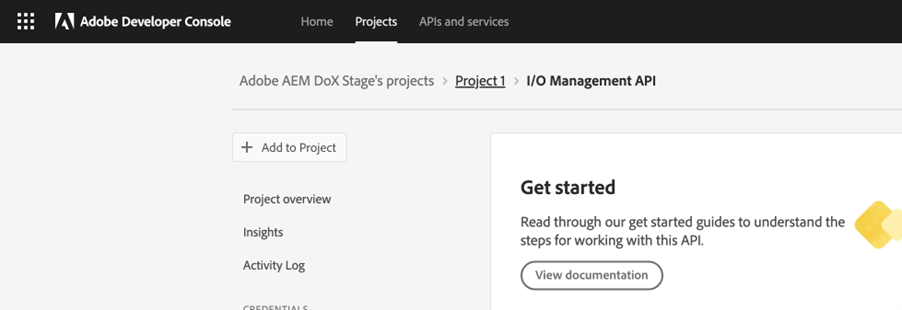

# Configure microservice-based publishing with OAuth authentication

The publishing microservice allows you to run large publishing workloads concurrently on Experience Manager Guides as a Cloud Service and take advantage of the industry-leading Adobe I/O Runtime serverless platform.

For each publishing request, Experience Manager Guides as a Cloud Service runs a separate container that scales horizontally according to the user requests. This provides the capability to run multiple publishing requests and get better performance than their large On-premise Adobe Experience Manager servers. 

>[!NOTE]
>
> Microservice-based publishing in Experience Manager Guides supports PDF (both Native and DITA-OT based), HTML5, JSON, and CUSTOM types of output presets.

As the cloud publishing service is secured by Adobe IMS OAuth-based authentication, perform the following steps to integrate their environments with Adobe's secure token-based authentication workflows and start using the cloud-based scalable publishing solution.


## Create IMS configurations in Adobe Developer Console

**Role required to create the configurations**: System Administrator

Perform the following steps to create IMS configurations in **Adobe Developer Console**:

>![TIP]
>
> If you have already created an OAuth project to configure the AI-powered smart suggestions for authoring, you can skip the following steps to create the project.

1. Open **Developer Console**: `https://developer.adobe.com/console`.

1. Switch to the **Projects** tab from the top.

    

    *Select the **Projects** tab on the **Adobe Developer Console***

1. To create a new empty project, select **Empty project** from the **Create new project** dropdown.

     

    *Create a new empty project.*

1. Select **API** from the **Add to Project** dropdown to add the IO Management API to your project.

     
    
    *Select the option to create an API project from the dropdown.*

    

    *Select **I/O Management API**.*

1. Create a new OAuth credential and save it.

     

    *Configure an OAuth server-to-server credential.*

 
1. Return to the **Projects** tab and select **Project overview** on the left. 

     
    
    *Get started on the new project.*

1. Click the **Download** button on the top to download the service JSON.

     

    *Download the JSON service details.*

You have configured the OAuth authentication details and downloaded the JSON service details. Keep this file handy as it's required in the next section.


## Add IMS configuration to the environment

>[!NOTE]
>
>If you've already created an OAuth project for smart suggestions, then you can reuse the same project for microservices and skip the following steps to add IMS configuration to the environment.

### Update existing configuration

If you are already using a microservice for publishing using JWT (deprecated), perform the following steps to update the configurations:


1. Open **Experience Manager** and select the program containing the environment that you want to configure.
1. Switch to the **Environments** tab.
1. Select the name of the environment that you want to configure. This should navigate you to the **Environment Information** page.
1. Switch to the **Configuration** tab.

1. Update the SERVICE_ACCOUNT_DETAILS JSON field with the new OAuth JSON file that you downloaded.
1. Delete the PRIVATE_KEY field.


    

    *Update the existing JWT environment configurations.*

### First-time configuration

To use a publishing microservice for the first time, update the configurations according to the following steps: 
1. Open **Experience Manager** and select the program containing the environment you want to configure.
1. Switch to the **Environments** tab.
1. Select the name of the environment that you want to configure. This should navigate you to the **Environment Information** page.
1. Switch to the **Configuration** tab.

1. Update the SERVICE_ACCOUNT_DETAILS JSON field. 

    >![NOTE]
    >
    >Ensure you are using the same name and configuration as given in the following screenshot.


*Configure the environment for the first time.*


### Use microservice-based publishing for the first time

>[!NOTE]
>
> Skip the following steps if you are already using microservice-based publishing:

Once you have added the IMS configuration to the environment, perform the following steps to link these properties with Experience Manager Guides using OSGi: 

1. In your cloud manager Git project code, add the following two files (for file contents, view [Appendix](#appendix)).

    * `com.adobe.aem.guides.eventing.ImsConfiguratorService.cfg.json`
    * `com.adobe.fmdita.publishworkflow.PublishWorkflowConfigurationService.xml`
1. Ensure that the newly added files are getting covered by your `filter.xml`.
1. Commit and push your Git changes.
1. Run the pipeline to apply the changes to the environment.

Once this is done, you can use the microservice-based cloud publishing.

## FAQs

1. Can a single key be used on multiple cloud environments?
    * Yes, you can generate one private key and use it for all environments, but you have to configure environment variables for all environments and use the same key.
1. If OSGi configurations to use microservice are enabled, will the publishing process work on the local Experience Manager server with the same codebase?
    * No, if the flag `dxml.use.publish.microservice` is set to `true`, it always looks for microservice configurations. Set `dxml.use.publish.microservice` to `false` for the publishing to work on your local server.
1. How much memory is allocated to the DITA process when using microservice-based publishing? Is this driven via the DITA profile and parameters?
    * With microservice-based publishing, memory allocation is not driven through the DITA profile and parameters. The total memory available on the service container is 8 GB, of which 6 GB is allocated to the DITA-OT process.


## Appendix {#appendix}

**File**: 
`com.adobe.aem.guides.eventing.ImsConfiguratorService.cfg.json`

**Content**:

```
{
  "service.account.details": "$[secret:SERVICE_ACCOUNT_DETAILS]",
  "private.key": "$[secret:PRIVATE_KEY]"
}
```

**File**: `com.adobe.fmdita.publishworkflow.PublishWorkflowConfigurationService.xml`

**Content**:
* `dxml.use.publish.microservice`: Switch to enable microservice-based publishing using DITA-OT
* `dxml.use.publish.microservice.native.pdf`: Switch to enable microservice-based Native PDF publishing

```
<?xml version="1.0" encoding="UTF-8"?>
<jcr:root xmlns:jcr="http://www.jcp.org/jcr/1.0" xmlns:sling="http://sling.apache.org/jcr/sling/1.0"
          jcr:primaryType="sling:OsgiConfig"
          dxml.publish.microservice.url="https://adobeioruntime.net/api/v1/web/543112-guidespublisher/default/publishercaller.json"
          dxml.use.publish.microservice="{Boolean}true"
          dxml.use.publish.microservice.native.pdf="{Boolean}true"
/>
```
