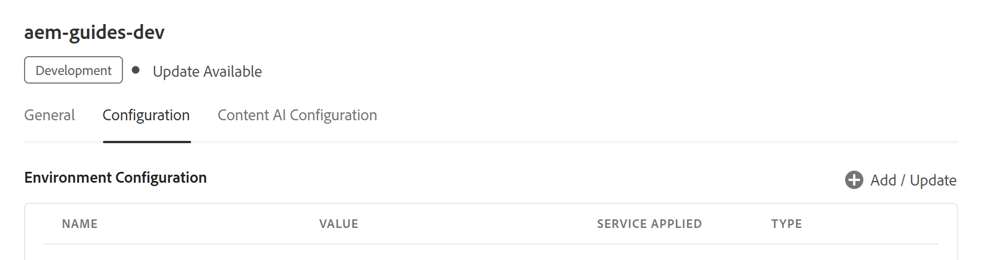
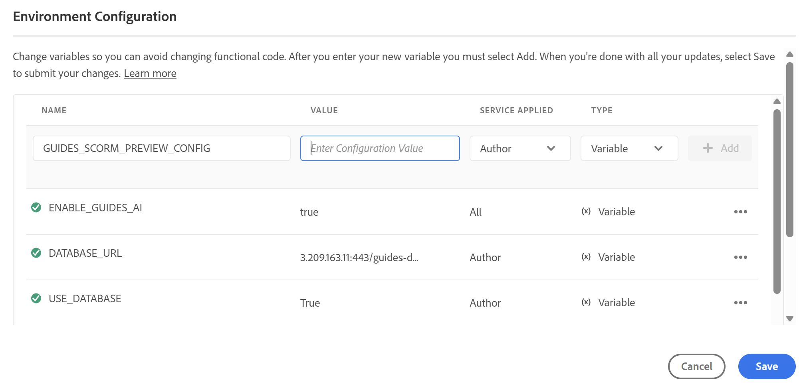
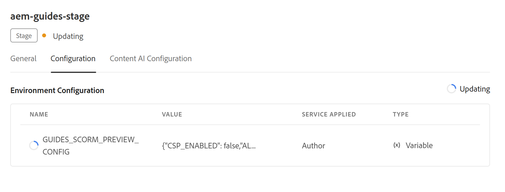

# Configure Content Security Policy (CSP) for SCORM preview

Experience Manager Guides SCORM preview is managed through a dedicated environment variable that governs the Content Security Policy (CSP) applied to the preview experience. After the setting is enabled, Administrators can extend it by adding additional trusted sources. These sources can include scripts, styles, fonts, images, media, frames, and more required for SCORM packages to load and render previews correctly in Experience Manager Guides.

This article explains how to add and configure the environment variable in Cloud Manager, breaks down what each field in the JSON value does, and shows how to update the value later if your needs change.

## Configuration fields

The variable `GUIDES_SCORM_PREVIEW_CONFIG` accepts JSON object as its value. Each value controls a specific aspect of the CSP applied during SCORM preview:

| Fields | Type | Description |
|---|---|---|
| `CSP_ENABLED` | Boolean | Turns CSP enforcement on (`true`) or off (`false`) for the SCORM preview.|
| `ALLOW_UNSAFE_EVAL` | Boolean | Allows the use of `eval()` and similar unsafe JavaScript evaluation methods when set to `true`. |
| `ADDITIONAL_SCRIPT_SRC` | Array | Additional trusted sources allowed to serve JavaScript. |
| `ADDITIONAL_STYLE_SRC` | Array | Additional trusted sources allowed to serve stylesheets. |
| `ADDITIONAL_FONT_SRC` | Array | Additional trusted sources allowed to serve fonts. |
| `ADDITIONAL_FRAME_SRC` | Array | Additional trusted sources allowed to be loaded within `<iframe>` elements. |
| `ADDITIONAL_IMG_SRC` | Array | Additional trusted sources allowed to serve images. |
| `ADDITIONAL_MEDIA_SRC` | Array | Additional trusted sources allowed to serve audio/video content. |
| `ADDITIONAL_WORKER_SRC` | Array | Additional trusted sources allowed to serve web workers. |
| `ADDITIONAL_CONNECT_SRC` | Array | Additional trusted sources the preview is allowed to connect to (e.g., XHR/fetch calls). |
| `ADDITIONAL_MANIFEST_SRC` | Array | Additional trusted sources allowed to serve web app manifests. |
| `ADDITIONAL_OBJECT_SRC` | Array | Additional trusted sources allowed to be loaded via `<object>`, `<embed>`, or `<applet>`. |


## Default values for configuration fields

```json
{
  "CSP_ENABLED": true,
  "ALLOW_UNSAFE_EVAL": false,
  "ADDITIONAL_STYLE_SRC": ["https://fonts.googleapis.com"],
  "ADDITIONAL_FONT_SRC": ["https://fonts.gstatic.com"],
  "ADDITIONAL_FRAME_SRC": ["https://www.youtube-nocookie.com", "https://www.youtube.com"],
  "ADDITIONAL_SCRIPT_SRC": [],
  "ADDITIONAL_WORKER_SRC": [],
  "ADDITIONAL_IMG_SRC": [],
  "ADDITIONAL_MEDIA_SRC": [],
  "ADDITIONAL_CONNECT_SRC": [],
  "ADDITIONAL_MANIFEST_SRC": [],
  "ADDITIONAL_OBJECT_SRC": []
}
```
Depending on your needs, you don't have to populate every value; leave any source type as an empty array if you don't need to allow additional origins for it.

>[!NOTE]
>
> If you want to disable CSP enforcement for SCORM preview, set `"CSP_ENABLED": false` in the JSON value.

## Add the variable in Cloud Manager

1. Log in to Cloud Manager and select the environment where you want to apply the configuration.
2. Navigate to the environment's **Configuration** tab.
3. Select **Add/Update** to add an environment variable.

    {width="650"}

4. Enter the name of the variable (`GUIDES_SCORM_PREVIEW_CONFIG`) in the **Name** field.

    {width="650"}

5. Enter your complete JSON configuration, including the source allow-lists your course needs, into the **Value** field.
6. Select the **Service Applied** to choose whether the variable should apply to **Author**, **Publish**, or both. For Experience Manager Guides authoring, select **Author**.
7. Select **Variable** in the **Type** field.
8. Select **Add**.
9. Select **Save**.
    
    {width="650"}

Once you save, Cloud Manager applies the configuration to the selected environment. This typically takes 10–12 minutes to propagate, so allow time for the update to complete. Once it finishes, the new configuration will be active for SCORM preview on that environment.

## Update the variable values

If your requirements change, you can revisit the `GUIDES_SCORM_PREVIEW_CONFIG` variable at any time from the same Configuration tab in Cloud Manager. Locate the existing variable and select its **Add/Update** option to open it for editing, and then revise the value as needed.