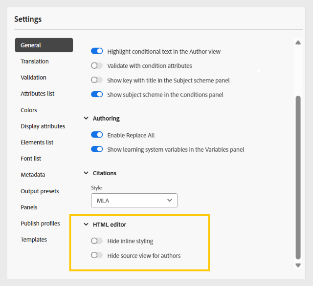

# Configure Folder profiles

A folder profile is required to segregate the configurations for different departments or products in your enterprise. For Learning and Training content, you can create and configure a folder-level profile to manage authoring templates, output templates, output presets, and other folder-level settings.  

To get started with the folder profile configuration for Learning and Training content, you need to: 

1. **Create different folders to manage authoring and output templates**: You can create folders for Authors and Publishers working in different departments or products in your enterprise. These folders can be mapped to specific folder profiles, each configured with different authoring and output templates to support department-specific learning course creation and decentralized administration. 

    You can create a new folder from the Repository panel. 

    {width="350" align="left"}
2. **Create language folders to manage translation**: If you translate content into different languages, you must create folders corresponding to each language. Each of these language folders will contain the content corresponding to that language. 

    For details, view [Best practices for content translation](../user-guide/translation-first-time.md). 
3. **Create a folder to manage Assets**: Similar to folders, you can also create different Assets folders to cater to the needs of different departments. This way, you also ensure that Authors and Publishers have access to the correct CSS configured in their templates, images, and other assets.  

    {width="350" align="left"}
4. [Create a folder profile](../cs-install-guide/conf-folder-level.md#create-and-configure-a-folder-level-profile) to map different folders. 
5. **Select the Folder profile to be configured**: Once the folder profile is created, you need to select the Folder profile on the [User Preferences](../user-guide/intro-home-page.md#user-preferences) page to ensure that Authors and Publishers have access to the correct templates.

    {width="650" align="left"}

6. **Configure Folder profile settings**: For Learning and Training content, the following settings can be configured at a folder level: 
    - [Panels](#configure-panels) 
    - [Templates](#configure-templates)
    - [Output presets](#configure-output-presets)
    - [HTML editor](#html-editor-settings) 
    - [Publish profiles](#manage-publish-profiles) 

 To access these settings, switch to the Editor view and select **Settings** from the **Options** menu as shown below: 

 

## Configure panels 

This setting controls the panels that are shown in the left and right panels of the **Editor** and **Map console** in Experience Manager Guides. You can toggle the button to show or hide the desired panel.  

For Learning and Training content, ensure that only the following features are enabled for the Editor and Map console.  

{width="350" align="left"}

### Editor 

**Left panel** 

- **Collections**: Enables you to organize and save frequently used files, or quickly access shared files. 
- **Repository**: Allows you to view and access all your maps, topics, images, and other assets stored in the content repository. 
- **Course manager**: Provides a dedicated workspace for creating and managing courses.  
- **Snippets**: Allow you to create and reuse small content fragments across various topics in your Learning courses. 
- **Conditions**: Allows you to configure conditional attributes at a global and folder level. 
- **Variables**: Allows you to create and manage variables to use in your learning content. 
- **Language variables**: Enables you to define localized strings for published output or static text in templates. 
- **Templates**: Allows you to create and manage templates for use by the Authors. 
- **Output templates**: Enables you to create and manage output templates to generate output in various formats.  
- **Find and replace**: Provides options to search for and replace text across files in a map or a folder within your repository.  

**Right panel**

- **Content properties**: Contains information about the type and attributes of the currently selected element in the Editor. 
- **File properties**: Allows you to view and manage the properties of the selected file.  
- **Styles**: Display the global class-based styling options for use in your learning content. 
- **Filters**: Enables you to filter content based on applied conditions in the Preview mode of a topic. 

### Map console 

**Left panel** 

- **Presets**: Enables you to configure output presets for publishing the Learning course. 
- **Translation**: Provides options to translate your content into multiple languages. 
- **Reports**: Allows you to generate and manage reports to get a useful insight into the overall health of the content in your course. 
- **Condition presets**: Provides options to configure condition-based output presets for different audiences, departments, and more. 

**Right panel**

- **Filters**: Allows you to use filters when working with reports and translation.  

## Configure Templates 

This setting allows you to manage the authoring and publishing templates present in the [Left panel in the Editor](../user-guide/web-editor-left-panel.md). You can add, remove, or reorder authoring and output templates, which will then be accessible to Authors and Publishers. 

{width="350" align="left"}

The Authoring templates are available in four categories – Learning course, Learning content, Quiz, and Question bank. If there are any predefined templates configured in your instance, they will be displayed by default. 

{width="350" align="left"}

### Add templates

Perform the following steps to add a new template: 

1. Navigate to the template category where you want to add a template and select **Add**.  
2. In the Select path dialog, select the desired template. 
3. Choose **Select**.  

    {width="350" align="left"}

The template is added in the respective category in the Settings panel. 

Similarly, you can add the other Authoring and Output templates. Once added, these templates are made available to Authors and Publishers in their respective course dialogs. For example, the Learning course template added by the Administrator will be available to Authors when they create a new course.  

{width="350" align="left"}

### Work with new authoring and output templates 

To use a different template than those shown in the **Select Path** dialog, create a custom authoring or output template. 

**Create new authoring templates**

To use a different map or topic template, create a new authoring template from the Templates panel in the Editor. Use map templates to create Learning courses and topic templates for Learning content, Quiz, or Learning summary. 

For details, view [Create customized templates from the Editor](../user-guide/create-maps-customized-templates.md). 

{width="350" align="left"}

**Create new output templates**

Perform the following steps to create a new output template for the Learning and Training content: 

1. From the left panel in the Editor, select **More** > **Output templates**.
    
    The Output templates panel is displayed. 

    {width="350" height="" align="left"}
2. In the Output templates panel, select (+) to create a new output template. 

    {width="350" align="left"}
3. Select an Output template from the dropdown menu. 

    {width="650" align="left"}
4. Based on the selected Output template type, a dialog is displayed where you can create a new template based on the available templates.  

     {width="350" align="left"}

5. Select **Create**. 

    A new Output template is created. 

6. To access and add the Output template for Publishers, navigate to **Settings** > **Templates** > **Output templates** and select **Add**.

    {width="350" align="left"}

    The output template is displayed in the Select path dialog.  
7. Select the template and choose **Confirm**. 

    {width="350" align="left"}

    The selected output template is now added to the Settings panel.  

    {width="350" align="left"}

### Remove or reorder templates 

Once added, you can remove or reorder the templates from the Settings panel.  

To remove a template, select the **Remove** icon next to it.    

{width="350" align="left"}

You can also define the order in which the templates present within a category are displayed. To change the display order of the templates, select the dotted bars and drag a template to the desired position.  

{width="350" align="left"}

## Configure Output presets 

The Output presets tab allows you to define which output formats are available for publishing a course. It contains two sections: **Allowed output preset types** and **Common output presets**.  

{width="350" align="left"}

- **Allowed output preset types**: This section lists all output presets supported in the Experience Manager Guides instance. For course publishing, only **SCORM** and **PDF** formats are applicable. You can select one or both options. The selected presets will be available to Publishers when generating course output. 

    {width="350" align="left"}

- **Common output presets**: This section displays the output presets commonly created and added by Publishers to a specific folder profile. You can also remove any preset that is no longer needed. 

    {width="350" align="left"}

## HTML editor settings 

This setting allows you to configure the Editor for HTML-based authoring. Key configuration options present in this setting are as follows: 

{width="350" align="left"}

- **Hide inline styling**: Enable this option to prevent Authors from applying inline formatting to the course content. When enabled, all the inline styling options like Fonts, Border, Layout, Background, and Columns present in the right panel of the Editor remain hidden for Authors. However, Authors can still use the global class-based styling options available in the **Styles** panel. This helps maintain consistency with your organization's style guidelines. 
- **Hide Source view for Authors**: Enable this option to restrict access to the HTML source code. This is useful when you want to simplify the editing experience or avoid accidental changes to the underlying code. 

## Manage Publish profiles 

This section allows you to view, create, and manage publish profiles used for publishing courses to SCORM Cloud. Each profile defines the connection settings and configuration details required to publish a learning course to a specific SCORM Cloud environment.  

You can create multiple profiles if you need to publish to different SCORM Cloud accounts, ensuring flexibility and control over your publishing process. 

Provide the server details along with the Client ID and Client secret of the associated SCORM cloud application to configure the Publish profile for SCORM cloud. 

{width="350" align="left"}
