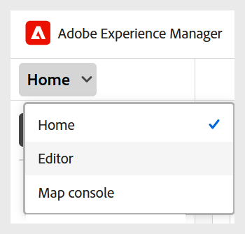

# Explore the interface and prerequisites

This article explains how to access the user interface and set up the correct Folder profile and Base path for learning courses. 

## Access and navigate the interface 

Perform the following steps to access the user interface:  

1. Log in to your AEM instance. 
2. On the AEM Navigation page, select **Guides**. 
3. You are now on the **Experience Manager Guides Home page**. Use the navigation switcher to switch to the following views: 

    - **Home**: The default page that you view when logging into Experience Manager Guides. It allows you to configure various folder-level settings. 
    - **Editor**: An easy-to-use Editor that allows you to author course content in Experience Manager Guides. 
    - **Map console**: Provides you a dedicated workspace to handle all aspects of course publishing. 

    For details, view [Adobe Experience Manager Guides Home page experience](../user-guide/intro-home-page.md).

    {width="350"}

## Prerequisites 

To get started with the user interface, you must first set up the correct **Folder profile** and **Base path** in the **User preferences** setting on Experience Manager Guides Home page. 

Folder profiles define the authoring templates, output templates, output presets, and other folder-level settings. Experience Manager Guides supports multiple folder profiles, enabling Administrators to segregate the configurations for different departments or products in your enterprise. Using an incorrect folder profile may result in missing templates or limited functionality. If you are unsure which folder profile to use, contact your Administrator before proceeding.

The User preferences page consists of two tabs:

- **General**: Allows you to select a Folder profile, Base path, Root map, and more.
- **Appearance**: Provides you with the options to select the themes for the application and the source view of the Learning content.

 For details, view [User preferences](../user-guide/intro-home-page.md#user-preferences) in Experience Manager Guides.
