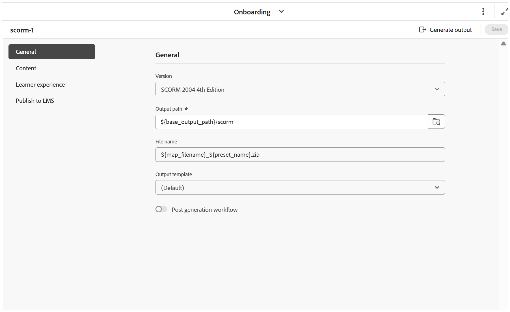
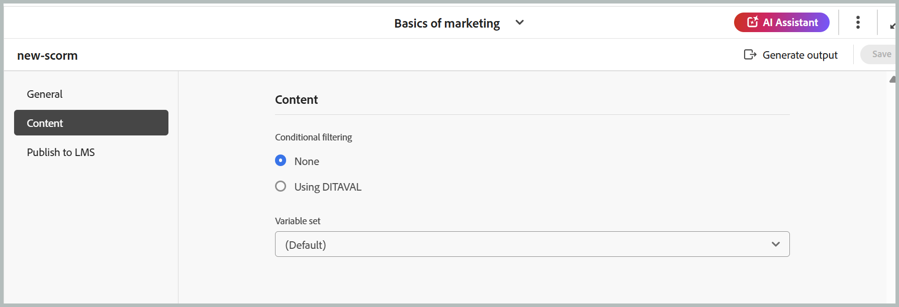
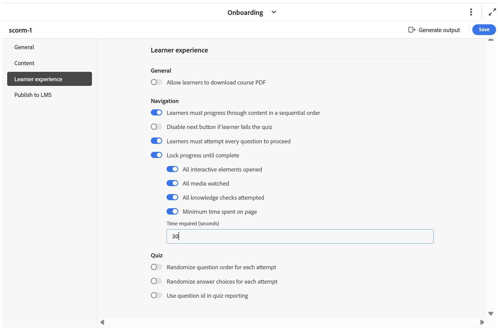
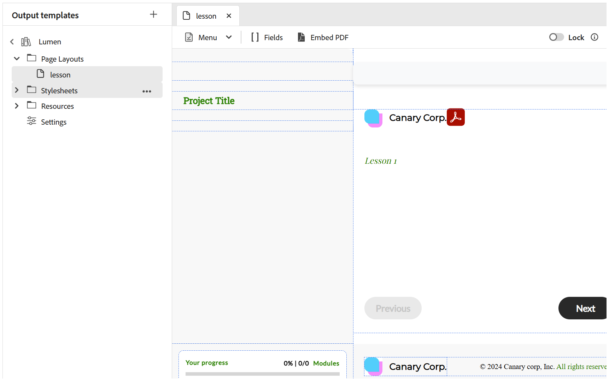
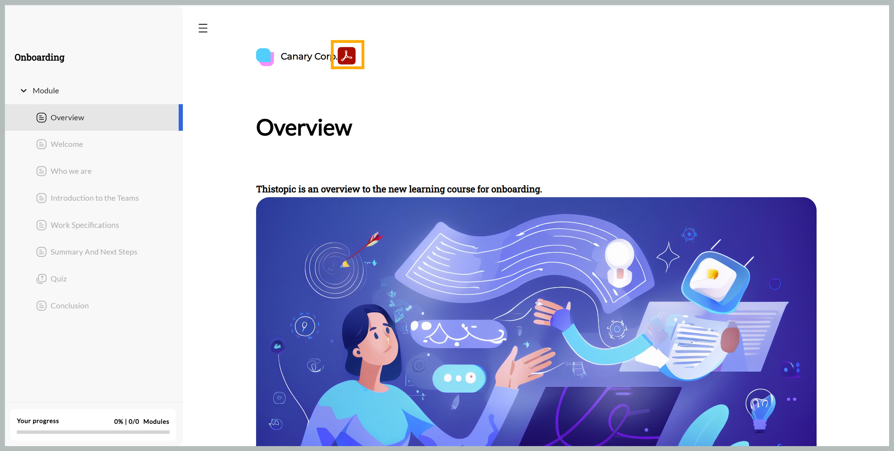
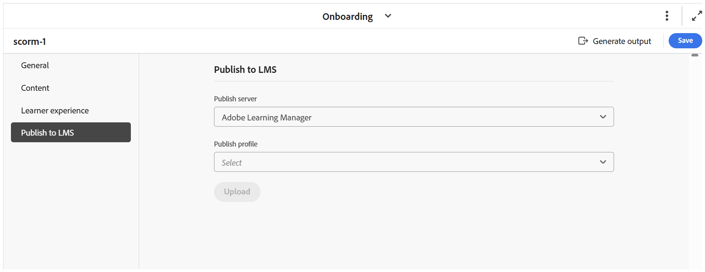

# Configure SCORM output preset

After the preset is created, configure the SCORM preset settings. The preset configuration options are organized under General, Content, Learner experience and Publish tabs.

- **General:**  Used to specify basic output settings, such as the supported version, output path, SCORM file name (zip), output template, and Post Generation Workflow for a new Post Generation Workflow drop-down list containing all workflows configured.

    {width="650"}
 
    
- **Content:** Use to specify the available conditional filtering (using DITAVAL or using some condition preset) and the variable set.

    {width="650"}

- **Learner Experience:** The **Learner Experience** tab lets you configure how learners interact with and navigate through the SCORM output. Settings are organized under **General**, **Navigation**, and **Quiz**, allowing you to control content accessibility, navigation flow, and quiz behavior for a tailored learning experience.

    {width="650"}

  - **General:** Configure output-level options such as enabling PDF downloads for learners.

    - **Allow learners to download course PDF**:  When enabled, this option adds a PDF icon to the SCORM output. Clicking this icon lets the learner download a PDF version of the course content directly from the published output.  

      **Prerequisites:** Before enabling this option, ensure the following:
      
      - The **Output template** must be configured with the **Embed PDF** icon at the desired location and the same template should be selected under the **Output template** option in the **General** tab while configuring a SCORM Preset.

        {width="650"}

      - The associated **Native PDF preset** must have been generated at least once. Selecting an ungenerated PDF preset will result in an error prompting the user to publish the preset.  

     Once the SCORM output is generated with the above settings, the resulting output includes a PDF icon, as shown below, allowing learners to download the course PDF.

    {width="650"}   

  - **Navigation:** Define how learners move through the course, including sequential progression, mandatory completion conditions, and rules for unlocking the **Next** button.

    - **Learners must progress through content in a sequential order**: Ensures learners move through the course in a fixed sequence and cannot skip ahead or jump between course components.
    - **Disable next button if learner fails the quiz**: Blocks the learner from moving to the next section/page until they pass the quiz.
    - **Learners must attempt every question to proceed**: Requires learners to attempt all questions before they can submit the quiz, preventing incomplete submissions.
    - **Lock progress until complete**: Prevents the navigation through the course until all of the configured sub-conditions below it are satisfied by disabling the **Next** button in the course.
      - **All interactive elements opened**: Requires the learner to open every interactive element on the page.
      - **All media watched**: Requires the learner to watch all video/audio media on the page.
      - **All knowledge checks attempted**: Requires the learner to attempt every knowledge-check question on the page.
      - **Minimum time spent on page**: Requires the learner to stay on the page for at least the specified duration before Next button is enabled. Once enabled, you need to enter the time required as mentioned below.
        - **Time required (seconds)**: The minimum number of seconds (e.g., `30`) a learner must remain on the page for this condition to be met.

  - **Quiz:** Configure quiz-related behavior such as randomizing question order and answer choices to reduce predictability across attempts.

    - **Randomize question order for each attempt**: Displays quiz questions in a different order for every attempt, helping reduce predictability.
    - **Randomize answer choices for each attempt**: Shuffles the answer options for each question on every attempt, reducing the chance of guessing.            

- **Publish to LMS:** Use this setting to publish your content directly to Adobe Learning Manager (ALM). From the **Publish server** dropdown, select **Adobe Learning Manager**, and then choose the required **Publish profile** that was previously configured in Workspace settings. The selected profile is used to establish the connection and upload the generated content to ALM.

  >[!NOTE]
  >
  > Before publishing content to ALM, you must configure an Adobe Learning Manager publish profile. For details, view [Publish profiles](../lc-config-guide/lc-folder-profile.md).

    {width="650"}

Once all the changes are configured, save the changes for the SCORM preset using **Save** on the right corner of the toolbar of the SCORM preset page.
