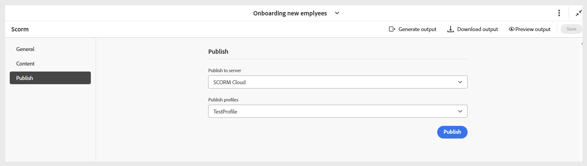

# Configure SCORM output preset

After the preset is created, configure the SCORM preset settings. The preset configuration options are organized under General, Content and Publish tabs.

- **General:**  Used to specify basic output settings, such as the supported version, output path, ZIP file name, output template, and other options related to Learner's experience.

    {width="650" align="left"}

    **Learner's experience** 

    - **Learners must progress through content in a sequential order**: Ensures learners move through the quiz in a fixed sequence and cannot skip ahead or jump between questions.
    - **Learners must attempt every question to proceed**: Requires learners to attempt all questions before they can submit the quiz, preventing incomplete submissions.
    - **Randomize question order for each attempt**: Displays quiz questions in a different order for every attempt, helping reduce predictability.
    - **Randomize answer choices for each attempt**: Shuffles the answer options for each question on every attempt, reducing the chance of guessing based on position.
    - **Use question id in quiz reporting**: Includes the unique question ID in quiz reports, making it easier to track, analyze, and map results back to specific questions.
    - **Post Generation Workflow**: When you choose this option, a new Post Generation Workflow drop-down list containing all workflows configured is displayed. 
    
- **Content:** Use to specify the available conditional filtering (using DITAVAL or using some condition preset) and the variable set.

    {width="650" align="left"}

- **Publish:** Use this setting only if you want to publish the output to SCORM Cloud for direct access.
  
    {width="650" align="left"}

Once all the changes are configured, save the changes for the SCORM preset using **Save** on the right corner of the toolbar of the SCORM preset page.
