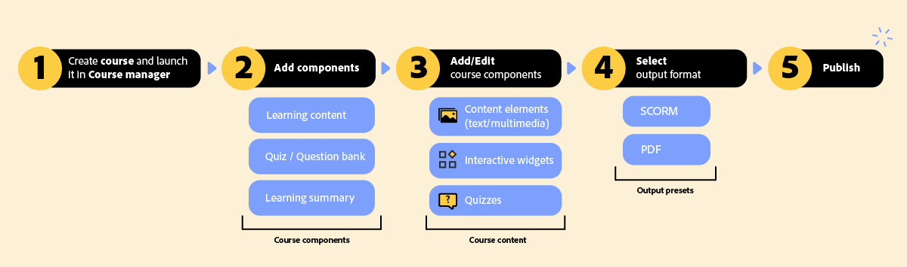

# Course overview

A Course is a learning unit designed to deliver interactive training experiences for product training and customer education.  Each course consists of Learning content, Quiz for assessment, and a Learning summary to reinforce key takeaways.  

## How does it work? 

As an Author, you create a course using the available course templates. You then build the course by adding key components, such as an Overview, Topic, Quiz, Summary, or a Group. These components are brought together and enhanced through an intuitive authoring interface, where content is enriched with text, multimedia, interactive widgets, and assessments to create an engaging learning experience.  

Once your course content is complete, output presets are configured to publish the course.  

The following diagram outlines the course workflow at a glance. 

