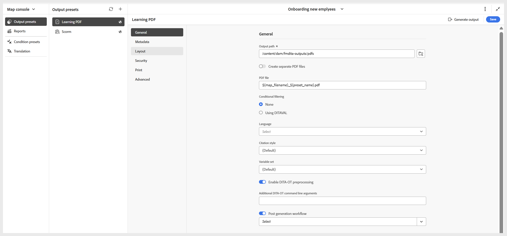

# Create a PDF output preset

Perform the following steps to create a PDF output preset: 

1. Open the course in **Map console**.

    {width="350" align="left"}
    
1. In the **Output presets** tab, select the + icon to create an output preset.    
1. Select **PDF** from the **Type** dropdown in the New output preset dialog.
1. In the **Name** field, provide a name for this preset.
1. In the **Generate PDF Using** field, select **Native PDF**.
1. Select the **Add to current folder profile** option to create an output preset within the current folder profile.   
1. Select **Add**.
   
The PDF preset page opens where you can do the necessary configurations. 

   {width="650" align="left"} 

    
