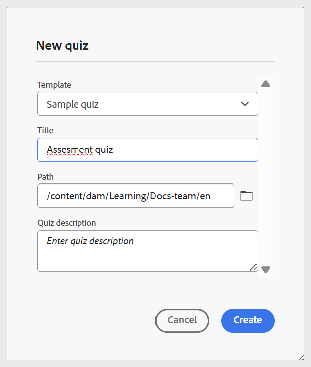

# Create Quiz

Perform the following steps to add quiz to a course: 

1. Open a course in the **Course manager** and select **Add new** from the **Options** menu.  

    {width="650" align="left"}
    
1. Select **Quiz**.  
    A **New quiz** dialog opens to specify the relevant details of the quiz. You can select the template from the dropdown menu and specify a suitable title for the same.   

    {width="350" align="left"}

1. Select **Create**. 
   
A Quiz is added as part of the course and is displayed in the Course manager panel. 
   
>[!NOTE]
>
>  Once you create a quiz, it is automatically assigned Version 1.0.
