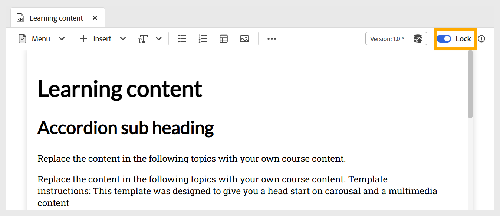

# Edit Topic

Perform the following steps for editing the Topic: 

1. Double-click the Topic to open it from the Course manager panel.  
1. You must **Lock** the topic using the toggle as shown below. This allows you to edit the content, and no one else can make any changes to this topic. 

    {width="650" align="left"}

1. To add content to a topic, you can [add basic building blocks](./lc-basic-blocks.md) such as text, multimedia, along with various [interactive widgets](./lc-widgets.md).
1. To save your work, use **Save as new version** to create a new version, or press `Ctrl+S` to overwrite the existing file. 

    {width="650" align="left"}

1. After saving the content, you can **Unlock** the topic for others to edit.
