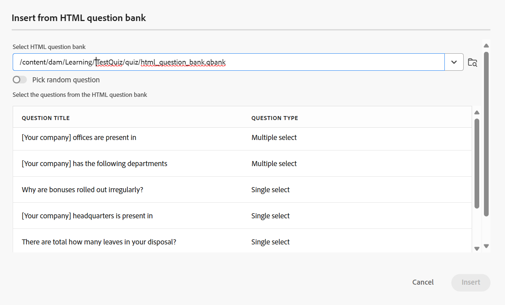

# Insert questions from Question bank

Perform the following steps to insert questions from question bank in the quiz: 

1. Select **Insert from question bank** option from the **Questions** dropdown menu in the toolbar as shown below. 

    {width="350" align="left"}

    The **Insert from HTML question bank** dialog is displayed.      
    
1. Specify the path to the question bank stored in your repository and select the questions you wish to insert into your quiz, as shown below. You can also select all the questions of the Question bank, using **Select all**.  

    {width="650" align="left"}

1. The selected questions are inserted into the quiz with a blue highlight, indicating they are non-editable. However, they will appear normally in the published output. 

    {width="650" align="left"}

1. Additionally, you can enable the **Pick random question** option using the toggle. Once enabled, you can define the number of questions to be randomly selected. The quiz will then display a placeholder indicating that a random question has been inserted, as shown in the second screenshot. During publishing, the system automatically selects and inserts the specified number of random questions from the question bank. 

    {width="650" align="left"}

    The random questions are added in the quiz as shown below.

    {width="650" align="left"}

For a quick video overview, view [Insert questions from Question bank](https://video.tv.adobe.com/v/3475212/learning-content-aem-guides) .
