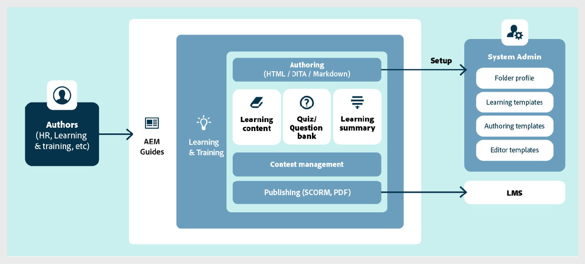

# Overview of the Learning and Training content

The support for Learning and Training content makes it easy to create and manage interactive eLearning content within enterprise environments. You can create courses using templates, add interactive elements (such as accordions, carousels, multimedia, and more), add quizzes using different question types or through a Question bank, and publish the course in supported output formats. 

## Core capabilities at a glance

The key capabilities are as follows:  

- Centralized learning content management 
- Template-driven authoring 
- Support for structured authoring and content reuse 
- Quiz creation and management  
- Industry-leading translation management 
- Multi-channel publishing using out-of-the-box SCORM and PDF output formats 

    
