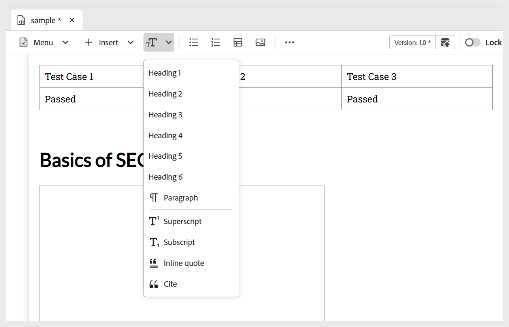
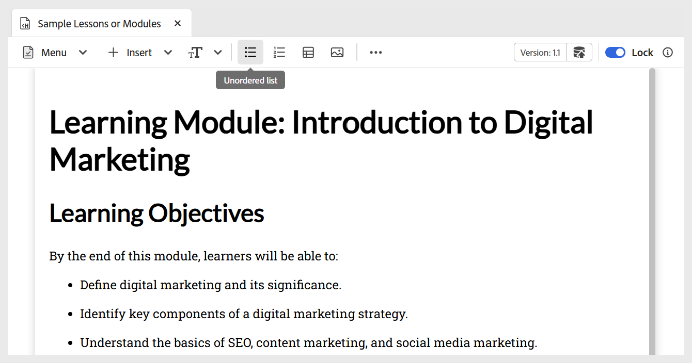
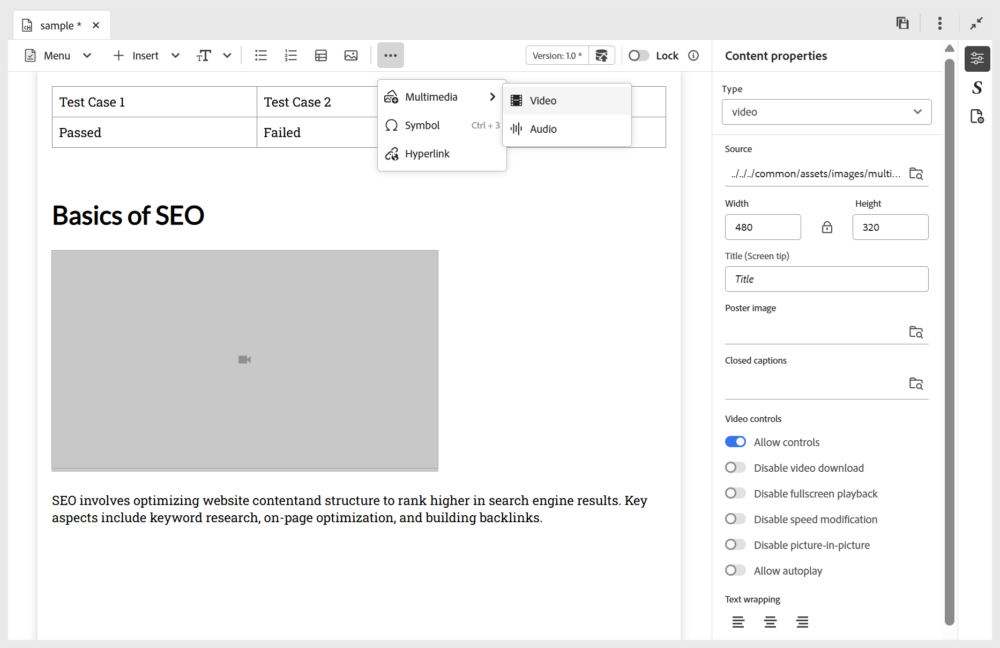

# Add basic building blocks to your Topic 

To provide a clearer understanding of how to create a Learning Topic and add basic building blocks to it, the following video offers a brief overview of the features available.

>[!VIDEO](https://video.tv.adobe.com/v/3469535/learning-content-aem-guides)

You can use the basic editing features available on the Editor toolbar, as described below:

- **Insert options**: Provides options to add [add interactive Widgets](./lc-widgets.md) such as Accordion, Carousel, HotSpot, Tabs, Flip cards, and Click to reveal, as well as [structural elements](./lc-other-insert-options.md) such as Iframe, Block Quotes, Code Block, and more. Use this menu to add functionality and variety to your learning content, making it engaging and well-structured.

    {width="650"}

- **Text components**: Adds heading, paragraph, inline quote, superscript, subscript and citation to your content. 

    >[!NOTE]
    >
    > You can also include a Title and subtitle to your learning content. For details on how to add it in the content, view [Add title and subtitle to learning content](#add-title-and-subtitle-to-learning-content).

    {width="650"}

- **Unordered list**: Adds an unordered list within your content.

    {width="650"}

- **Ordered list**: Inserts a numbered list within your content.

    {width="650"}

- **Table**: Inserts a table of required dimensions into the content. You can further manage various table properties using the **Content Properties** panel, as shown below.

    {width="650"}

- **Image**: Insert images into the content along with alternate text and a screen tip. Images can be added from the repository or via an external URL. Additionally, image properties can be modified using the **Content Properties** panel.

    {width="650"}

- **Multimedia**: Adds video and audio to the content. You can customize their properties using the **Content Properties** panel.

    {width="650"}

- **Reusable content**: Enables you to incorporate existing content from your assets or repository for reusability. Perform the following steps to insert a Reusable content:

    1. Select **Reusable content** from the toolbar.
        The **Reuse Content** dialog opens.
    2. Navigate and select the desired topic to include its content in the current course.
    3. Select the ID of the content you want to add; a preview will be displayed alongside for reference.

        {width="650"}

    4. Choose **Select**. 

    The content gets inserted. For example, the section on Vehicle structure is a content piece that is reused and added to the topic of the course. The type is shown as **Reference**, and its **ID** is reflected in the **Content properties** panel.

    {width="650"}

- **Symbols**: Adds symbols of your choice to the content from a list as shown below.

    {width="350"}

- **Hyperlinks**: Adds hyperlinks to the required location in your content. It can be a file reference, web URL, or an e-mail link as shown below. 

    {width="650"}

Additionally, the **Menu** dropdown provides access to the editing actions (Cut, Copy, Delete), Find and replace and Version label.  

## Add title and subtitle to learning content

Perform the following steps to include title and subtitle to your learning content:

1. Open the learning course in Map console.
1. Open the topic, quiz, or any other course component where you want to add a title or subtitle. 
1. Navigate to the File properties panel and select **Add title**. 

    
1. When prompted, choose whether to use the existing heading as the title. 

    >[!NOTE]
    >
    > If you do not want to use the existing heading as the title, first insert a heading using the Text component in the Editor toolbar, and then select **Add title**. This adds a sample **Title** is added to the content, which you can edit as needed.
    
1. In File properties, select **Add subtitle**. 
     A sample **Subtitle** is added to the content. 

     

To remove a title, clear the **Add title** option in File properties. Removing the title automatically removes the associated subtitle.

