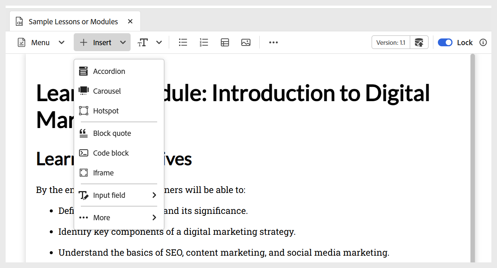
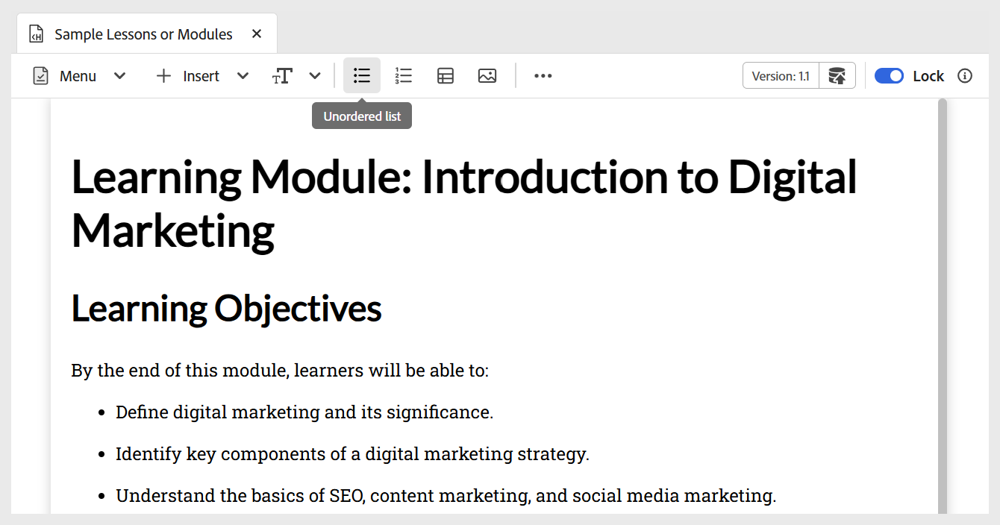

# Add basic building blocks to your Learning content 

You can use the basic editing features available on the Learning content toolbar, as described below:

- **Widgets**: Add widgets like accordion, carousel, hotspots, and more to your learning content using the **Insert** menu as shown below. For more details on interactive widgets, view [Use interactive widgets](./lc-widgets.md). 

     {width="650" align="left"}

- **Text components**: Adds heading/titles, paragraph, inline quote, superscript, subscript and citation to your content. 

    {width="650" align="left"}

- **Unordered list**: Adds an unordered list within your content.

    {width="650" align="left"}

- **Ordered list**: Inserts a numbered list within your content.

    {width="650" align="left"}

- **Table**: Inserts a table of required dimensions into the content. You can further manage various table properties using the **Content Properties** panel, as shown below.

    {width="650" align="left"}

- **Image**: Insert images into the content along with alternate text and a screen tip. Images can be added from the repository or via an external URL. Additionally, image properties can be modified using the **Content Properties** panel.

    {width="650" align="left"}

- **Multimedia**: Adds video and audio to the content from the **More** menu on the toolbar. You can customize their properties using the **Content Properties** panel.

    {width="650" align="left"}

- **Symbols**: Adds symbols of your choice to the content from a list as shown below. You can use it from the **More** menu on the toolbar.

    {width="350" align="left"}

- **Hyperlinks**: Adds hyperlinks to the required location in your content. You can use it from the **More** menu on the toolbar. It can be a file reference, web URL, or an e-mail link as shown below. 

    {width="650" align="left"}

     
