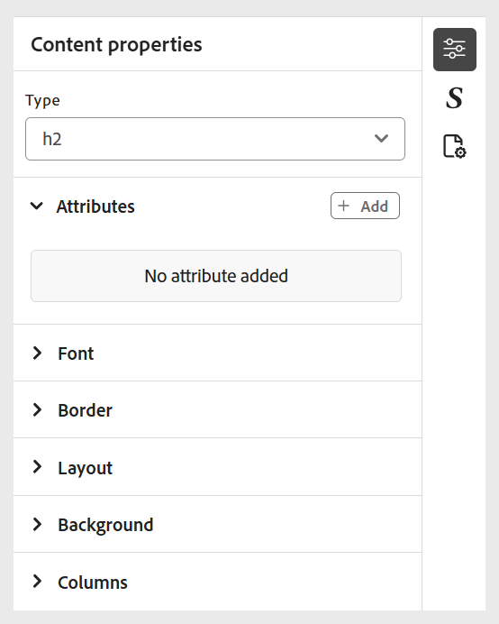
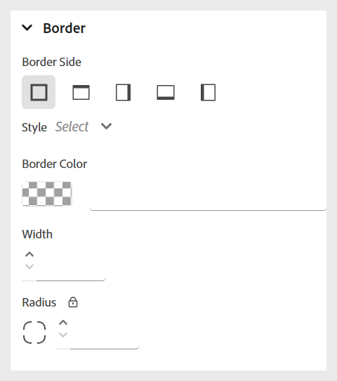

# Use inline styles 

Apply inline styles to customize the appearance of specific text directly within your course content. This allows for quick formatting adjustments such as font size, color, alignment, and more. You can modify the inline styles for the selected text using the **Content properties** panel. 

>[!NOTE]
>
> These styling options will be visible only if they are enabled by the administrator. 

{width="350" align="left"}

The following options are available: 

- **Font:** Enables you to customize the text appearance using various options such as font family, font weight, text decoration, font size, and more. These settings help you style your content as shown in the example below. 

    {width="350" align="left"}

- **Border**: Allows you to define and customize the border of an element using options such as border side, width, style (solid, dashed, dotted, and more), color. These settings help visually separate or highlight specific sections of your content.   

    {width="350" align="left"}

- **Layout**: Helps you control the positioning and spacing of elements within the content. You can adjust properties like margin, padding, alignment, display type and more. to organize your content structure effectively.

    {width="350" align="left"}

- **Background**: Allows you to customize the background of an element by setting options such as background color, image, position, and repeat style. These settings help enhance the visual appeal and clarity of your content.  

    {width="350" align="left"}

- **Column**: Enables you to organize content into multiple columns. You can adjust the number of columns, spacing between them, column width, and more. to improve readability and layout structure within your content. 

    {width="350" align="left"}