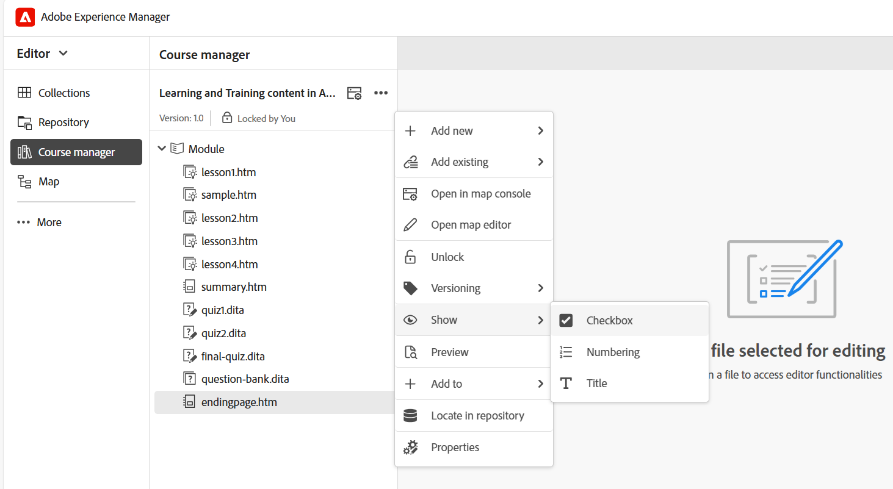

# Manage your course  

After creating a course, it opens in the Course manager panel. You can lock the course and make all necessary changes at the course level. The following sections explain the available options for editing the course. 

## Add new content

Perform the following steps to add new content in your course: 

1. Select the **Options** menu > **Add new**.  
    
    
2. Select the type of content you want to create. The available options are:  
    - **Learning content**: The main material in a course consists of short, focused pieces like steps, examples, or explanations that teach a specific skill or idea. For more details, view [Create and customize Learning content](./create-content.md). 
    - **Learning summary**: A quick review at the end of a course chapter that reminds learners of the key points they just learned.    
    - **Quiz**: A set of questions used to check how well someone understands what they've learned. For more details, view [Create and manage Quiz](./create-quiz.md). 
    - **Question bank**: A shared pool of reusable questions that can be used to create quizzes quickly and consistently. For more details, view [Question bank](./create-qb.md). 
    - **Learning group**: A Learning Group helps organize related learning content like chapters, topics, and other modules into a logical order, building a clear hierarchy that makes it easier to manage and reuse training materials.     
3. Select **Create**. 
    The selected content is created and added to the course.  

## Add existing content

You can add existing content from your content repository to your course. Perform the following steps to add existing content: 

1. Select the **Options** menu > **Add existing**.  
2. Select the type of course content you want to create.  
3. In the Select path dialog, navigate to the content location and select the desired Learning content. 

    
4. Choose **Select**. 

 The selected Learning content is added to the course from the repository.  

## Remove content 

You can remove any topic from the course by selecting the **Options** menu for that specific topic and then selecting **Remove** as shown below.

{width="350" align="left"}

## Create course versions 

You can control the versioning of your course by selecting the **Options** menu > **Versioning**.  

{width="650" align="left"}

You get the following options for versioning a course: 

- **Save as new version**: Saves your course with a new version number. 
- **Version history**: Shows the preview of the current version and also allows you to compare it with the other available versions for the course. 
- **Version label**: Allows you to specify labels in a free-form text format or use a set of predefined labels.

## Display settings: Show 

The **Show** option determines how topics are displayed. You can choose to present them using checkboxes for multiple topic selections, numbering to indicate hierarchical structure, or by showing either the topic title or the filename. 

>[!NOTE]
>
> These view settings apply only within the Course manager and have no impact on the published output. 

