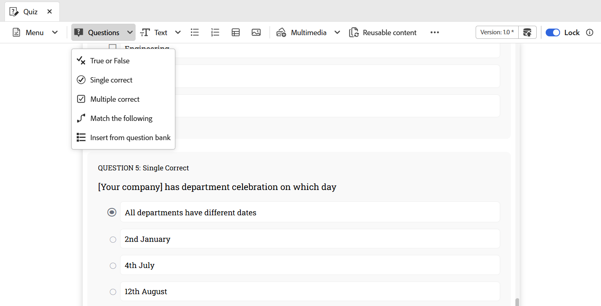

# Insert questions into a Quiz 

Perform the following steps to insert questions into a quiz: 

1. Choose the desired question type from the **Questions** dropdown menu in the toolbar. Based on your requirements, you can add questions using any of the four available formats: True or False, Single correct, Multiple correct, Match the following and Short answer as shown below. For more details, view [Question types](#question-types).

    {width="650"}

    When inserting a question, if your cursor is on a question block, the new question is added right after it by dafault.
    
    To insert a question between the two existing questions, first [insert a paragraph](#insert-paragraph-within-the-quiz), and then insert questions. 
   
1. A question is inserted in the selected format. You can then edit the question based on your requirements.    
    
1. You can select any question and configure its properties using the **Content properties** panel.

    {width="650"}

 1. Save all the changes you have made in the quiz.

## Question properties

You can configure the questions using the following question properties from the **Content properties** panel:

{width="350"}

- **Options**: Specify the correct answer of the question
- **Question Id**: Specifies the question ID for each question. If a question id is not present, it is recommended to always add it. 
- **Points for correct answer**: Specify the points to be awarded for the correct answer.
- **Penalty for incorrect answer**: Specify the points to be deducted for an incorrect answer.
- **Question label**: Enable to add a question label.
- **Feedback**: Enable to provide the feedback for correct or incorrect answer.
- **Pin option to position**: When a specific option for a question is pinned, it remains fixed in the specified position in the option list, even if **Randomize answer choices for each attempt** is enabled in the SCORM preset configuration, which would otherwise reshuffle the available options. You can hover over the desired option of a question in the Content Properties panel and pin it.

    {width="350"}

## Insert paragraph within the quiz

When you place your cursor on a question specific question or blank space between the two questions, a blue horizontal line is displayed with a blue arrow at the right-most corner of the screen. Selecting the blue arrow, allows you to insert a paragraph within the quiz authoring interface. 

 {width="650"} 

- When used within a question, it allows you to add more elements like images, table, text elements, and more within the question.
- When used between the questions, it allows you to insert another question or add other authoring elements as mentioned above.

## Delete question or option

Perform the following steps to delete a question or specific option from a quiz:

1. Right-click the question or option you want to remove.
1. In the context menu, select **Delete question** (to remove the entire question) or **Delete option** (to remove only the selected option).

{width="650"} 

## Question types

The following question types are supported in a Quiz:

- **Single correct**: A question with multiple options where only one answer is correct.

    {width="650"} 

- **True/False**: A statement-based question where learners choose whether it is True or False.

    {width="650"}

- **Multiple correct**: A question with multiple options where more than one answer can be correct.

    {width="650"} 

- **Match the following**: Allows learners to match items from two lists to form correct pairs. You can add new option sets from the **Content properties** panel. To increase complexity, you can remove one option from the first list and include an extra match in the Match column. This creates an element of difficulty by requiring learners to think critically about which option does not have a direct pair.

    {width="650"} 

    In the published output, the **Match the following** question appears with dropdown menu for each item, allowing you to select the correct match from the available options.

    {width="650"}

- **Short answer**: Allows learners to respond using a brief text input. It accepts alphanumeric answers, matches responses case‑insensitively, and for very long answers it provides a horizontal scrolling bar.

    {width="650"}
