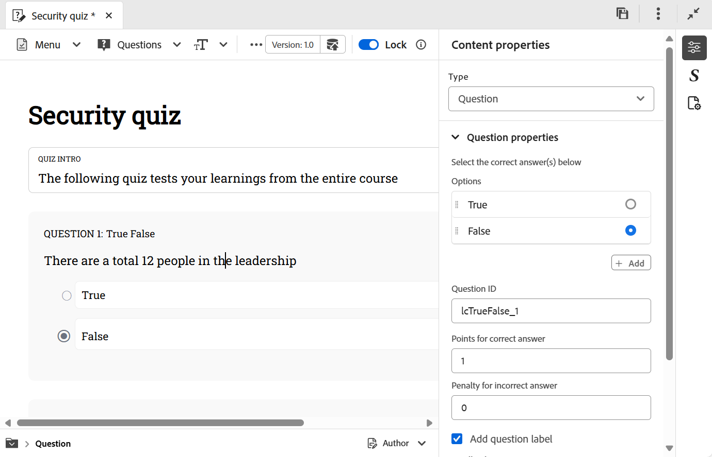

# Insert questions into a Quiz 

Perform the following steps to insert questions into a quiz: 

1. Choose the desired question type from the **Questions** dropdown menu in the toolbar. Based on your requirements, you can add questions using any of the three formats available: True or False, Single correct, and Multiple correct as shown below. 

    {width="650" align="left"}

    When inserting a question, if your cursor is on a question block, the new question is added right after it by dafault.
    
    To insert a question between the two existing questions, first [insert a paragraph](#insert-paragraph-within-the-quiz), and then insert questions. 
   
1. A question is inserted in the selected format. You can then edit the question based on your requirements.    
    
1. You can select any question and configure its properties using the **Content properties** panel. For example, you can specify the correct answer, set the marks to be awarded, and define any penalty for incorrect responses.   

    {width="650" align="left"}

1. Save all the changes you have made in the quiz.

## Insert paragraph within the quiz

When you place your cursor on a question specific question or blank space between the two questions, a blue horizontal line is displayed with a blue arrow at the right-most corner of the screen. Selecting the blue arrow, allows you to insert a paragraph within the quiz authoring interface. 

 {width="650" align="left"} 

 - When used within a question, it allows you to add more elements like images, table, text elements, and more within the question.
 - When used between the questions, it allows you to insert another question or add other authoring elements as mentioned above.

 ## Delete question or option

 Perform the following steps to delete a question or specific option from a quiz:

 1. Right-click the question or option you want to remove.
 1. In the context menu, select **Delete question** (to remove the entire question) or **Delete option** (to remove only the selected option).

{width="650" align="left"} 